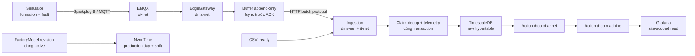

# Roadmap hiểu M2 và M3

Roadmap này dùng để **hiểu và tự giải thích được** M2–M3, không chỉ để đọc hết file hoặc chạy được
một vài lệnh. Nó đi theo chuỗi nhân quả của hệ thống:



## Kết quả cuối cùng

Hoàn thành roadmap khi bạn làm được cả sáu việc sau mà không mở tài liệu:

1. Vẽ lại đường đi của một measurement từ simulator hoặc CSV tới raw table và rollup.
2. Chỉ đúng **authority** ở từng chặng: ai quyết identity, ai quyết duplicate, ai quyết thời gian nghiệp
   vụ, ai giữ bằng chứng gốc.
3. Trace được năm tình huống: duplicate, `NDEATH`, clock drift, backend outage và late data.
4. Giải thích được vì sao mỗi cơ chế reliability tồn tại bằng hậu quả trên dây chuyền, không chỉ bằng
   tên pattern.
5. Phân biệt được code đã chạy ở M3 với thiết kế tương lai trên Mintlify.
6. Hoàn thành teach-back chính thức của M2 và M3 bằng lời của chính bạn.

## Snapshot và bốn nguồn

Roadmap được lập trên `learning-projects` tại `0e71ba1`. Mintlify ở repo `../docs` đang đồng bộ đúng
SHA này theo [`../docs/.docs-sync.json`](../../docs/.docs-sync.json).

| Nhãn | Nguồn | Dùng để làm gì |
|---|---|---|
| **CODE** | `src/`, `tests/`, `scripts/`, `tools/`, migrations và `docker-compose.yml` | Hành vi thật và phép kiểm chạy được |
| **REPO DOCS** | `docs/scope.md`, plan, ADR, glossary, benchmarks | Contract, quyết định, trade-off và số đo |
| **MINTLIFY** | repo sibling `../docs` | Bản giải thích dễ đọc và sơ đồ tổng quan tại snapshot M3 |
| **TỰ VIẾT** | Bài tập, sơ đồ, bảng invariant và counterfactual trong roadmap này | Buộc kiến thức chuyển từ “nhận ra” sang “nhớ lại” |

Thứ tự nguồn sự thật vẫn là `AGENTS.md` → ADR accepted → `scope.md` → plan → code → runtime.
Mintlify là lớp giải thích, không thay contract. Nếu hai nguồn lệch nhau, ghi lại mâu thuẫn và kiểm
[`implementation-status.mdx`](../../docs/technical/implementation-status.mdx) trước.

## Sự thật cần giữ ngay từ đầu

- M2 đã đạt 5/5 DoD kỹ thuật; M3 đã đạt 5/5 DoD kỹ thuật.
- Cả hai vẫn `in_progress` vì owner teach-back chưa hoàn tất.
- N1 `>= 5.000 msg/s` và N2 `p95 < 5 s` **chưa đạt**; chúng được qualification ở M9 và đo lại ở
  M13. Đừng biến số đo M2 thành một pass giả.
- M2 bảo vệ không mất dữ liệu ở chặng thiết bị → ingestion. Chặng ingestion → bus vẫn là dual-write
  cho tới khi có outbox.
- Retention raw 400 ngày và rollup 15 năm là quyết định đã chốt, nhưng job retention hiện cố ý bị
  tắt cho tới khi legal hold được dựng ở M12.
- M3 không diễn giải telemetry thành yield, OEE hay state của `ProductionUnit`; đó là scope sau M3.

## Cách học mỗi chặng

Mỗi chặng dùng cùng một vòng lặp, theo thứ tự:

1. **Dự đoán**: viết trước điều bạn nghĩ sẽ xảy ra khi có fault.
2. **Đọc overview**: Mintlify để có mô hình tổng thể.
3. **Đọc quyết định**: plan và ADR để biết vì sao chọn thiết kế hiện tại.
4. **Đọc test trước code**: test cho biết mệnh đề cần đúng; sau đó trace production code.
5. **Kiểm chứng**: chạy targeted test hoặc đọc lab script + số thật trong `benchmarks.md`.
6. **Teach-back mini**: đóng mọi file và giải thích trong 3–5 phút.

Dùng mẫu ghi chú sau cho từng chặng:

```text
Mệnh đề cần hiểu:
Dự đoán trước khi đọc/chạy:
Đường đi qua code:
Invariant được bảo vệ:
Fault làm hỏng điều gì:
Bằng chứng test/lab:
Điểm vẫn chưa giải thích được:
```

Không đọc tuần tự toàn bộ 19 commit M2 rồi 15 commit M3. Commit history giúp thấy quá trình xây dựng;
HEAD mới là trạng thái cuối sau audit. Chỉ dùng `git show`/`git diff`, không cần checkout commit cũ:

```powershell
git log --reverse --oneline 90b064f..f60ba15
git log --reverse --oneline d467095..e1fb656
```

## Lộ trình gợi ý

Phần lõi gồm khoảng **26–32 giờ**, chưa tính các lab dài. Học 60–120 phút mỗi phiên; dừng ở gate của
mỗi chặng thay vì cố đọc hết trong một lần.

| Chặng | Chủ đề | Thời lượng lõi | Gate |
|---|---|---:|---|
| 0 | Bản đồ và ranh giới M2/M3 | 1,5 giờ | Vẽ được pipeline và nói M2/M3 mỗi mốc sở hữu việc gì |
| M2.1 | Formation và ngôn ngữ Sparkplug | 2,5 giờ | Trace được birth → data → death |
| M2.2 | Identity và natural key | 2 giờ | Tự dựng lại sáu phần của identity từ code |
| M2.3 | Simulator và fault có kiểm soát | 2 giờ | Phân biệt logical measurement, publish attempt và DB row |
| M2.4 | Gateway, network và durable acceptance | 3 giờ | Chỉ được điểm ACK an toàn và đường bị cấm |
| M2.5 | Ingestion, dedup và ba timestamp | 3 giờ | Trace được normal, duplicate, drifted và CSV path |
| M2.6 | Reliability evidence | 2 giờ + runtime | Đọc được oracle của D1–D5 và phát hiện oracle giả |
| Cầu nối | Từ “đúng và đủ” sang “lưu, đọc, gọi tên thời gian” | 1 giờ | Lập được bảng ba timestamp × mục đích |
| M3.1 | Production calendar và DST | 3 giờ | Trace được instant → site → shift boundary |
| M3.2 | Raw table thành hypertable | 2 giờ | Giải thích được PK, partition và authority dedup |
| M3.3 | Compression và retention | 2 giờ | Phân biệt ratio, saving, policy intent và job đang chạy |
| M3.4 | Rollup và late data | 3 giờ | Trace raw → parent → child và đường repair |
| M3.5 | Backfill và benchmark | 2,5 giờ + runtime | Nói được số đo chứng minh gì và không chứng minh gì |
| M3.6 | Raw evidence, file publish và WORM | 2,5 giờ | Trace `.ready` tới MinIO + metadata append-only |
| M3.7 | Scoped read và Grafana | 1,5 giờ | Chứng minh dashboard không đọc cross-site/OT |
| Kết thúc | Capstone + teach-back chính thức | 2 giờ | Hai teach-back hoàn tất không dùng ghi chú |

---

# Phần I — M2: đưa dữ liệu vào đúng và đủ

## Chặng 0 — Định vị M2 và M3

### Đọc

- **REPO DOCS**: [`scope.md`](scope.md) §7.1–§7.3, §9/M2, §9/M3 và §13.1.
- **REPO DOCS**: phần mục tiêu + DoD của
  [`M2-simulator-ingestion-idempotency.md`](plans/M2-simulator-ingestion-idempotency.md) và
  [`M3-telemetry-timescaledb-production-calendar.md`](plans/M3-telemetry-timescaledb-production-calendar.md).
- **MINTLIFY**: [`implementation-status.mdx`](../../docs/technical/implementation-status.mdx) và
  [`architecture.mdx`](../../docs/technical/architecture.mdx).
- **CODE**: chỉ đọc service/network trong [`docker-compose.yml`](../docker-compose.yml), chưa đi vào
  chi tiết class.

### Tự làm

Vẽ ba vùng `ot-net`, `dmz-net`, `it-net`. Đặt Simulator, EMQX, EdgeGateway, Ingestion, TimescaleDB,
RabbitMQ, MinIO và Grafana vào đúng vùng. Vẽ riêng đường **được phép** và đường **bị cấm**.

### Gate

Bạn nói được trong một phút:

- M2 kết thúc ở đâu trên data path.
- M3 thêm ý nghĩa gì mà M2 cố ý chưa thêm.
- Vì sao Ingestion là deployable duy nhất có hai chân mạng.

## M2.1 — Formation và ngôn ngữ Sparkplug

### Đọc theo thứ tự

1. **MINTLIFY**: [`formation-aging.mdx`](../../docs/guides/formation-aging.mdx), nhưng chỉ đọc phần
   formation và callout “một phần khả dụng”. Saga/cell assignment là M7, không phải M2.
2. **MINTLIFY**: [`mqtt-sparkplug.mdx`](../../docs/integration/mqtt-sparkplug.mdx).
3. **REPO DOCS**: [`ADR-026`](adr/ADR-026-sinh-c-sharp-tu-sparkplug-proto.md).
4. **CODE**: [`FormationProfile.cs`](../src/Workers/Nvm.Simulator/Formation/FormationProfile.cs) →
   [`FormationChannel.cs`](../src/Workers/Nvm.Simulator/Formation/FormationChannel.cs) →
   [`FormationLine.cs`](../src/Workers/Nvm.Simulator/Formation/FormationLine.cs).
5. **CODE**: [`SparkplugTopic.cs`](../src/Platform/Nvm.Sparkplug/Topics/SparkplugTopic.cs),
   [`SparkplugPayload.cs`](../src/Platform/Nvm.Sparkplug/SparkplugPayload.cs),
   [`MetricAliasTable.cs`](../src/Platform/Nvm.Sparkplug/MetricAliasTable.cs) và vendored
   [`sparkplug_b.proto`](../src/Platform/Nvm.Sparkplug/proto/sparkplug_b.proto).
6. **TEST**: `SparkplugBirthTests`, `SparkplugDecodeTests`, `SparkplugTopicTests` và
   `FormationProfileTests` trong [`tests/Unit`](../tests/Unit/Nvm.UnitTests).

### Tự làm

Tạo một timeline gồm `NBIRTH`, `DBIRTH`, `DDATA`, `NDEATH`. Ghi cạnh mỗi message:

- state nào được khai báo hoặc thay đổi;
- `bdSeq`, `seq` và metric alias có ý nghĩa ở đâu;
- consumer phải làm gì nếu bỏ lỡ một đoạn.

Sau đó mô tả một channel formation bằng **đường cong có quy luật**, không gọi nó là random telemetry.

### Gate

Không nhìn code, bạn phân biệt được:

- birth certificate với data report;
- `NDEATH` với timeout do im lặng;
- `STALE`, `null` và `0`;
- report-by-exception với publish theo polling cố định.

## M2.2 — Identity: từ topic tới natural key

### Đọc theo thứ tự

1. **REPO DOCS**: plan M2 C02–C04 và
   [`ADR-010`](adr/ADR-010-idempotency-key-uuid-v5.md).
2. **MINTLIFY**: [`pipeline.mdx`](../../docs/technical/ingestion/pipeline.mdx) phần natural key và
   [`idempotency.mdx`](../../docs/technical/kernel/idempotency.mdx) phần hai tầng dedup.
3. **CODE**: [`DeviceReadingIdentity.cs`](../src/Platform/Nvm.Sparkplug/DeviceReadingIdentity.cs),
   [`MeasurementNaturalKey.cs`](../src/Platform/Nvm.Kernel/Identity/MeasurementNaturalKey.cs),
   [`DeterministicGuid.cs`](../src/Platform/Nvm.Kernel/Identity/DeterministicGuid.cs) và
   [`SparkplugMessageDecoder.cs`](../src/Workers/Nvm.EdgeGateway/Decoding/SparkplugMessageDecoder.cs).
4. **TEST**: `DeviceReadingIdentityTests`, `MeasurementNaturalKeyTests`,
   `NaturalKeyWithoutDeviceTimestampTests` và `DeterministicGuidTests`.

### Tự làm

Chọn một reading và viết tay chuỗi biến đổi:

```text
Sparkplug topic + payload
→ EquipmentPath + metric identity
→ MeasurementNaturalKey
→ UUIDv5 source_event_id
```

Lập ba counterfactual: bỏ timestamp, đổi equipment path, gửi lại nguyên message. Dự đoán identity có
giữ nguyên không và hậu quả là “thừa row” hay “nuốt measurement”, rồi mới đọc test tương ứng.

### Gate

Bạn chỉ ra được field nào khiến hai sample liên tiếp của cùng signal vẫn là hai measurement khác nhau,
và field nào giữ cùng identity khi broker giao lại đúng message cũ.

## M2.3 — Simulator: fault phải tạo ra bằng chứng

### Đọc theo thứ tự

1. **MINTLIFY**: [`simulator.mdx`](../../docs/technical/edge/simulator.mdx).
2. **CODE**: [`Program.cs`](../src/Workers/Nvm.Simulator/Program.cs),
   [`SimulatorWorker.cs`](../src/Workers/Nvm.Simulator/SimulatorWorker.cs),
   [`FaultInjectingPublisher.cs`](../src/Workers/Nvm.Simulator/Faults/FaultInjectingPublisher.cs),
   [`MqttSparkplugPublisher.cs`](../src/Workers/Nvm.Simulator/Publishing/MqttSparkplugPublisher.cs) và
   [`RunReport.cs`](../src/Workers/Nvm.Simulator/Reporting/RunReport.cs).
3. **TEST**: `SimulatorFaultTests`, `SimulatorMqttDisconnectTests`,
   `SimulatorSessionRecoveryTests` và `ThousandChannelTopologyTests`.
4. **REPO DOCS**: `benchmarks.md` mục M2, chỉ sau khi đã tự dự đoán counter nào tăng.

### Tự làm

Lập bảng bốn cột:

| Khái niệm | Tăng khi nào | Có thể retry không | Dùng ở vế nào của reconciliation |
|---|---|---|---|
| logical measurement | | | |
| publish attempt | | | |
| published message | | | |
| telemetry row | | | |

Điền từ code. Đây là bài chống oracle giả: hai counter “gần giống nhau” có thể làm lab luôn xanh mà
không chứng minh điều cần chứng minh.

### Gate

Bạn giải thích được vì sao duplicate fault phải phát lại **cùng identity**, và vì sao time compression
không được dùng để giả thành “một giờ đồng hồ thật” trong D1.

## M2.4 — Edge gateway: durable acceptance trước throughput

### Đọc theo thứ tự

1. **MINTLIFY**: [`infrastructure.mdx`](../../docs/technical/infrastructure.mdx) rồi
   [`gateway.mdx`](../../docs/technical/edge/gateway.mdx).
2. **REPO DOCS**: [`ADR-027`](adr/ADR-027-http-protobuf-gateway-ingestion-trong-dmz.md),
   [`ADR-028`](adr/ADR-028-file-append-only-cho-store-and-forward.md) và
   [`ADR-029`](adr/ADR-029-rate-limit-va-backpressure-khi-xa-buffer.md).
3. **TEST trước code**: `FileStoreAndForwardBufferTests`, `StoreAndForwardFlusherTests`,
   `FlushPacingTests`, `HttpGatewayBatchSinkTests` và `NodeSessionTrackerTests`.
4. **CODE**:
   [`EdgeGatewayWorker.cs`](../src/Workers/Nvm.EdgeGateway/EdgeGatewayWorker.cs) →
   [`BufferWritePump.cs`](../src/Workers/Nvm.EdgeGateway/Buffering/BufferWritePump.cs) →
   [`FileStoreAndForwardBuffer.cs`](../src/Workers/Nvm.EdgeGateway/Buffering/FileStoreAndForwardBuffer.cs)
   → [`StoreAndForwardFlusher.cs`](../src/Workers/Nvm.EdgeGateway/Buffering/StoreAndForwardFlusher.cs)
   → [`HttpGatewayBatchSink.cs`](../src/Workers/Nvm.EdgeGateway/Forwarding/HttpGatewayBatchSink.cs).
5. **CODE**: [`NodeSessionTracker.cs`](../src/Workers/Nvm.EdgeGateway/Sessions/NodeSessionTracker.cs)
   và [`RebirthRequestPump.cs`](../src/Workers/Nvm.EdgeGateway/Sessions/RebirthRequestPump.cs).

### Tự làm

Trace ba ranh giới riêng:

```text
MQTT delivery → decode → append → fsync → MQTT ACK
buffer read → HTTP POST → ingestion response → cursor fsync
503/429 + Retry-After → backoff/rate limiter → lần flush kế tiếp
```

Với mỗi mũi tên, ghi “process chết ngay tại đây thì message đang ở đâu?”. Sau đó mở
[`buffer-crash.sh`](../scripts/buffer-crash.sh) và đối chiếu nó có giết process ở đúng các ranh giới đó
không.

### Gate

Bạn xác định được:

- byte nào là payload, length, CRC và cursor;
- thời điểm sớm nhất được ACK MQTT;
- vì sao buffer đầy phải fail loud thay vì ghi đè bản cũ;
- vì sao backpressure yêu cầu chậm lại thay vì retry nhanh hơn.

## M2.5 — Ingestion: một cửa, một transaction, nhiều nguồn

### Đọc theo thứ tự

1. **MINTLIFY**: [`pipeline.mdx`](../../docs/technical/ingestion/pipeline.mdx).
2. **REPO DOCS**: plan M2 C12–C15, `ADR-010`, `ADR-030` và
   [`ADR-035`](adr/ADR-035-hop-dong-publish-cho-file-drop.md).
3. **TEST trước code**: `IngestionDeduplicationTests`, `ParallelWriterDeduplicationTests`,
   `IngestionClockQualityTests`, `MeasurementPublishingTests` và `FileDropTests`.
4. **CODE**: [`IngestionEndpoints.cs`](../src/Workers/Nvm.Ingestion/IngestionEndpoints.cs),
   [`PostgresMeasurementIngestor.cs`](../src/Workers/Nvm.Ingestion/Persistence/PostgresMeasurementIngestor.cs),
   [`MeasurementRow.cs`](../src/Workers/Nvm.Ingestion/Persistence/MeasurementRow.cs),
   [`ClockQuality.cs`](../src/Workers/Nvm.Ingestion/ClockQuality.cs) và migrations
   [`001`](../src/Workers/Nvm.Ingestion/Migrations/Up/001_ingestion_dedup.sql)–
   [`002`](../src/Workers/Nvm.Ingestion/Migrations/Up/002_clock_quality.sql).
5. **CODE**: [`FileDropProcessor.cs`](../src/Workers/Nvm.Ingestion/FileDrop/FileDropProcessor.cs) và
   [`BusMeasurementEventPublisher.cs`](../src/Workers/Nvm.Ingestion/Publishing/BusMeasurementEventPublisher.cs).

### Tự làm

Trace bốn input qua cùng write path:

| Input | Claim mới? | Telemetry insert? | `clock_quality` | Publish event? |
|---|---:|---:|---|---:|
| reading bình thường | | | | |
| retry cùng identity | | | | |
| reading lệch 2 giờ | | | | |
| CSV không có device clock | | | | |

Tìm transaction boundary thật trong `PostgresMeasurementIngestor`. Tách rõ:

- authority dedup của telemetry;
- primary key của telemetry như lớp phòng thủ thứ hai;
- idempotency của command pipeline, vốn vẫn process-local ở M3;
- publish lên RabbitMQ, vốn nằm ngoài transaction PostgreSQL.

### Gate

Bạn nói được một câu chính xác cho mỗi timestamp: nó được đóng ở đâu, đáng tin tới đâu và trả lời câu
hỏi nào. Bạn cũng chỉ được trường hợp DB commit thành công nhưng event publish thất bại.

## M2.6 — Đọc bằng chứng, không chỉ đọc code

### Đọc

- **REPO DOCS**: bảng DoD và checklist cuối plan M2.
- **REPO DOCS**: `benchmarks.md` mục M2.
- **CODE**: [`reconcile.sh`](../scripts/reconcile.sh),
  [`backend-outage-lab.sh`](../scripts/backend-outage-lab.sh),
  [`load-gate.sh`](../scripts/load-gate.sh) và
  [`backpressure-lab.sh`](../scripts/backpressure-lab.sh).
- **MINTLIFY**: phần DoD M2 trong [`implementation-status.mdx`](../../docs/technical/implementation-status.mdx).

### Tự làm

Với D1–D5, viết đúng bốn dòng:

```text
Mệnh đề:
Oracle trái/phải:
Negative control:
Số đo đã ghi:
```

Đặc biệt, đọc lịch sử oracle D3 trong checklist M2. Tìm ba cách một phép đo đã từng xanh nhưng không
chấm đúng mệnh đề.

### Thực hành chọn lọc

- Nhanh: chạy unit test project và targeted integration test phù hợp.
- Trải nghiệm outage: chạy `make outage-lab` sau khi **dự đoán** backlog và drain time.
- Rehearsal D1: có thể chạy `make reconcile DURATION=300`; kết quả này chỉ để học, **không** thay bằng
  chứng D1 chính thức 3.600 giây.
- Không cần chạy lại `make load` hay `make backpressure-lab` trong lượt học đầu; đọc script và số đã
  ghi trước. Hai lab này tốn thời gian và ghi hàng triệu row.

### Gate M2 nội bộ

Tự kể lại hai câu chuyện, mỗi câu không quá năm phút:

1. Một duplicate đi xuyên hệ thống và bị chặn ở đâu.
2. Backend chết hai phút nhưng thiết bị vẫn chạy; dữ liệu sống ở đâu trước, trong và sau outage.

Đây chưa phải teach-back chính thức.

---

# Phần II — Cầu nối M2 sang M3

M2 trả lời “có nhận đúng và đủ không?”. M3 đổi câu hỏi thành:

- dữ liệu nằm ở chunk nào;
- giữ raw bao lâu và rollup bao lâu;
- query theo channel/machine có nhanh ổn định không;
- một instant thuộc `production_day` và shift nào;
- late data có xuất hiện trong mọi tầng đọc không;
- bằng chứng gốc có còn nguyên byte không.

Trước khi sang M3, lập bảng sau từ code M2, không chép từ docs:

| Trường | Clock owner | Dùng để partition? | Dùng cho nghiệp vụ? | Dùng cho audit/lag? | Failure mode |
|---|---|---:|---:|---:|---|
| `device_timestamp` | | | | | |
| `gateway_timestamp` | | | | | |
| `recorded_at` | | | | | |

Nếu chưa điền được từ production code và test, quay lại M2.5.

---

# Phần III — M3: lưu đúng, đọc nhanh, gọi đúng tên thời gian

## M3.1 — Production calendar là domain logic

### Đọc theo thứ tự

1. **MINTLIFY**: [`production-calendar.mdx`](../../docs/technical/time/production-calendar.mdx).
2. **REPO DOCS**: `scope.md` §2.3 và
   [`ADR-012`](adr/ADR-012-production-day-va-ca-tinh-trong-gio-local.md).
3. **TEST trước code**: `ProductionCalendarTests`, `ProductionCalendarDaylightSavingTests`,
   `ShiftScheduleTests` và `FactoryModelSiteCalendarDirectoryTests`.
4. **CODE**: [`ProductionDay.cs`](../src/Platform/Nvm.Time/ProductionDay.cs),
   [`ShiftSchedule.cs`](../src/Platform/Nvm.Time/ShiftSchedule.cs),
   [`ShiftBoundaries.cs`](../src/Platform/Nvm.Time/ShiftBoundaries.cs),
   [`ProductionCalendar.cs`](../src/Platform/Nvm.Time/ProductionCalendar.cs) và
   [`FactoryModelSiteCalendarDirectory.cs`](../src/FunctionalBlocks/FactoryModel/Time/FactoryModelSiteCalendarDirectory.cs).
5. **REPO DOCS**: `benchmarks.md` mục M3/C14 rồi đọc
   [`calendar-lab.sh`](../scripts/calendar-lab.sh) và tool
   [`Nvm.CalendarLab`](../tools/telemetry/Nvm.CalendarLab).

### Tự làm

- Vẽ local wall-clock timeline quanh cả hai lần đổi DST của `Europe/Berlin`.
- Tìm trong test cách code xử lý giờ **không tồn tại** và giờ **xuất hiện hai lần**.
- Tự giải thích vì sao ngày ghi trong tên DST transition và `ProductionDay` của shift xuyên đêm có thể
  không mang cùng `DateOnly`.
- Kiểm tra dependency direction: `Nvm.Time` không biết FactoryModel; adapter ở FactoryModel cung cấp
  `ISiteCalendarDirectory`.

### Kiểm chứng

```powershell
dotnet test --project tests/Unit/Nvm.UnitTests/Nvm.UnitTests.csproj
make calendar-lab
```

Hãy dự đoán kết quả lab trước khi chạy. Không dùng roadmap này làm đáp án cho câu teach-back chính thức.

### Gate

Bạn trace được một `DateTimeOffset` qua timezone của revision đang active, schedule, production day,
shift và boundaries; đồng thời chỉ ra vì sao phép cast ngày thông thường không phải production calendar.

## M3.2 — Từ raw table thành hypertable

### Đọc theo thứ tự

1. **REPO DOCS**: plan M3 §2.1, §3.1 và
   [`ADR-011`](adr/ADR-011-device-timestamp-la-truc-phan-manh.md).
2. **MINTLIFY**: [`telemetry-storage.mdx`](../../docs/technical/ingestion/telemetry-storage.mdx).
3. **TEST trước code**: `TelemetryHypertableTests` và `ParallelWriterDeduplicationTests`.
4. **CODE**: migrations [`001`](../src/Workers/Nvm.Ingestion/Migrations/Up/001_ingestion_dedup.sql),
   [`003`](../src/Workers/Nvm.Ingestion/Migrations/Up/003_telemetry_hypertable.sql) và write path trong
   [`PostgresMeasurementIngestor.cs`](../src/Workers/Nvm.Ingestion/Persistence/PostgresMeasurementIngestor.cs).

### Tự làm

Trên giấy, áp bốn constraint cùng lúc:

- TimescaleDB yêu cầu unique index chứa partition column;
- `source_event_id` vẫn là global dedup authority ở bảng claim;
- telemetry có năm `value_kind`, không chỉ số thực;
- mọi query phải mang `site_id`.

Sau đó tự dựng schema tối thiểu rồi so với migration thật. Ghi rõ cái gì đã đổi từ schema M2 và cái gì
không được phép đổi.

### Gate

Bạn phân biệt được `ingest.processed_message`, `ts.telemetry_measurement` và `ts.process_signal`:
authority, dạng dữ liệu và mục đích của từng cái.

## M3.3 — Compression và retention không cùng một lời hứa

### Đọc theo thứ tự

1. **REPO DOCS**: plan M3 C06 và `ADR-011` phần consequences/evidence.
2. **CODE**: migration
   [`004_telemetry_policies.sql`](../src/Workers/Nvm.Ingestion/Migrations/Up/004_telemetry_policies.sql),
   rồi đọc tiếp
   [`007_retention_awaits_legal_hold.sql`](../src/Workers/Nvm.Ingestion/Migrations/Up/007_retention_awaits_legal_hold.sql),
   [`010_rollup_retention_awaits_legal_hold.sql`](../src/Workers/Nvm.Ingestion/Migrations/Up/010_rollup_retention_awaits_legal_hold.sql)
   và [`011_rollup_compression_for_read_locality.sql`](../src/Workers/Nvm.Ingestion/Migrations/Up/011_rollup_compression_for_read_locality.sql).
3. **TEST**: `TelemetryPolicyTests` và policy assertions trong `ProcessSignalRollupTests`.
4. **CODE/EVIDENCE**: [`telemetry-policy-lab.sh`](../scripts/telemetry-policy-lab.sh),
   [`compression-report.sql`](../scripts/sql/compression-report.sql) và `benchmarks.md` mục D1/M3.

### Tự làm

Lập bảng:

| Cơ chế | Đơn vị tác động | Clock dùng | Đang schedule? | Rủi ro nếu clock sai |
|---|---|---|---:|---|
| raw compression | | | | |
| raw retention | | | | |
| rollup compression | | | | |
| rollup retention | | | | |

Phân biệt hai số: `compressed/original` và phần dung lượng tiết kiệm. Không đổi tên chúng cho nhau.

### Gate

Bạn giải thích được vì sao một row vừa được ghi vẫn có thể rơi vào chunk đủ cũ để retention xoá, và
vì sao hệ thống hiện chọn **đếm rủi ro + tắt job** thay vì giả vờ đã có legal hold.

## M3.4 — Rollup: late data phải nhìn thấy được

### Đọc theo thứ tự

1. **REPO DOCS**: plan M3 §2.2, §3.2–§3.3 và
   [`ADR-032`](adr/ADR-032-cua-so-refresh-rollup-khong-phai-bao-dam.md).
2. **CODE**: migrations
   [`005_process_signal_rollup.sql`](../src/Workers/Nvm.Ingestion/Migrations/Up/005_process_signal_rollup.sql),
   [`013_machine_level_rollup.sql`](../src/Workers/Nvm.Ingestion/Migrations/Up/013_machine_level_rollup.sql)
   và [`014_scoped_machine_rollup.sql`](../src/Workers/Nvm.Ingestion/Migrations/Up/014_scoped_machine_rollup.sql).
3. **TEST trước script**: `ProcessSignalRollupTests`.
4. **CODE/EVIDENCE**: [`rollup-reconcile.sql`](../scripts/sql/rollup-reconcile.sql),
   [`rollup-refresh-wide.sql`](../scripts/sql/rollup-refresh-wide.sql) và `benchmarks.md` mục D2/D5.

### Tự làm

Trace một late row qua ba trạng thái:

```text
raw / parent / child
3 / 0 / 0
3 / 3 / 0
3 / 3 / 3
```

Đừng học thuộc ba dòng. Tìm câu lệnh nào làm parent thay đổi, câu lệnh nào làm child thay đổi, vì sao
refresh parent không tự refresh child, và negative control nào chứng minh query không trả tập rỗng.

Tiếp theo, tự suy ra công thức aggregate mức machine từ các bucket channel. Kiểm migration để xem nó
có weighted theo `sample_count` hay lấy `avg(avg_value)` sai.

### Kiểm chứng

```powershell
make rollup-reconcile
```

Lệnh ghi fixture và refresh aggregate trên database local; đọc phần an toàn ở cuối roadmap trước khi chạy.

### Gate

Bạn vẽ được regular refresh, wide refresh và reconciliation như ba lớp khác nhau; không gọi cửa sổ
refresh là một bảo đảm tuyệt đối.

## M3.5 — Backfill và benchmark phải giữ đúng hình dạng dữ liệu

### Đọc theo thứ tự

1. **REPO DOCS**: plan M3 §2.4–§2.5, §3.4 và D1/D2 trong checklist.
2. **CODE**: [`Nvm.TelemetryBackfill`](../tools/telemetry/Nvm.TelemetryBackfill), đặc biệt
   `TelemetryBackfillGenerator.cs`, `TelemetryBackfillStore.cs` và `BackfillTopology.cs`.
3. **TEST**: `TelemetryBackfillTests`.
4. **CODE/EVIDENCE**: `telemetry-backfill.sh`, `compression-report.sh`, `rollup-bench.sh`,
   `rollup-bench-line.sh` và SQL tương ứng trong [`scripts/sql`](../scripts/sql).
5. **REPO DOCS**: `benchmarks.md` M3, đọc cả các lần benchmark bị bác bỏ chứ không chỉ số cuối.

### Tự làm

Với mỗi con số D1/D2, ghi:

- fixture đến từ đâu;
- cardinality và volume nào được giữ cố định/thay đổi;
- query ở scope channel, machine hay line;
- cache/chunk/segment nào thực sự được đọc;
- con số chứng minh điều gì;
- con số **không** đủ để chứng minh điều gì.

So sánh ba thế hệ của D2: fixture cô lập, query machine trên database full-line, machine-level rollup.
Mục tiêu là hiểu vì sao một benchmark xanh có thể bị gỡ dấu tick khi môi trường chứa thêm dữ liệu không
liên quan.

### Gate

Bạn giải thích được vì sao `generate_series + random()` cho một compression ratio đẹp vẫn là evidence
sai, và vì sao một backfill bỏ qua MQTT/gateway vẫn hợp lệ cho câu hỏi storage nhưng không hợp lệ cho
câu hỏi ingestion throughput.

## M3.6 — File publish contract và raw evidence WORM

### Đọc theo thứ tự

1. **MINTLIFY**: phần CSV/raw archive trong
   [`pipeline.mdx`](../../docs/technical/ingestion/pipeline.mdx) và
   [`telemetry-storage.mdx`](../../docs/technical/ingestion/telemetry-storage.mdx).
2. **REPO DOCS**: [`ADR-033`](adr/ADR-033-minio-object-lock-cho-ban-goc-duong-cong.md) và `ADR-035`.
3. **TEST trước code**: `FileDropTests` và `RawCurveArchiveTests`.
4. **CODE**: [`FileDropWatcher.cs`](../src/Workers/Nvm.Ingestion/FileDrop/FileDropWatcher.cs),
   [`FileDropProcessor.cs`](../src/Workers/Nvm.Ingestion/FileDrop/FileDropProcessor.cs),
   [`RawCurveArchiveStore.cs`](../src/Workers/Nvm.Ingestion/RawCurves/RawCurveArchiveStore.cs) và
   migrations [`006`](../src/Workers/Nvm.Ingestion/Migrations/Up/006_raw_curve_archive.sql),
   [`009`](../src/Workers/Nvm.Ingestion/Migrations/Up/009_raw_curve_correction_trail.sql),
   [`012`](../src/Workers/Nvm.Ingestion/Migrations/Up/012_correction_trail_stays_inside_one_site.sql).

### Tự làm

Vẽ state path của file:

```text
.partial → .csv.ready → .processing/<claim>/snapshot → processed | retry | rejected
```

Đặt các fault vào giữa từng mũi tên: writer chưa đóng file, process crash, archive timeout, DB commit
thất bại, retry cùng file, correction khác digest. Với mỗi fault, chỉ nơi còn giữ byte gốc và cách retry
tránh tạo hai metadata row giống nhau.

### Gate

Bạn phân biệt được ba lời hứa độc lập:

- telemetry đã chuẩn hoá để query;
- SHA-256 chứng minh nội dung;
- Object Lock `COMPLIANCE` + metadata append-only giữ bằng chứng và correction trail.

## M3.7 — Read path, site scope và Grafana

### Đọc theo thứ tự

1. **CODE**: migration
   [`008_site_scoped_read_access.sql`](../src/Workers/Nvm.Ingestion/Migrations/Up/008_site_scoped_read_access.sql),
   `014_scoped_machine_rollup.sql` và `SiteScopedReadAccessTests`.
2. **CODE**: [`deploy/grafana/README.md`](../deploy/grafana/README.md) và provisioned dashboard
   [`formation-overview.json`](../deploy/grafana/dashboards/formation-overview.json).
3. **MINTLIFY**: implementation status, phần dữ liệu/dashboard đã chạy.
4. **REPO DOCS**: plan M3 C13 và các debt M3 giao cho milestone sau.

### Tự làm

Trace SQL của từng panel về view nguồn. Xác nhận:

- query mang `site_id` bằng cơ chế nào;
- Grafana có hay không có route tới `ot-net`;
- đây là authorization theo connection/deployment hay per-user;
- dashboard đang hiển thị raw, channel rollup hay machine rollup.

### Kiểm chứng

```powershell
make up-obs
make grafana-net-check
```

### Gate

Bạn nói được dashboard nào đang có thật ở M3 và phần observability nào vẫn thuộc M13.

---

# Phần IV — Capstone và teach-back

## Capstone 1 — Trace một measurement

Chọn một `Formation/Temperature` reading và tạo một tài liệu một trang, không copy code, gồm:

1. topic + alias resolution;
2. natural key + `source_event_id`;
3. durable acceptance ở gateway;
4. claim + telemetry transaction;
5. ba timestamp + `clock_quality`;
6. raw chunk;
7. channel rollup → machine rollup;
8. site-scoped dashboard.

Vẽ thêm ba nhánh: delivery lặp, backend outage và late arrival.

## Capstone 2 — Bảng invariant

Điền từ code/test, không chép ADR:

| Invariant | Owner | Persistence boundary | Test/lab | Khoảng trống còn lại |
|---|---|---|---|---|
| Không thừa/thiếu telemetry | | | | |
| MQTT ACK chỉ sau durable write | | | | |
| Node death không xoá lịch sử | | | | |
| Clock drift không làm dừng ingest | | | | |
| Late data không mất im lặng | | | | |
| Cross-site read bị chặn | | | | |
| Raw export không bị sửa/xoá | | | | |

## Teach-back chính thức

Chỉ mở các câu hỏi chính thức sau khi hai capstone đã xong:

- M2: cuối §7 của [`M2-simulator-ingestion-idempotency.md`](plans/M2-simulator-ingestion-idempotency.md).
- M3: cuối §7 của [`M3-telemetry-timescaledb-production-calendar.md`](plans/M3-telemetry-timescaledb-production-calendar.md).

Quy tắc:

- đóng roadmap, plan, ADR và code;
- trả lời thành lời;
- không dùng đáp án mẫu hoặc hint;
- tắc câu nào thì quay lại đúng chặng liên quan, không học thuộc một câu trả lời;
- chỉ sau khi owner tự xác nhận teach-back đạt mới đổi status plan và `oef-mapping.md`.

Roadmap này cố ý **không viết đáp án** cho câu hỏi teach-back M2/M3.

## Ma trận lệnh và mức ảnh hưởng

Đọc script trước khi chạy. Không dùng `make down-v`: nó xoá volume và bằng chứng local.

| Lệnh | Mức | Tác động/ghi chú |
|---|---|---|
| `git show`, `git diff`, đọc file | A — read-only | Nên dùng tự do |
| `dotnet test --project tests/Unit/...` | A | Không cần stack; phép kiểm nhanh |
| `make net-check`, `make sim-net-check`, `make edge-net-check` | A | Probe network của stack đang chạy |
| `make up`, `make up-obs` | B — stateful | Khởi động container; không xoá volume |
| Integration tests | B | Dùng Testcontainers; có thể tốn thời gian nhưng cô lập |
| `make calendar-lab` | B | Đọc DB local và chạy tool calendar |
| `make rollup-reconcile` | B | Ghi fixture rồi refresh parent/child aggregate |
| `make buffer-crash` | B, chậm | 200 vòng crash-recovery trên buffer test |
| `make outage-lab` | C — vận hành | Stop/start backend giữa lúc simulator chạy |
| `make reconcile` | C, dài | Mặc định 3.600 giây và ghi telemetry |
| `make load` | C, lớn | 10 phút, topology 1.000 kênh, hàng triệu row |
| `make telemetry-backfill` | C, lớn | Ghi dataset lịch sử bằng binary COPY |
| `make compression-report` | C | Nén chunk thật của fixture |
| `make backpressure-lab` | C, rất lớn | Nạp 30 phút; evidence trước từng dùng khoảng 1,55 GiB |
| `make telemetry-policy-lab` | C, destructive có chủ đích | Gọi `drop_chunks`; chỉ chạy khi hiểu và chấp nhận fixture bị xoá |

## Route rút gọn nếu chỉ có 10 giờ

Route này cho bản đồ tốt nhưng **không thay teach-back đầy đủ**:

1. Chặng 0.
2. M2.1: Mintlify + tests birth/death/alias.
3. M2.4: trace ACK → fsync → flush.
4. M2.5: trace transaction và ba timestamp.
5. M2.6: đọc oracle D1/D3 và chạy một outage lab.
6. M3.1: production calendar + DST tests + calendar lab.
7. M3.2: migration 003 + hypertable tests.
8. M3.4: migrations 005/013 + rollup reconciliation.
9. M3.6: file publish + raw archive tests.
10. Capstone 1, rồi ghi danh sách chỗ còn tắc để quay lại route đầy đủ.

