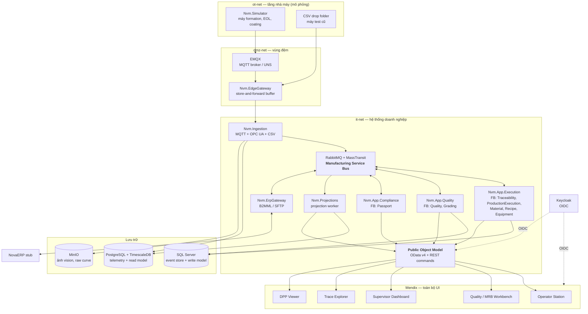
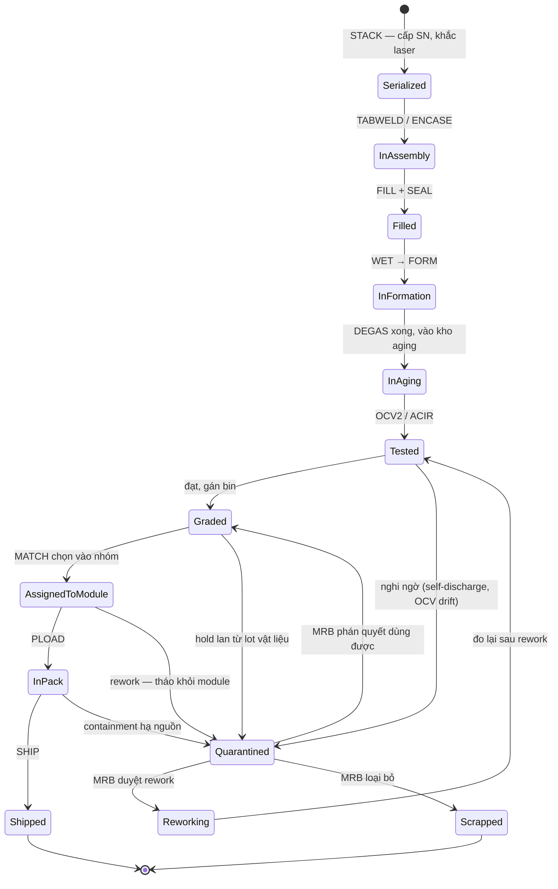
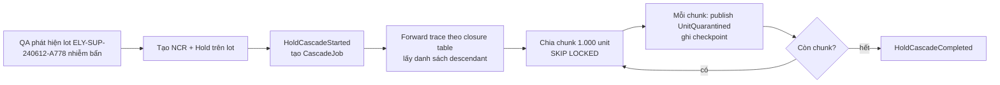
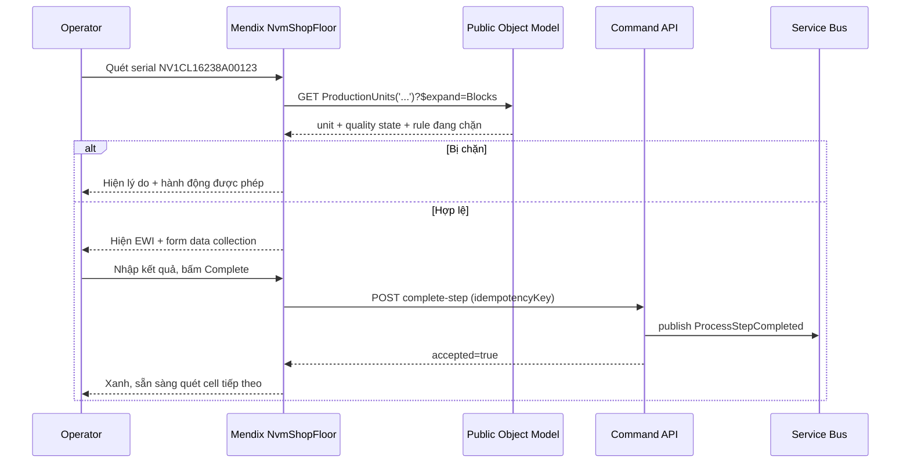
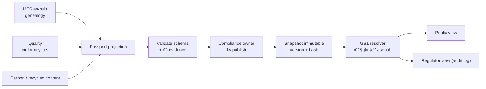

# NovaVolt Battery MES — Scope & Design

> Dự án học tập mô phỏng một hệ thống **MES / Traceability cho nhà máy pin xe điện**.
>
> Ba mục tiêu chồng lên nhau:
> 1. Học **nghiệp vụ ngành pin** đủ sâu để nói chuyện với BA và kỹ sư quy trình.
> 2. Viết **code .NET sát production thực tế** — không phải CRUD demo.
> 3. Học **mô hình phát triển của Siemens Opcenter Execution Foundation** bằng cách tự tay dựng lại nó, và **Mendix** bằng cách làm toàn bộ UI trên đó.

---

## Mục lục

| # | Phần | Nội dung |
|---|---|---|
| 0 | [Cách dùng tài liệu](#0-cách-dùng-tài-liệu-này) | Quy tắc làm việc với scope này |
| 1 | [Mục tiêu & tiêu chí thành công](#1-mục-tiêu--tiêu-chí-thành-công) | Học được gì, đo bằng cách nào |
| 2 | [Bối cảnh nghiệp vụ giả lập](#2-bối-cảnh-nghiệp-vụ-giả-lập--novavolt-gigafactory) | Nhà máy, sản phẩm, con số |
| 3 | [Phạm vi](#3-phạm-vi) | In / out of scope, bounded context |
| 4 | [Yêu cầu phi chức năng](#4-yêu-cầu-phi-chức-năng-slo-đo-được) | SLO đo được |
| 5 | [Kiến trúc hệ thống](#5-kiến-trúc-hệ-thống) | Ánh xạ OEF, deployable, repo, polyglot persistence |
| 6 | [Thiết kế domain](#6-thiết-kế-domain-chi-tiết) | Aggregate, event, state machine, genealogy |
| 7 | [Contract & tích hợp](#7-contract--tích-hợp) | MQTT, CloudEvents/EPCIS, Public Object Model, Mendix, ERP, DPP |
| 8 | [Dữ liệu & schema](#8-dữ-liệu--schema) | DDL SQL Server + PostgreSQL |
| 9 | [Lộ trình milestone](#9-lộ-trình-milestone) | M0 → M13, DoD đo được |
| 10 | [Chiến lược test](#10-chiến-lược-test) | Kim tự tháp test đầy đủ |
| 11 | [Observability & vận hành](#11-observability--vận-hành) | OTel, Grafana, SLO |
| 12 | [CI/CD](#12-cicd--delivery) | Pipeline, migration, package versioning |
| 13 | [Bảo mật](#13-bảo-mật--otit-segregation) | OT/IT, e-signature |
| 14 | [Simulator & seed data](#14-simulator--bộ-dữ-liệu-mẫu) | Bộ sinh dữ liệu |
| 15 | [Rủi ro](#15-rủi-ro--cách-né) | Bẫy đã biết trước |
| 16 | [Câu hỏi cho đồng nghiệp](#16-câu-hỏi-hỏi-đồng-nghiệp--bản-ngôn-ngữ-đời-thường) | **Bản không thuật ngữ** |
| 17 | [Glossary](#17-glossary-vi--en) | Từ điển nghiệp vụ |
| 18 | [Tham khảo](#18-tham-khảo--liên-kết-vault) | Nguồn, liên kết vault |
| A | [Checklist tiến độ](#phụ-lục-a--checklist-tiến-độ) | Bảng theo dõi |

---

## 0. Cách dùng tài liệu này

Đây **không phải** tutorial để đọc một mạch rồi code. Cách dùng đúng:

1. Đọc §1–§5 một lần để nắm bối cảnh, ràng buộc và kiến trúc. Đây là "hợp đồng" — mọi quyết định kỹ thuật sau này phải giải thích được bằng một dòng trong các phần này.
2. Trước mỗi milestone ở §9, đọc lại phần domain (§6) và contract (§7) tương ứng.
3. **Mọi quyết định lệch khỏi tài liệu này phải ghi thành ADR** trong `docs/adr/`. Sau 3 tháng bạn sẽ quên vì sao mình chọn khác — ADR là thứ nhắc lại.
4. Mỗi milestone có mục **Lab phá hoại** — một thí nghiệm cố tình làm hỏng hệ thống. Đừng bỏ qua; đó chính là chỗ tách "biết tên pattern" khỏi "hiểu vì sao có pattern".
5. Mỗi milestone có **Definition of Done đo được**. Không có "cảm thấy xong". Có số, hoặc có test đỏ → xanh.

> [!important] Nguyên tắc xuyên suốt
> Với mỗi pattern (Event Sourcing, CQRS, Outbox, Saga), lộ trình luôn là: **làm cách ngây thơ trước → đo cho nó gãy → mới refactor sang pattern**. Nếu nhảy thẳng vào pattern, bạn học được cú pháp chứ không học được phán đoán. Phán đoán mới là thứ phỏng vấn Solution Architect hỏi.

> [!tip] Ba kịch bản dự án — thiết kế này phục vụ cả ba
> Bạn chưa rõ dự án sắp tới ở FPT là Opcenter-based, .NET custom, hay Mendix low-code. Scope này được xây để **cả ba kịch bản đều dùng được**:
> - Nếu là **Opcenter** → §5.2 (ánh xạ OEF) và §12.4 (package versioning) là phần bạn dùng ngay.
> - Nếu là **.NET custom Factory Digitalization** → §6, §7, §8 là phần bạn dùng ngay.
> - Nếu là **Mendix** → §7.5 (Mendix ↔ Public Object Model) và toàn bộ track UI là phần bạn dùng ngay.
>
> §16 cho bạn bộ câu hỏi để hỏi đồng nghiệp và biết mình rơi vào kịch bản nào.

---

## 1. Mục tiêu & tiêu chí thành công

### 1.1 Mục tiêu nghiệp vụ (domain)

Sau dự án, bạn phải trả lời được các câu sau mà không cần tra cứu:

| # | Câu hỏi | Milestone chứng minh |
|---|---|---|
| D1 | Vì sao electrode trace theo **lot** còn cell trace theo **serial**, và ranh giới nằm ở đâu? | M4 |
| D2 | Vì sao genealogy là **DAG** chứ không phải tree, và rework phá vỡ cây thế nào? | M4, M9 |
| D3 | Formation/aging khác gì một API call, vì sao cần **process manager**? | M7 |
| D4 | Vì sao grading không phải `GROUP BY`, và một cell đạt chuẩn vẫn có thể vô dụng? | M8 |
| D5 | Hold một lot vật liệu thì hạ nguồn bị ảnh hưởng ra sao, ai được release? | M9 |
| D6 | Recipe version có ý nghĩa gì với traceability, thiếu nó thì mất gì? | M10 |
| D7 | Ranh giới ERP ↔ MES ở đâu, tranh cãi thường nằm chỗ nào? | M11 |
| D8 | DPP yêu cầu gì về định danh, phân quyền đa bên và retention? | M12 |
| D9 | Quality state khác Inventory state khác Execution state như thế nào? | M9 |
| D10 | Vì sao "raw evidence" phải bất biến và sửa sai bằng bút toán bù trừ? | M5, M9 |

### 1.2 Mục tiêu kỹ thuật (.NET production-realistic)

| # | Năng lực | Bằng chứng |
|---|---|---|
| T1 | Ingestion at-least-once + idempotency **thật sự đúng** | M2: chạy 1h với 10% duplicate + ngắt mạng → số bản ghi khớp chính xác |
| T2 | Event sourcing có versioning và upcaster | M5: replay event ghi bởi schema v1 sau khi code lên v3 |
| T3 | Transactional outbox không mất, không nhân đôi | M6: kill process giữa commit → không mất message |
| T4 | CQRS với projection rebuild được | M6: xoá read model, rebuild từ event store, kết quả identical |
| T5 | Saga chạy nhiều ngày, test được trong vài giây | M7: `FakeTimeProvider` tua 12 ngày trong 1 test |
| T6 | Thuật toán tối ưu có ràng buộc, đo được | M8: CP-SAT thắng greedy ≥ 8% yield trên 100k cell |
| T7 | Long-running batch không chặn luồng realtime | M9: cascade 3.000 pack trong khi ingestion giữ nguyên throughput |
| T8 | Polyglot persistence có transaction boundary rõ | M5: ghi SQL Server + publish bus không rơi vào dual-write |
| T9 | Observability đầu-cuối xuyên MQTT | M13: một trace span từ message MQTT → domain → projection → Mendix |
| T10 | Graceful degradation | M13: chaos test tắt DB 2 phút, không mất message, tự phục hồi |
| T11 | CI/CD với migration, SBOM, mutation test | M13: pipeline xanh từ commit tới deploy k3d |

### 1.3 Mục tiêu Opcenter (OEF)

| # | Năng lực | Bằng chứng |
|---|---|---|
| O1 | Hiểu **Bus-Centric Design** bằng cách tự dựng Manufacturing Service Bus | M3 |
| O2 | Hiểu **Functional Block**: Entity, Facet, Command, Command Handler | M5 |
| O3 | Hiểu **App** và **Public Object Model** = chính là CQRS read side | M6 |
| O4 | Hiểu **Extension App**: mở rộng không sửa core | M9 (Mendix) |
| O5 | Hiểu **package versioning** và deploy pipeline kiểu Solution Studio | M13 |
| O6 | Hiểu **Multiplant**: site NV1 (VN) và DE1 (Đức) chạy chung solution | M10 |

### 1.4 Mục tiêu Mendix

| # | Năng lực | Bằng chứng |
|---|---|---|
| X1 | Domain model, page, microflow, nanoflow cơ bản | M4 |
| X2 | Consume REST/OData từ backend .NET (đúng pattern Starter Kit: auth → query → command) | M4 |
| X3 | Mendix **Workflow** engine cho quy trình có phê duyệt nhiều cấp (MRB) | M9 |
| X4 | Security: module role, entity access, XPath constraint theo site/ca | M10 |
| X5 | Deploy lên Mendix Cloud free node, ALM qua Team Server | M13 |

### 1.5 Tiêu chí "hoàn thành dự án"

Dự án hoàn thành khi **tất cả** mệnh đề sau đúng:

- [ ] `docker compose up` dựng toàn bộ backend từ máy sạch trong ≤ 5 phút.
- [ ] Mendix app chạy local, đăng nhập được, thao tác được nghiệp vụ đầu-cuối.
- [ ] `make demo` sinh 100.000 cell → 8.000 module → 1.000 pack, dữ liệu nhất quán.
- [ ] Forward trace từ 1 lot vật liệu ra danh sách pack: **p95 < 200 ms**.
- [ ] Ingestion chịu **≥ 5.000 msg/s** duy trì 10 phút, lag < 5 s.
- [ ] Test suite chạy < 10 phút; coverage domain ≥ 85%; mutation score domain ≥ 70%.
- [ ] Có ≥ 18 ADR ghi lại quyết định kiến trúc.
- [ ] Có README cho phép một dev lạ chạy được trong 15 phút.
- [ ] Có một trang `docs/oef-mapping.md` ánh xạ từng khái niệm Opcenter sang thành phần trong repo.

---

## 2. Bối cảnh nghiệp vụ giả lập — NovaVolt Gigafactory

> Toàn bộ tên công ty, sản phẩm, mã số ở đây là **hư cấu**. Con số được chọn để giống thực tế về thứ tự độ lớn, đồng thời chạy được trên một laptop.

### 2.1 Hồ sơ nhà máy

| Thuộc tính | Giá trị |
|---|---|
| Doanh nghiệp | NovaVolt Energy (hư cấu) |
| Site chính | `NV1` — Hải Phòng, Việt Nam, TZ `Asia/Ho_Chi_Minh` (UTC+7, **không DST**) |
| Site phụ | `DE1` — Leipzig, Đức, TZ `Europe/Berlin` (**có DST** — cố ý, xem §2.3) |
| Loại hình | Cell maker **kiêm** pack assembler → có cả process lẫn discrete manufacturing |
| Areas (ISA-95) | `ELECTRODE`, `ASSEMBLY`, `FORMATION`, `AGING`, `MODULE`, `PACK`, `WAREHOUSE` |
| Lines | 2 cell line (`L1`, `L2`), 1 module line (`M1`), 1 pack line (`P1`) |
| Ca kíp | 3 ca/ngày, 7 ngày/tuần |
| Khách hàng | 1 OEM ô tô (xuất EU → **bắt buộc DPP**), 1 khách ESS nội địa |
| Chứng nhận | IATF 16949, ISO 9001; chuẩn bị audit DPP 2027 |

**Phân cấp ISA-95 làm khoá định danh xuyên hệ thống:**

```
Enterprise  NOVAVOLT
└─ Site       NV1
   └─ Area      FORMATION
      └─ Line      F1
         └─ WorkCell  FORM-01
            └─ Equipment  FORM-01-CH-0142     (kênh sạc số 142)
```

Chuỗi này là `equipment_path`, dùng làm: MQTT topic, tên entity, nhãn metric, khoá phân quyền, XPath constraint trong Mendix. **Quyết định một lần, dùng khắp nơi.**

### 2.2 Danh mục sản phẩm & routing

Hai sản phẩm được chọn có chủ đích để **ép data model phải cấu hình được**, không hard-code.

#### Sản phẩm A — `NV-P120-NMC` (prismatic NMC, có tầng module)

| Thuộc tính | Giá trị |
|---|---|
| Cell | Prismatic NMC811, 3,7 V danh định, **120 Ah**, ~444 Wh |
| Module | **12 cell (12S1P)**, ~5,3 kWh |
| Pack | **8 module (96S1P)**, ~355 V, **~42,6 kWh** |
| Genealogy | **3 tầng**: Lot → Cell → Module → Pack |
| Khách | OEM ô tô EU → cần DPP |

#### Sản phẩm B — `NV-C100-LFP-CTP` (prismatic LFP, Cell-to-Pack)

| Thuộc tính | Giá trị |
|---|---|
| Cell | Prismatic LFP, 3,2 V danh định, **100 Ah**, 320 Wh |
| Module | **Không có** — CTP |
| Pack | **104 cell** gắn thẳng vào pack, ~333 V, ~33 kWh |
| Genealogy | **2 tầng**: Lot → Cell → Pack |
| Khách | ESS nội địa → không cần DPP, nhưng cần carbon footprint |

> [!danger] Đây là bẫy thiết kế số 1 của dự án
> Nếu bạn viết `Pack.Modules` và `Module.Cells` như hai bảng cứng, sản phẩm B sẽ phá vỡ model ở M8. Genealogy **phải** là graph tổng quát với `unit_type` cấu hình theo routing của sản phẩm, ngay từ M4.

#### Routing (chuỗi bước công đoạn)

| Step # | Step code | Area | Đơn vị trace | SP |
|---|---|---|---|---|
| 10 | `MIX` | ELECTRODE | Lot (slurry batch) | A, B |
| 20 | `COAT` | ELECTRODE | Lot (roll) + **vị trí mét** | A, B |
| 30 | `DRY` | ELECTRODE | Lot (roll) | A, B |
| 40 | `CAL` | ELECTRODE | Lot (roll) | A, B |
| 50 | `SLIT` | ELECTRODE | Lot (roll con) + **ánh xạ toạ độ** | A, B |
| 60 | `NOTCH` | ELECTRODE | Lot | A, B |
| 70 | `VDRY` | ELECTRODE | Lot + **exposure clock** | A, B |
| 100 | `STACK` | ASSEMBLY | **← Serial ra đời** | A, B |
| 110 | `TABWELD` | ASSEMBLY | Serial | A, B |
| 120 | `ENCASE` | ASSEMBLY | Serial | A, B |
| 130 | `FILL` | ASSEMBLY | Serial | A, B |
| 140 | `SEAL` | ASSEMBLY | Serial | A, B |
| 200 | `WET` | FORMATION | Serial | A, B |
| 210 | `FORM` | FORMATION | Serial + **tray/channel** | A, B |
| 220 | `DEGAS` | FORMATION | Serial | A |
| 230 | `AGE` | AGING | Serial | A, B |
| 240 | `OCV2` | AGING | Serial | A, B |
| 250 | `ACIR` | AGING | Serial | A, B |
| 260 | `GRADE` | AGING | Serial | A, B |
| 300 | `MATCH` | MODULE | Serial → nhóm | A, B |
| 310 | `MLOAD` | MODULE | Serial + **position** | A |
| 320 | `BUSWELD` | MODULE | Serial | A |
| 330 | `MTEST` | MODULE | Serial | A |
| 400 | `PLOAD` | PACK | Serial + **position** | A, B |
| 410 | `BMSFLASH` | PACK | Serial + **firmware hash** | A, B |
| 420 | `LEAK` | PACK | Serial | A, B |
| 430 | `HVTEST` | PACK | Serial | A, B |
| 440 | `EOL` | PACK | Serial | A, B |
| 450 | `SHIP` | WAREHOUSE | Serial | A, B |

Sản phẩm B **bỏ qua** step 300–330, đi thẳng `GRADE` → `PLOAD`. Routing là **dữ liệu**, không phải `switch-case`.

> [!warning] EOL có hai nghĩa — không dùng chung enum
> `EOL` ở step 440 là **End-of-Line** (test cuối chuyền). Cuối vòng đời pin là **End-of-Life**. Trong code dùng `ProductionEol` và `LifecycleEol`, không bao giờ dùng `EOL` trần.

### 2.3 Ca kíp, production day, timezone

| Ca | Giờ bắt đầu (local) | Giờ kết thúc |
|---|---|---|
| `A` | 06:00 | 14:00 |
| `B` | 14:00 | 22:00 |
| `C` | 22:00 | 06:00 (+1 ngày) |

**Định nghĩa `production_day`**: ngày dương lịch (giờ site) mà **ca A của chu kỳ đó bắt đầu**. Ca C từ 22:00 ngày 25/08 tới 06:00 ngày 26/08 thuộc `production_day = 2026-08-25`.

> [!danger] Vì sao có site DE1 với DST
> Ngày chuyển giờ ở Đức, ca C dài 9 tiếng hoặc ngắn 7 tiếng. `SELECT CAST(ts AS date)` sai. `ts AT TIME ZONE 'Europe/Berlin'` cũng chưa đủ nếu bạn tính `production_day` bằng phép trừ 6 giờ. Bài tập bắt buộc ở M3: viết `IProductionCalendar` có test cho **cả hai ngày chuyển giờ** (chủ nhật cuối tháng 3 và cuối tháng 10).

Mọi timestamp lưu DB dùng `datetimeoffset` (SQL Server) / `timestamptz` (PostgreSQL). Mọi timestamp trong code dùng `DateTimeOffset`, **không bao giờ** `DateTime`. Ràng buộc này ép bằng architecture test (§10.3).

### 2.4 Con số vận hành: thực tế vs quy mô lab

Bảng quan trọng nhất để hiệu chỉnh kỳ vọng — cột trái là "nói với BA", cột phải là "phải chạy được trên laptop của bạn".

| Chỉ số | Nhà máy thật (thứ tự độ lớn) | Mục tiêu lab (bắt buộc đạt) |
|---|---|---|
| Sản lượng cell | 6.000 cell/ngày (2 line) | Simulator sinh 6.000 cell/ngày ở tốc độ nén 100× |
| Takt cell assembly | 20 s/cell/line | Không mô phỏng vật lý, chỉ giữ đúng thứ tự sự kiện |
| Sản lượng pack | 60 pack/ngày | 1.000 pack trong bộ demo |
| Telemetry coating | ~10.000 điểm/phút/line | 500 signal @ 1 Hz = 500 msg/s |
| Telemetry formation | 3.000 kênh @ 1 Hz | 1.000 kênh @ 1 Hz |
| **Peak ingestion** | ~15.000 msg/s | **≥ 5.000 msg/s duy trì 10 phút** |
| Thời gian formation | 36 giờ | 36 "giờ ảo" = 36 giây thực (compressed clock) |
| Thời gian aging | 10 ngày | 10 "ngày ảo" |
| WIP trong aging | ~60.000 cell | 30.000 cell |
| Cell trong DB (demo) | hàng trăm triệu | **100.000 cell / 8.000 module / 1.000 pack** |
| Retention traceability | 10–15 năm | Event store vĩnh viễn; telemetry thô 400 ngày, rollup 1 phút giữ lâu |
| Forward trace (recall) | < 1 phút là yêu cầu hợp đồng | **p95 < 200 ms** trên bộ 100k |

> [!tip] Compressed clock — kỹ thuật xuyên suốt
> Simulator và saga dùng chung một `TimeProvider` có hệ số nén cấu hình (`SimulationSpeed=100`). Ở test dùng `FakeTimeProvider` (`Microsoft.Extensions.TimeProvider.Testing`). Ở production dùng `TimeProvider.System`. Đây là lý do §10 **cấm tuyệt đối** `DateTime.UtcNow` trong code domain.

### 2.5 Trả lời sẵn bộ câu hỏi BA

Để scope này **không mơ hồ**, toàn bộ câu hỏi mở đã được chốt sẵn:

**Phạm vi**
- Nhà máy làm **cả cell lẫn pack**.
- 6.000 cell/ngày, 60 pack/ngày. Takt cell 20 s, takt pack 20 phút.
- 2 cell line, 1 module line, 1 pack line. **2 sản phẩm** (một có module, một CTP).

**Định danh & truy vết**
- Electrode: trace theo **lot + khoảng mét trên cuộn**, độ phân giải 1 mét. Cell trở đi: **serial**.
- Quy tắc serial do **NovaVolt sở hữu**, 16 ký tự cố định (§6.1).
- Forward trace khi recall: **p95 < 200 ms**, hard limit 2 s.
- Retention: event store & genealogy **15 năm**; telemetry thô **400 ngày**, rollup 1 phút **15 năm**.

**Tích hợp**
- ERP: hệ thống giả lập `NovaERP`, **B2MML XML trên SFTP** (chiều xuống) + **REST** (chiều lên).
- Thiết bị: **MQTT Sparkplug B** (formation, EOL), **OPC UA** (coating — qua adapter), **CSV drop** (một máy test cũ — cố ý, để học integration bẩn).
- Historian: chưa có, dự án tự dựng TimescaleDB.
- Unified Namespace: **dự án phải dựng** (EMQX).
- OT/IT: 3 vùng mạng docker `ot-net` / `dmz-net` / `it-net`; service IT **không có route** tới `ot-net` (§13).

**Chất lượng & ngoại lệ**
- Hold: `LineLeader` được hold; **release cần 2 chữ ký** (`QaEngineer` + `QaManager`).
- Rework tháo cell khỏi module: **có**, ~0,5% module.
- Tiêu chí grading/matching: **khách hàng tự cấu hình** → rule engine, không phải hàm.
- Khi MES down: dây chuyền **vẫn chạy**, edge gateway buffer, MES nhận bù sau.

**Compliance**
- Xuất EU: **có** (sản phẩm A) → cần DPP.
- IATF 16949: **có**.
- Electronic signature cho MRB và recipe approval: **bắt buộc**.

---

## 3. Phạm vi

### 3.1 In scope

| Nhóm | Nội dung |
|---|---|
| **Ingestion** | MQTT Sparkplug B, OPC UA adapter (giả lập), CSV file drop, idempotency, store-and-forward |
| **Telemetry** | TimescaleDB hypertable, compression, continuous aggregate, retention policy |
| **Domain core** | Event-sourced `ProductionUnit`, `MaterialLot`, `WorkOrder`, `QualityHold`, `RecipeVersion` |
| **Genealogy** | DAG append-only, backward/forward trace, roll-position interval, rework unlink |
| **CQRS** | Outbox, MassTransit, projection worker, closure table read model, rebuild |
| **Saga** | Formation & Aging process manager, timeout tính bằng ngày |
| **Grading** | Rule engine cấu hình được, binning theo capacity/OCV/DCIR |
| **Matching** | Bài toán tổ hợp có ràng buộc: greedy baseline + OR-Tools CP-SAT |
| **Quality** | SPC (X̄-R chart, Cpk), defect code, NCR, MRB workflow, hold cascade, e-signature |
| **Material** | Shelf life, exposure time limit, FIFO, consumption/backflush |
| **Equipment** | OEE, downtime với lý do, quy tắc micro-stop |
| **ERP** | B2MML production order → work order, báo tiến độ, **master data reconciliation** |
| **DPP** | GS1 Digital Link resolver, passport API, phân quyền đa bên, snapshot immutable |
| **OEF mapping** | Manufacturing Service Bus, Functional Block, App, Public Object Model, Extension App, package versioning, multiplant |
| **UI (100% Mendix)** | Operator Station, Quality/MRB Workbench, Supervisor Dashboard, Trace Explorer, DPP Viewer |
| **Ops** | OpenTelemetry, Grafana, health check, graceful degradation, chaos test |
| **Delivery** | GitHub Actions CI, migration, SBOM, container scan, deploy k3d + Helm, Mendix Team Server |

### 3.2 Out of scope (cố ý)

| Không làm | Vì sao |
|---|---|
| Hoá học vật liệu, mô phỏng vật lý pin | Không phục vụ mục tiêu học code |
| PLC thật, OPC UA server thật | Dùng simulator; OPC UA chỉ làm adapter interface |
| Cài đặt Opcenter thật | Không có license — thay bằng lớp ánh xạ tự dựng (§5.2) |
| Blazor / React | Đã chốt: **toàn bộ UI bằng Mendix** |
| Multi-tenant SaaS | Một enterprise, hai site là đủ để học multiplant |
| ML dự đoán chất lượng | Có thể là dự án sau; giữ scope này về data engineering |
| Kubernetes production-grade (HA, service mesh) | Chỉ deploy k3d để chứng minh pipeline |
| Xác thực DPP theo chuẩn EU chính thức | Chuẩn chưa chốt hoàn toàn; làm theo tinh thần Regulation (EU) 2023/1542 |

### 3.3 Bounded context & mức đầu tư

Không phải context nào cũng đáng đầu tư ngang nhau. Bảng này quyết định bạn tiêu công sức ở đâu.

| Context | Loại | Đầu tư | Kỹ thuật | Nơi ở |
|---|---|---|---|---|
| **Traceability & Genealogy** | Core | ★★★★★ | Event sourcing, DAG, closure table, CQRS | .NET |
| **Production Execution** | Core | ★★★★☆ | Event sourcing, state machine, saga | .NET |
| **Quality** | Core | ★★★★☆ | State machine, workflow, SPC, e-signature | .NET + Mendix Workflow |
| **Grading & Matching** | Core | ★★★★☆ | Rule engine, CP-SAT optimization | .NET |
| **Material & WIP** | Supporting | ★★★☆☆ | EF Core + invariant, shelf-life | .NET |
| **Recipe & Master Data** | Supporting | ★★★☆☆ | EF Core, versioning, effectivity, approval | .NET + Mendix |
| **Equipment** | Supporting | ★★☆☆☆ | EF Core + Timescale aggregate | .NET |
| **Compliance / DPP** | Generic | ★★★☆☆ | Read-only API, authz đa bên, snapshot | .NET + Mendix |
| **Identity & Shift** | Generic | ★★☆☆☆ | Keycloak OIDC, policy-based authz | Keycloak + Mendix |
| **Analytics** | Generic | ★★☆☆☆ | Grafana + continuous aggregate | Grafana |

> [!tip] Traceability hay Production Execution mới là core?
> Traceability là lý do hệ thống tồn tại và là thứ bị audit. Production Execution phần lớn là **điều phối** — quan trọng nhưng thay thế được. Đầu tư event sourcing đầy đủ cho Traceability; Production Execution ở mức vừa; Equipment/Material dùng CRUD là hợp lý. **Đừng event-source tất cả.**

---

## 4. Yêu cầu phi chức năng (SLO đo được)

Không có "nhanh", "ổn định", "realtime". Chỉ có số. Mỗi dòng phải có một test chứng minh.

| ID | Yêu cầu | Ngưỡng | Đo bằng | Milestone |
|---|---|---|---|---|
| N1 | Ingestion throughput | ≥ 5.000 msg/s duy trì 10 phút | Load harness MQTT | M2 |
| N2 | Ingestion lag (device → DB) | p95 < 5 s ở tải N1 | Metric `ingest.lag` | M2 |
| N3 | Không mất message khi MES down | 0 message mất sau outage 2 phút | Chaos test | M13 |
| N4 | Idempotency | 0 bản ghi thừa với 10% duplicate | Reconciliation test | M2 |
| N5 | Command API latency | p95 < 300 ms, p99 < 800 ms | k6 | M6 |
| N6 | Forward trace (recall) | **p95 < 200 ms**, max < 2 s trên 100k cell | k6 + closure table | M6 |
| N7 | Backward trace | p95 < 150 ms | k6 | M6 |
| N8 | Projection lag | p95 < 3 s sau khi event commit | Metric `projection.lag` | M6 |
| N9 | Hold cascade | 3.000 pack trong < 60 s, **không làm N1 giảm quá 10%** | Load + cascade đồng thời | M9 |
| N10 | Matching algorithm | 100k cell → kết quả < 30 s | Benchmark | M8 |
| N11 | Projection rebuild | Rebuild toàn bộ read model từ event store < 10 phút | Rebuild test | M6 |
| N12 | Mendix page load | p95 < 1,5 s trên màn hình Operator Station | Mendix trace + browser | M4 |
| N13 | Startup | Toàn hệ thống từ `docker compose up` → healthy < 5 phút | Health check loop | M1 |
| N14 | Test suite | Toàn bộ < 10 phút | CI timing | M13 |
| N15 | Availability của dây chuyền | **MES down không được làm dừng dây chuyền** | Simulator vẫn chạy khi backend tắt | M2 |

> [!danger] N15 là ràng buộc cứng nhất, và nó quyết định kiến trúc
> Nếu MES chết, dây chuyền **vẫn phải chạy**. Nghĩa là **mọi** lời gọi từ tầng thiết bị lên là **fire-and-forget có buffer**, không bao giờ synchronous blocking. Edge gateway store-and-forward khi mất kết nối, và hệ thống phải nuốt được trận lũ dữ liệu tồn đọng khi mạng có lại.
>
> Hệ quả trực tiếp lên code: `Nvm.Ingestion` **không được** gọi `Nvm.App.Execution` bằng HTTP đồng bộ. Nó chỉ ghi vào bus. Đây là lý do có Manufacturing Service Bus, không phải vì "microservice cho hiện đại".

### 4.1 Định nghĩa "realtime" trong dự án này

Từ "realtime" bị lạm dụng. Trong scope này nó có ba nghĩa khác nhau, và ba nghĩa này là ba kiến trúc:

| Loại | Độ trễ chấp nhận | Cơ chế | Ví dụ |
|---|---|---|---|
| **Interlock** (chặn thao tác sai) | < 300 ms | Command API đồng bộ | Scan cell chưa release → chặn ngay |
| **Live monitoring** | 1–5 s | Bus → projection → Mendix polling/SSE | Bảng WIP, andon |
| **Reporting** | 1–15 phút | Continuous aggregate | OEE, yield theo ca |

Khi ai đó nói "cần realtime", câu hỏi tiếp theo luôn là: **"realtime là mấy giây?"**

---

## 5. Kiến trúc hệ thống

### 5.1 Sơ đồ tổng thể



### 5.2 Ánh xạ Opcenter Execution Foundation → thành phần trong repo

**Đây là phần giá trị nhất của tài liệu này với bạn.** Mỗi bài trong course "Opcenter Essentials for Developers" có một thứ tương ứng để tự tay dựng.

| Khái niệm OEF | Bài trong course | Thành phần trong dự án | File / thư mục |
|---|---|---|---|
| **Bus-Centric Design** | 1. Key Design Principles | RabbitMQ + MassTransit, mọi giao tiếp liên-FB đi qua bus | `src/Platform/Nvm.Bus/` |
| **Manufacturing Service Bus** | 1, 6. RabbitMQ Configuration | Topology exchange/queue, retry, DLQ, delayed message | `src/Platform/Nvm.Bus/Topology/` |
| **SOA layers** | 1 | Horizontal (Platform) + vertical (Functional Block) | `src/Platform/` vs `src/FunctionalBlocks/` |
| **Event-Driven Architecture** | 1 | CloudEvents envelope + domain event trên bus | `src/Platform/Nvm.Contracts/` |
| **Domain-Driven Design / bounded context** | 1, 17. Domain within OEF | Mỗi Functional Block = một bounded context có schema DB riêng | `src/FunctionalBlocks/<Name>/` |
| **Functional Block** | 9. Functional Block Artifacts | Class library có `Entities/`, `Commands/`, `Handlers/`, `Facets/`, `Events/`, `Migrations/` | `src/FunctionalBlocks/Traceability/` |
| **Entity** | 9, 18–19 | Aggregate root / entity trong FB | `.../Entities/ProductionUnit.cs` |
| **Facet** (mở rộng entity) | 18–19 | Bảng mở rộng + interface `IFacetOf<TEntity>`, FB khác đóng góp field mà không sửa FB gốc | `.../Facets/` |
| **Command / Extended Command** | 18–19 | `record XxxCommand : ICommand`, extended command là command bổ sung do FB khác đăng ký | `.../Commands/` |
| **Command Handler** | 18–19 | `ICommandHandler<TCommand>` + pipeline behavior (validation, idempotency, audit) | `.../Handlers/` |
| **App** | 10. App and Extension App Artifacts | Một host ASP.NET Core gom nhiều FB + expose Public Object Model | `src/Apps/Nvm.App.Execution/` |
| **Public Object Model** | 10 | **Chính là CQRS read side**: OData v4 endpoint trên read model Postgres | `src/Apps/*/PublicObjectModel/` |
| **Extension App** | 11, 21. Extension App Development | App Mendix mở rộng UI + gọi command; và `Nvm.App.Compliance` mở rộng nghiệp vụ | `mendix/`, `src/Apps/Nvm.App.Compliance/` |
| **UI Component** | 20. App Development Process | Mendix page/snippet dùng lại giữa nhiều app | `mendix/NvmShared/` |
| **Project Studio** (add-in Visual Studio) | 13. Project Studio Overview | `dotnet new` template + Roslyn analyzer ép quy ước FB | `tools/templates/`, `tools/analyzers/` |
| **Solution Studio** (web app) | 14. Solution Studio Overview | CLI + manifest `solution.yaml` compose các App, sinh docker-compose và Helm values | `tools/solution-cli/` |
| **Package Versioning** | 15. Package Versioning | SemVer cho từng FB, `PackageReference` nội bộ, compatibility matrix | `docs/package-versioning.md` |
| **Manufacturing Solution** | 8. Manufacturing Solution Structure | Toàn bộ repo = một manufacturing solution | `solution.yaml` |
| **Multiplant Management** | 7. Multiplant Management | `SiteId` là first-class trong mọi entity, event, query, và trong Mendix XPath | §5.6 |
| **Factory Model** | 3. System Architecture | Cây ISA-95 `Enterprise/Site/Area/Line/WorkCell/Equipment` | `src/FunctionalBlocks/FactoryModel/` |
| **Technology Stack** | 4. Technology Stack | .NET 10, SQL Server, RabbitMQ, OData — cố ý bám sát stack Opcenter thật | §5.5 |
| **Scalability / dev modes** | 5. Scalability and Development Modes | Chạy monolith (dev) hoặc tách process (prod) qua cùng `solution.yaml` | §5.4 |

> [!important] Vì sao tự dựng lại có ích hơn là chỉ đọc tài liệu Opcenter
> Bạn không có license Opcenter. Nhưng khi tự tay viết `ICommandHandler` với pipeline idempotency, tự viết Facet để một FB mở rộng entity của FB khác, tự viết OData read model — thì lúc mở Project Studio thật lần đầu, bạn sẽ nhận ra ngay **cái nút này để làm gì**. Đó là khác biệt giữa "học sản phẩm" và "hiểu sản phẩm".
>
> Ngược lại nếu dự án hoá ra không dùng Opcenter, những thứ bạn viết vẫn là kiến trúc .NET tử tế, mang đi đâu cũng dùng được.

### 5.3 Danh sách deployable

| Deployable | Loại | Trách nhiệm | Ánh xạ OEF |
|---|---|---|---|
| `Nvm.Simulator` | Console | Giả lập máy: formation cycler, EOL tester, coating line, CSV drop | (không có — công cụ test) |
| `Nvm.EdgeGateway` | Worker | Buffer store-and-forward, gán `gateway_timestamp`, decode Sparkplug B | Edge connector |
| `Nvm.Ingestion` | Worker | Dedup, normalize, ghi telemetry, publish canonical event | Automation Gateway |
| `Nvm.App.Execution` | Web API | Host FB: FactoryModel, Traceability, ProductionExecution, Material, Recipe, Equipment. Expose POM | **App** |
| `Nvm.App.Quality` | Web API | Host FB: Quality, Grading, Matching. Expose POM | **App** |
| `Nvm.App.Compliance` | Web API | Host FB: Passport. Expose POM công khai + authz đa bên | **Extension App** |
| `Nvm.Projections` | Worker | Xây read model từ event stream | (projection engine) |
| `Nvm.ErpGateway` | Worker | B2MML in/out qua SFTP, REST lên ERP, master data reconciliation | **Connect MOM** |
| `mendix/NvmShopFloor` | Mendix app | Operator Station + Supervisor Dashboard | **Extension App** |
| `mendix/NvmQuality` | Mendix app | Quality / MRB Workbench (Mendix Workflow) | **Extension App** |
| `mendix/NvmTrace` | Mendix app | Trace Explorer + DPP Viewer | **Extension App** |

> [!tip] Dev mode vs Prod mode (bài 5 của course)
> Ở dev, tất cả App chạy chung một process (`Nvm.Host.All`) để debug dễ. Ở "prod" (k3d), tách thành các container riêng. **Cùng một code**, chỉ khác `solution.yaml` — đây chính là "Scalability and Development Modes" của OEF. Đừng viết hai bản code.

### 5.4 Cấu trúc repo

```
novavolt-mes/
├─ solution.yaml                      # Manifest: App nào gồm FB nào, chạy mode gì
├─ Directory.Build.props              # LangVersion, Nullable, TreatWarningsAsErrors
├─ Directory.Packages.props           # Central Package Management
├─ docker-compose.yml                 # Hạ tầng + 3 network OT/DMZ/IT
├─ Makefile                           # make up / demo / test / load / rebuild
│
├─ src/
│  ├─ Platform/                       # ── Horizontal layers (SOA) ──
│  │  ├─ Nvm.Contracts/               # CloudEvents envelope, event schema v1..vN, upcaster
│  │  ├─ Nvm.Bus/                     # MassTransit config, topology, outbox, DLQ
│  │  ├─ Nvm.EventStore/              # Event store trên SQL Server, optimistic concurrency
│  │  ├─ Nvm.Kernel/                  # ICommand, ICommandHandler, IFacetOf, pipeline behaviors
│  │  ├─ Nvm.Time/                    # TimeProvider, IProductionCalendar, shift/DST
│  │  └─ Nvm.PublicObjectModel/       # OData host, convention, authz
│  │
│  ├─ FunctionalBlocks/               # ── Vertical layers (bounded contexts) ──
│  │  ├─ FactoryModel/
│  │  ├─ Traceability/                # ★ core
│  │  ├─ ProductionExecution/         # ★ core
│  │  ├─ Quality/                     # ★ core
│  │  ├─ Grading/                     # ★ core
│  │  ├─ Material/
│  │  ├─ Recipe/
│  │  ├─ Equipment/
│  │  └─ Passport/
│  │
│  ├─ Apps/
│  │  ├─ Nvm.App.Execution/
│  │  ├─ Nvm.App.Quality/
│  │  ├─ Nvm.App.Compliance/
│  │  └─ Nvm.Host.All/                # dev mode: gom hết vào một process
│  │
│  └─ Workers/
│     ├─ Nvm.Ingestion/
│     ├─ Nvm.EdgeGateway/
│     ├─ Nvm.Projections/
│     ├─ Nvm.ErpGateway/
│     └─ Nvm.Simulator/
│
├─ mendix/
│  ├─ NvmShopFloor/                   # .mpr + Team Server
│  ├─ NvmQuality/
│  ├─ NvmTrace/
│  └─ NvmShared/                      # module dùng chung: auth, POM connector, UI building block
│
├─ tests/
│  ├─ Unit/                           # domain, không I/O
│  ├─ Architecture/                   # NetArchTest: ép quy ước
│  ├─ Integration/                    # Testcontainers: SQL Server, PG, RabbitMQ, EMQX, MinIO
│  ├─ Contract/                       # golden file cho event schema + OData shape
│  ├─ Load/                           # k6 + NBomber
│  └─ Chaos/                          # Toxiproxy
│
├─ tools/
│  ├─ templates/                      # dotnet new nvm-fb, nvm-app  (≈ Project Studio)
│  ├─ analyzers/                      # Roslyn: cấm DateTime.UtcNow, ép naming
│  └─ solution-cli/                   # compose solution.yaml → compose/Helm  (≈ Solution Studio)
│
├─ deploy/
│  ├─ helm/
│  └─ k3d/
│
└─ docs/
   ├─ adr/                            # ≥ 18 ADR
   ├─ oef-mapping.md                  # bảng §5.2, cập nhật liên tục
   ├─ event-catalog.md
   ├─ package-versioning.md
   └─ runbook.md
```

### 5.5 Polyglot persistence — dữ liệu nào ở đâu, và vì sao

Bạn đã chọn **SQL Server cho nghiệp vụ (giống Opcenter thật) + PostgreSQL/TimescaleDB cho telemetry và read model**. Đây là bảng quyết định, và mỗi dòng phải giải thích được:

| Loại dữ liệu | Ví dụ | Store | Vì sao |
|---|---|---|---|
| **Event store** | `ProductionUnitSerialized`, `UnitGraded` | **SQL Server** | Cần transaction với write model, cần audit, giống Opcenter thật. `REVOKE UPDATE, DELETE` để ép immutability |
| **Write model / master data** | Recipe, Material lot, Equipment, Factory model | **SQL Server** | EF Core, quan hệ chặt, invariant cần transaction |
| **Outbox** | Message chờ publish | **SQL Server** | Phải cùng transaction với event store — đây là lý do outbox tồn tại |
| **Telemetry** | Nhiệt độ máy sấy mỗi 100 ms, đường cong formation | **TimescaleDB** | Volume lớn, ghi nhiều đọc ít, cần compression + downsampling + retention policy |
| **Read model** | Closure table, WIP board, OEE, dashboard | **PostgreSQL** | Đọc nặng, tách khỏi write để không tranh chấp; JSONB tiện cho projection linh hoạt |
| **Genealogy closure** | Bảng đóng cho forward trace | **PostgreSQL** | Cần index GiST cho khoảng mét trên cuộn, `numrange` + exclusion constraint |
| **Binary** | Ảnh vision, raw curve CSV, log máy | **MinIO** | Chỉ lưu key + SHA-256 trong DB. **Không bao giờ** blob trong DB giao dịch |

> [!danger] Bẫy dual-write
> Ghi SQL Server rồi publish RabbitMQ là **hai hệ thống**. Nếu process chết giữa chừng → mất message hoặc mất dữ liệu. Giải: **transactional outbox** — ghi event + ghi outbox row trong **cùng một transaction SQL Server**, worker riêng đọc outbox và publish. Đây là nội dung M6, và là lý do `Nvm.Bus` có thư mục `Outbox/`.
>
> Tương tự: **projection ghi PostgreSQL không cùng transaction với SQL Server**. Nên projection phải **idempotent** và có checkpoint — nghĩa là replay được. Đây là ràng buộc thật của polyglot persistence, không phải chi tiết vặt.

**Ranh giới rõ ràng — quy tắc để không lẫn:**

> Nếu nó **thay đổi trạng thái nghiệp vụ của một đơn vị sản phẩm** → **domain event** → SQL Server.
> Nếu nó chỉ là **quan trắc liên tục** → **telemetry** → TimescaleDB.
>
> "OCV của cell X lúc T là 3,72 V" → **cả hai**: event `MeasurementRecorded` (giá trị đã đánh giá) ở SQL Server, đường cong thô ở TimescaleDB + MinIO.

### 5.6 Multiplant — `SiteId` là first-class

Bài 7 của course. Trong dự án này, `SiteId` xuất hiện ở:

- Mọi entity: cột `SiteId NOT NULL`, index đầu tiên trong mọi composite index.
- Mọi event: field `siteId` trong CloudEvents `data`, và trong routing key `nvm.NV1.traceability.unit-serialized.v1`.
- Mọi OData query: filter bắt buộc, ép ở tầng authz — không phải để client tự nhớ.
- Mendix: entity access XPath `[SiteId = '[%CurrentUser%]/Site/Code']`.
- Production calendar: mỗi site có timezone và shift pattern riêng (§2.3).
- Serial number: ký tự đầu mã hoá site (§6.1).

> [!warning] Test bắt buộc ở M10
> Một integration test tạo dữ liệu ở NV1 và DE1, đăng nhập bằng user chỉ thuộc NV1, và assert rằng **mọi** endpoint đều không trả về dữ liệu DE1 — kể cả trace, dashboard, và DPP. Rò rỉ cross-site là lỗi bảo mật, không phải bug hiển thị.

### 5.7 Quy ước code & ADR

**Quy ước bắt buộc** (ép bằng analyzer + architecture test, không phải bằng code review):

| Quy ước | Ép bằng |
|---|---|
| Cấm `DateTime.Now` / `DateTime.UtcNow` — dùng `TimeProvider` | Roslyn analyzer `NVM001` |
| Cấm `DateTime` trong entity/event — dùng `DateTimeOffset` | Analyzer `NVM002` |
| Functional Block không được reference FB khác trực tiếp (chỉ qua Contracts + bus) | NetArchTest |
| Domain layer không reference EF Core / Npgsql / MassTransit | NetArchTest |
| Event type phải có `[EventVersion(n)]` | Analyzer `NVM003` |
| Mọi command handler phải idempotent (có `IdempotencyKey`) | Test convention |
| Mọi bảng có `SiteId` | Migration test |

**ADR** — tối thiểu 18 bản, ghi ngay khi quyết định, không ghi hồi tố. Danh sách gợi ý:

`ADR-001` Vì sao SQL Server cho event store · `ADR-002` Vì sao PostgreSQL cho read model · `ADR-003` Hand-rolled event store thay vì Marten · `ADR-004` RabbitMQ thay vì Kafka · `ADR-005` Genealogy là DAG có thời gian · `ADR-006` Closure table thay vì recursive CTE · `ADR-007` Định dạng serial number · `ADR-008` CloudEvents envelope · `ADR-009` Ngữ nghĩa EPCIS cho genealogy edge · `ADR-010` Idempotency key = UUIDv5 từ natural key · `ADR-011` Ba loại timestamp · `ADR-012` Production day & shift · `ADR-013` OData cho Public Object Model · `ADR-014` Mendix là lớp UI duy nhất · `ADR-015` Saga dùng Quartz store thay vì delayed exchange · `ADR-016` OR-Tools CP-SAT cho matching · `ADR-017` Hold cascade là job có checkpoint · `ADR-018` Package versioning theo FB.

---

## 6. Thiết kế domain chi tiết

### 6.1 Chiến lược định danh

Định danh phải quyết **trước dòng code đầu tiên**. Đổi sau là đổi cả dữ liệu lịch sử.

#### Serial number của cell / module / pack

Mã phải **khắc laser được** và **đọc lại bằng camera được** → không dùng GUID hiển thị.

```
NV1 C L1 6 238 A 00123
│   │ │  │ │   │ │
│   │ │  │ │   │ └─ 5 chữ số: số thứ tự trong ca (00001–99999)
│   │ │  │ │   └─── 1 ký tự: ca (A/B/C)
│   │ │  │ └─────── 3 chữ số: ngày trong năm (001–366)
│   │ │  └────────── 1 chữ số: chữ số cuối của năm (6 = 2026)
│   │ └───────────── 2 ký tự: line (L1, L2, M1, P1)
│   └─────────────── 1 ký tự: loại unit (C=cell, M=module, P=pack)
└─────────────────── 3 ký tự: site (NV1, DE1)
```

Tổng **16 ký tự**, chỉ chữ hoa và số → khắc Data Matrix hoặc Code128 đều được.

**Sức chứa**: 99.999 unit/ca/line. Với 6.000 cell/ngày chia 3 ca 2 line → 1.000/ca/line. Dư 100 lần. Ghi con số này vào ADR-007, vì câu hỏi "mã có đủ dùng 10 năm không" chắc chắn sẽ được hỏi.

> [!danger] Serial number KHÔNG unique tuyệt đối trong thực tế
> Máy khắc lỗi, cell bị khắc đè, cell rớt sàn rồi nhặt lên khắc lại. Nếu bạn đặt `UNIQUE` cứng rồi để service crash, dây chuyền dừng — vi phạm N15.
>
> **Thiết kế đúng**: `UNIQUE` ở DB **có**, nhưng handler bắt `UniqueConstraintViolation` và chuyển sang luồng nghiệp vụ `DuplicateSerialDetected` → tạo `QualityHold` + ghi audit + **trả về 202 Accepted cho thiết bị**, không trả 500. Bài tập ở M5.

#### Lot code

```
SLU-NV1-260825-MX2-07     Slurry batch: site, ngày, mixer, số mẻ
ROL-NV1-260825-CT1-004    Coated roll: site, ngày, coater, số cuộn
SLT-NV1-260825-CT1-004-B  Daughter roll sau slitting: thêm hậu tố vị trí
ELE-NV1-260826-NT1-0912   Electrode piece lot
ELY-SUP-240612-A778       Electrolyte lot (mã của nhà cung cấp, cố ý khác format)
```

> [!warning] Lot của nhà cung cấp có format khác — đây là thực tế, không phải lỗi
> `ELY-SUP-240612-A778` không theo quy tắc của bạn vì nó do nhà cung cấp đặt. Data model phải chấp nhận `LotCode` là string tự do có `Namespace`. Đây là mầm của bài toán master data reconciliation ở M11.

#### GS1 Digital Link cho DPP

Passport dùng chuẩn quốc tế, không dùng ID nội bộ:

```
https://dpp.novavolt.example/01/09506000134352/21/NV1P16238A00042
                                │                 │
                                │                 └─ AI 21 = serial number
                                └─────────────────── AI 01 = GTIN-14 của model pin
```

Tách bạch **`BatteryModel`** (GTIN, dùng chung cho hàng nghìn pack) và **`BatteryInstance`** (serial, một pack). Rất nhiều dữ liệu passport (carbon footprint, thành phần vật liệu) gắn ở **model + plant + year**, không phải instance.

#### Identity alias

Cùng một thứ có nhiều mã ở nhiều hệ thống. Bảng `IdentityAlias` là bắt buộc, không phải tuỳ chọn:

| `namespace` | `code` | `canonical_id` |
|---|---|---|
| `MES` | `NV1CL16238A00123` | `unit:cell:01J8X...` |
| `ERP.MATERIAL` | `MAT-0009812` | `material:nmc811-cathode` |
| `ERP.MATERIAL` | `9812` | `material:nmc811-cathode` |
| `SCADA.TAG` | `CT1_COATER_01` | `equip:NOVAVOLT/NV1/ELECTRODE/E1/COAT-01` |
| `SUPPLIER.LOT` | `A778` | `lot:ELY-SUP-240612-A778` |

Hai dòng `ERP.MATERIAL` khác nhau trỏ cùng một thứ — đó chính là bẫy "master data bẩn hơn bạn tưởng".

### 6.2 Aggregate và invariant

| Aggregate | Invariant chính | Ghi chú |
|---|---|---|
| `ProductionUnit` (cell/module/pack) | Chỉ sang bước N khi hoàn tất N−1 theo routing; unit đã `Scrapped` không xử lý tiếp; unit đang `Quarantined` không được consume | **Aggregate root của phần lớn nghiệp vụ**. Event-sourced |
| `MaterialLot` | Không tiêu hao quá số còn lại; không dùng lot hết hạn / đang hold / quá exposure time | Boundary theo lot, không theo kho |
| `WorkOrder` | Số đã sản xuất không vượt số lệnh quá dung sai (mặc định +2%) | Liên kết ERP |
| `QualityHold` | Không release nếu chưa đủ chữ ký; người hold không được tự release | Phân quyền theo cấp + e-signature |
| `GenealogyLink` | **Append-only tuyệt đối** — không UPDATE, không DELETE | Gỡ liên kết = set `unlinked_at`, không xoá dòng |
| `RecipeVersion` | Chỉ một version `Active` tại một thời điểm cho mỗi (equipment, product); immutable sau approve | Approve cần e-signature |
| `FormationSaga` | Một cell chỉ có một saga instance đang chạy | Correlation theo `UnitId` |
| `CascadeJob` | Resume được từ checkpoint; chạy hai lần cho kết quả như chạy một lần | Idempotent batch |

> [!danger] Sai lầm thiết kế phổ biến nhất
> Gom cả pack, module và cell vào **một aggregate**. Nghe hợp lý vì chúng là quan hệ cha–con. Nhưng một pack chứa tới 104 cell, và mỗi phép đo trên một cell sẽ phải load toàn bộ pack, giữ lock, và tuần tự hoá mọi thao tác trên dây chuyền.
>
> **Đúng**: mỗi unit là **một aggregate riêng**; quan hệ giữa chúng là **liên kết bằng ID**, thể hiện bởi các `GenealogyLink` riêng biệt.
>
> **Lab phá hoại M5**: cố tình làm sai (một aggregate cho cả pack), chạy load test, xem p99 nổ như thế nào, rồi mới refactor. Ghi số liệu vào ADR.

#### Ba loại state — không được nhập làm một enum

Đây là điểm mà rất nhiều hệ thống MES tự viết làm sai:

| Loại state | Ai sở hữu | Ví dụ giá trị | Ghi chú |
|---|---|---|---|
| **Execution state** | Production Execution | `Scheduled`, `Running`, `Completed`, `Aborted` | Của *operation*, không phải của unit |
| **Quality state** | Quality | `Pending`, `Released`, `Held`, `Rework`, `Scrapped` | **Độc lập với vị trí vật lý** |
| **Inventory / location state** | Material & WIP | `InTransit`, `AtRack-A12-L3`, `Shipped` | Đổi vị trí ≠ release |

> [!important] "Container đang ở kho nhưng vẫn `Held`"
> Một khay cell nằm trong kho thành phẩm vẫn có thể đang bị giữ. Chuyển kho **không** đồng nghĩa release. Nếu bạn dùng một enum chung, bạn sẽ vô tình release hàng lỗi bằng một thao tác chuyển kho — và đó là loại lỗi bị audit phát hiện.

### 6.3 Vòng đời một cell — state machine



> [!warning] Các cạnh "quay ngược" là chỗ spec luôn quên
> `AssignedToModule → Quarantined`, `InPack → Quarantined`, `Graded → Quarantined` — ba cạnh này là rework và containment. Chúng luôn xuất hiện ở sprint 6 chứ không ở sprint 1. **Viết chúng vào state machine ngay từ M5**, kể cả khi chưa implement, để test bắt được khi ai đó thêm transition sai.

**Cách implement**: bảng transition là **dữ liệu** (`allowed_transition` table), không phải `switch`. Lý do: routing của sản phẩm B khác A, và khách hàng sẽ đòi thêm state.

```csharp
// Guard không chỉ là "state hiện tại là gì" — nó cần cả context.
public sealed record TransitionContext(
    UnitState        Current,
    string           StepCode,
    RoutingVersion   Routing,      // sản phẩm A hay B
    QualityState     Quality,      // đang bị hold không
    IReadOnlySet<string> ActorRoles,
    DateTimeOffset   OccurredAt);
```

### 6.4 Genealogy là DAG có thời gian, không phải tree

Điểm này quan trọng và hay bị hiểu sai:

- Một cuộn electrode → **nhiều** cell (một–nhiều, xuôi chiều).
- Một cell → **nhiều** lot vật liệu đầu vào (một–nhiều, ngược chiều).
- Cell bị tháo khỏi module rồi lắp vào module khác (rework) → cạnh có **thời gian hiệu lực**.
- Recycling: nhiều pack → một batch → nhiều fraction vật liệu → quay lại làm nguyên liệu.

Vậy đây là **directed acyclic graph có gán nhãn thời gian**.

#### Năm loại cạnh (ngữ nghĩa mượn từ GS1 EPCIS 2.0)

| Loại cạnh | Ý nghĩa | Ví dụ trong nhà máy pin |
|---|---|---|
| `TRANSFORMATION` | Input biến thành output khác bản chất | Lot vật liệu → slurry batch; roll + separator + electrolyte → cell |
| `ASSOCIATION` | Gắn vào nhau, có thể tháo ra | Cell → module; module → pack; BMS → pack |
| `AGGREGATION` | Gom tạm thời, **không phải thành phần sản phẩm** | Cell → tray formation; pack → pallet |
| `SPLIT_MERGE` | Chia hoặc gộp, có ánh xạ toạ độ / cân bằng khối lượng | Mother roll → daughter rolls |
| `CORRECTION` | Sửa sai sau khi đã đóng | Ghi nhầm cell vào module M-01, thực ra là M-02 |

> [!important] Vì sao phân biệt `ASSOCIATION` và `AGGREGATION`
> Cell nằm trên tray formation **không phải** là thành phần của tray. Nếu bạn dùng chung một loại cạnh, câu hỏi "pack này gồm những gì" sẽ trả về cả tray, cả pallet, cả xe đẩy. Auditor sẽ hỏi ngay.

#### DDL — bảng cạnh (PostgreSQL, read-optimized copy; nguồn là event ở SQL Server)

```sql
CREATE TABLE trace.genealogy_link (
    id              BIGINT GENERATED ALWAYS AS IDENTITY PRIMARY KEY,
    site_id         TEXT         NOT NULL,
    edge_kind       SMALLINT     NOT NULL,  -- 1=TRANSFORMATION 2=ASSOCIATION
                                            -- 3=AGGREGATION 4=SPLIT_MERGE 5=CORRECTION
    parent_type     SMALLINT     NOT NULL,  -- 1=lot 2=cell 3=module 4=pack 5=roll 6=tray
    parent_id       TEXT         NOT NULL,
    child_type      SMALLINT     NOT NULL,
    child_id        TEXT         NOT NULL,
    position        TEXT         NULL,      -- slot trong module: "S07"
    span            NUMRANGE     NULL,      -- khoảng mét trên cuộn: [1250.0, 1250.82)
    quantity        NUMERIC(18,6) NULL,
    uom             TEXT         NULL,
    operation_run_id TEXT        NOT NULL,
    linked_at       TIMESTAMPTZ  NOT NULL,  -- thời điểm xảy ra ở nhà máy (device time)
    recorded_at     TIMESTAMPTZ  NOT NULL,  -- thời điểm hệ thống ghi nhận
    unlinked_at     TIMESTAMPTZ  NULL,      -- rework: gỡ liên kết, KHÔNG xoá dòng
    superseded_by   BIGINT       NULL,      -- CORRECTION trỏ về dòng bị thay
    source_event_id UUID         NOT NULL   -- idempotency key
);

-- Append-only: ép ở tầng quyền, không tin vào kỷ luật của dev
REVOKE UPDATE, DELETE ON trace.genealogy_link FROM nvm_app;
-- unlinked_at được set qua stored procedure có audit, không qua UPDATE trực tiếp

CREATE UNIQUE INDEX ux_genealogy_source_event
    ON trace.genealogy_link (source_event_id);
CREATE INDEX ix_genealogy_forward
    ON trace.genealogy_link (site_id, parent_type, parent_id)
    WHERE unlinked_at IS NULL;
CREATE INDEX ix_genealogy_backward
    ON trace.genealogy_link (site_id, child_type, child_id)
    WHERE unlinked_at IS NULL;
```

#### Trace theo vị trí trên cuộn — mô hình khoảng

Đây là chỗ dev "vỡ trận đầu tiên". Lỗi coating ở **mét 1250–1430** phải suy ra được những cell nào lấy vật liệu từ đoạn đó.

```sql
CREATE TABLE trace.roll_segment (
    roll_id           TEXT        NOT NULL,
    web_side          CHAR(1)     NOT NULL,   -- 'A' | 'B'
    span              NUMRANGE    NOT NULL,   -- [from_meter, to_meter)
    slurry_batch_id   TEXT        NOT NULL,
    foil_lot_id       TEXT        NOT NULL,
    recipe_version_id TEXT        NOT NULL,
    equipment_id      TEXT        NOT NULL,
    recorded_at       TIMESTAMPTZ NOT NULL,
    -- Không cho hai segment cùng cuộn cùng mặt chồng lấn nhau
    EXCLUDE USING gist (roll_id WITH =, web_side WITH =, span WITH &&)
);
CREATE INDEX ix_roll_segment_span ON trace.roll_segment USING gist (span);
```

Truy vấn "đoạn lỗi ảnh hưởng những gì":

```sql
SELECT DISTINCT g.child_id
FROM   trace.genealogy_link g
WHERE  g.parent_id = 'ROL-NV1-260825-CT1-004'
  AND  g.span && numrange(1250, 1430)   -- toán tử overlap, dùng index GiST
  AND  g.unlinked_at IS NULL;
```

> [!tip] Vì sao dùng `numrange` + GiST thay vì hai cột `from_meter`/`to_meter`
> Với hai cột, truy vấn overlap là `from < 1430 AND to > 1250` — B-tree index không giúp được nhiều khi khoảng nhỏ nằm rải rác. `numrange` + GiST cho phép index trực tiếp phép giao. Thêm nữa, `EXCLUDE` constraint chặn được lỗi dữ liệu chồng lấn ngay ở DB — thứ mà code review không bắt nổi.
>
> Đây cũng là lý do read model nằm ở **PostgreSQL** chứ không phải SQL Server: SQL Server không có range type và exclusion constraint. Ghi vào ADR-002.

#### Hai truy vấn nghiệp vụ ngược chiều nhau

| | Backward trace | Forward trace |
|---|---|---|
| Câu hỏi | "Pack P-0001 hỏng, nó dùng lot nào?" | "Lot điện dịch E-001 nhiễm bẩn, những pack nào đã dùng?" |
| Dùng khi | Điều tra nguyên nhân | **Recall** |
| Áp lực | Vài giờ | **Mỗi giờ chậm = thêm hàng nghìn xe phải triệu hồi** |
| Fan-out | Nhỏ (một pack ~ vài trăm node) | **Rất lớn** (một lot → hàng chục nghìn pack) |
| Cách làm | Recursive CTE trên bảng cạnh là đủ | **Phải có closure table** |
| SLO | p95 < 150 ms | **p95 < 200 ms** |

Forward trace là lý do chính đáng để dựng **read model riêng** (materialized closure table), thay vì recursive CTE trên bảng gốc. M6 sẽ đo cả hai và ghi số vào ADR-006.

### 6.5 Domain event catalog

Tên event dùng **thì quá khứ**, theo **ngôn ngữ nhà máy** chứ không theo ngôn ngữ lập trình.

| Event | FB phát ra | Ý nghĩa |
|---|---|---|
| `MaterialLotReceived` | Material | Nhận lot từ nhà cung cấp |
| `MaterialLotReleased` | Quality | Lab đạt → cho phép dùng |
| `MaterialLotConsumed` | Material | Tiêu hao trong một operation |
| `MaterialLotExpired` | Material | Hết shelf life hoặc quá exposure |
| `SlurryBatchProduced` | ProductionExecution | Trộn xong một mẻ |
| `RollCoated` | ProductionExecution | Phủ xong, kèm segment map |
| `RollSplit` | Traceability | Slitting: mother → daughter + ánh xạ toạ độ |
| `ProductionUnitSerialized` | Traceability | **Cell được cấp SN** — điểm khai sinh serial |
| `SerialEngravingVerified` | Quality | Vision đọc lại mã khắc thành công |
| `DuplicateSerialDetected` | Traceability | Trùng mã — luồng ngoại lệ có thật |
| `ProcessStepStarted` | ProductionExecution | Bắt đầu một bước |
| `ProcessStepCompleted` | ProductionExecution | Kết thúc, kèm actual |
| `MeasurementRecorded` | Quality | OCV, ACIR, torque, áp suất hàn… |
| `FormationRunStarted` | ProductionExecution | Vào máy formation, gắn tray/channel |
| `FormationRunCompleted` | ProductionExecution | Xong, kèm summary + URI đường cong |
| `AgingPeriodElapsed` | ProductionExecution | Saga timeout — đủ ngày aging |
| `UnitGraded` | Grading | Gán bin sau grading |
| `UnitAssembledInto` | Traceability | cell → module, module → pack |
| `UnitRemovedFrom` | Traceability | Rework: tháo ra |
| `UnitQuarantined` | Quality | Bị giữ |
| `UnitReleasedFromQuarantine` | Quality | Được thả, kèm 2 chữ ký |
| `UnitScrapped` | Quality | Loại bỏ |
| `NonConformanceRaised` | Quality | Mở NCR |
| `DispositionApplied` | Quality | MRB ra quyết định |
| `HoldCascadeStarted` / `HoldCascadeCompleted` | Quality | Job lan hold hạ nguồn |
| `RecipeVersionApproved` | Recipe | Duyệt, kèm e-signature |
| `RecipeVersionApplied` | ProductionExecution | **Ghi lại version nào đã dùng cho lot nào** |
| `EquipmentStateChanged` | Equipment | Chạy / dừng / bảo trì |
| `EquipmentDowntimeRecorded` | Equipment | Dừng có lý do |
| `WorkOrderReleased` | ProductionExecution | ERP đẩy xuống |
| `ProductionEolTestPassed` | Quality | Test cuối chuyền đạt |
| `PassportPublished` | Passport | DPP được công bố |
| `GenealogyCorrectionRecorded` | Traceability | Bút toán bù trừ |

> [!tip] Vì sao Event Sourcing thực sự hợp ở đây
> Không phải vì thời thượng, mà vì **nghiệp vụ vốn đã là event log**. Auditor sẽ hỏi: *"Ngày 12/3 lúc 14:20, tham số nào đang áp dụng cho máy này?"* — đó chính xác là câu hỏi mà event store trả lời tự nhiên và một bảng có `UPDATE` không trả lời được.
>
> Nhưng **đừng event-source tất cả**. Telemetry từ sensor (nhiệt độ mỗi 100 ms) **không phải** domain event — nó là telemetry, đi vào TSDB. Ranh giới ở §5.5.

### 6.6 Grading & Matching — bài toán "ngon" nhất để code

#### Grading — rule engine, không phải hàm

Sau aging, mọi cell được đo và **phân hạng** theo capacity, OCV, điện trở trong. Vì khách hàng tự cấu hình tiêu chí, đây là **rule engine**.

```csharp
// Rule là DỮ LIỆU, có version, có effective date, có approver.
public sealed record GradingRuleSet(
    string            RuleSetId,
    int               Version,
    string            ProductCode,
    DateTimeOffset    EffectiveFrom,
    IReadOnlyList<BinDefinition> Bins,
    IReadOnlyList<RejectCriterion> Rejects);

public sealed record BinDefinition(
    string  BinCode,              // "A1".."A8", "B1".."B4"
    Range<decimal> CapacityAh,    // [119.5, 120.0)
    Range<decimal> OcvVolt,
    Range<decimal> DcirMilliOhm,
    int     Priority);            // bin nào ưu tiên gán trước khi chồng lấn
```

Cấu hình mặc định cho sản phẩm A: capacity bin bước 0,5 Ah quanh 120 Ah → A1…A8; loại nếu `OCV drift > 15 mV` sau 10 ngày aging, hoặc `DCIR > 1,2 mΩ`.

**Ràng buộc quan trọng**: `UnitGraded` là event mới, **không ghi đè** grade cũ. Nếu rule set đổi và cần đánh giá lại → tạo `Evaluation` mới trỏ về cùng `Measurement`. Measurement gốc bất biến.

#### Matching — bài toán tổ hợp thật sự

Cell trong cùng module phải có đặc tính gần nhau. Ghép cell khoẻ với cell yếu nối tiếp → cell yếu bị "kéo" quá mức, nóng hơn, chai nhanh, kéo tuổi thọ cả pack xuống.

> **Điểm nghiệp vụ tinh tế**: một cell đạt chuẩn riêng lẻ vẫn có thể **vô dụng nếu không ghép được nhóm**. Module cần 12 cell cùng bin; nếu bin đó chỉ còn 7 cell thì 7 cell này bị treo, chờ mẻ sau hoặc bị hạ cấp.

```csharp
public sealed record MatchingRequest(
    ModuleSpec           Spec,              // 12 cell, topology 12S1P
    ToleranceWindow      Capacity,          // spread <= 0.8 Ah trong nhóm
    ToleranceWindow      Ocv,               // spread <= 10 mV
    ToleranceWindow      Dcir,              // spread <= 0.15 mΩ
    int                  MaxDistinctLots,   // <= 3 electrode lot khác nhau/module
    TimeSpan             MaxCellAge,        // cell tồn kho > 30 ngày bị loại
    int                  ReservedForPriorityOrders);
```

**Ràng buộc phụ thường bị bỏ sót khi estimate** — và chính chúng làm bài toán khó:

1. **FIFO**: ưu tiên cell cũ để không hết hạn tồn kho.
2. **Không trộn quá nhiều lot** trong một module (truy vết và đồng nhất).
3. **Giữ dự phòng** đủ cell cho đơn hàng ưu tiên.
4. **Cân bằng site**: không rút cạn một bin ở NV1 rồi DE1 không có gì dùng.

**Hai cách làm, phải làm cả hai để so sánh** (M8):

| Cách | Thư viện | Kỳ vọng |
|---|---|---|
| Baseline: sort theo capacity rồi cắt khúc 12 | thuần C# | Nhanh, nhưng bỏ phí nhiều cell ở biên bin |
| CP-SAT: mô hình hoá ràng buộc | `Google.OrTools` | Chậm hơn, **yield cao hơn ≥ 8%** |

**Metric để so sánh** (ghi vào ADR-016): số module tạo được trên 10.000 cell, % cell tồn dư, tuổi trung bình cell được dùng, thời gian chạy.

### 6.7 Quality — hold, NCR, MRB

#### Hold cascade — thao tác nguy hiểm nhất

Hold một lot vật liệu → mọi unit hạ nguồn phải bị đánh dấu. Với một lot điện dịch dùng cho 3.000 pack, đây là **hàng trăm nghìn unit**.



**Ràng buộc N9**: cascade 3.000 pack trong < 60 s, **và ingestion không được giảm quá 10% throughput trong lúc đó**. Nghĩa là:

- Job chạy ở worker riêng, không chung process với ingestion.
- Chunk nhỏ, commit từng chunk, có `checkpoint` để resume.
- Chạy hai lần cho kết quả như chạy một lần (idempotent).
- Có rate limiter để không làm nghẹt bus.

> [!danger] Bẫy: cascade không được hold cái không liên quan
> Nếu lỗi là ở **đoạn mét 1250–1430** của một cuộn, chỉ những cell lấy vật liệu từ đoạn đó mới bị hold. Hold cả cuộn là giữ nhầm hàng tốt → nhà máy mất tiền và mất niềm tin vào hệ thống. Đây là lý do §6.4 phải có `span`.

#### MRB workflow — làm bằng Mendix Workflow

Quy trình phê duyệt nhiều cấp, có e-signature, là đúng sở trường của Mendix Workflow engine:

```
NCR Raised
   → [Task] QA Engineer điều tra, đính kèm bằng chứng
   → [Decision] Disposition: Use-as-is | Rework | Scrap | Concession
       ├─ Use-as-is  → [Approval] QA Manager ký  → Release
       ├─ Rework     → [Approval] QA Engineer    → tạo rework route
       ├─ Scrap      → [Approval] QA Manager + Production Manager (song song) → Scrap + hạch toán
       └─ Concession → [Approval] QA Manager + Customer Rep → Release có điều kiện
```

**E-signature** (theo tinh thần 21 CFR Part 11 / IATF): mỗi chữ ký yêu cầu **re-authenticate** (nhập lại mật khẩu, không dùng session), ghi `signer_id`, `signed_at`, `meaning` (Approved/Rejected/Reviewed), và **hash của nội dung được ký**. Chuỗi chữ ký nối hash trước đó → chuỗi không sửa được.

> [!warning] Người hold không được tự release
> Separation of duties. `QualityHold` lưu `held_by`; handler của `ReleaseHold` kiểm tra `signer_id != held_by`. Đây là invariant, không phải chính sách UI — đừng chỉ ẩn nút trên Mendix.

### 6.8 Recipe — version, effectivity, và vì sao nó là linh hồn của traceability

Mỗi bước có một bộ tham số công nghệ. Yêu cầu nghiệp vụ **luôn** có: version, phê duyệt nhiều cấp, ngày hiệu lực, và **ghi lại recipe version nào đã dùng cho từng lot**.

> **Không có cái cuối thì traceability vô nghĩa.** Bạn biết cell X hỏng, biết nó chạy trên máy Y, nhưng không biết máy Y lúc đó chạy tham số nào → không kết luận được gì.

```csharp
public sealed record RecipeVersion(
    string          RecipeId,
    int             Version,
    string          ProductCode,
    string          StepCode,
    string          EquipmentClass,
    IReadOnlyDictionary<string, ParameterSpec> Parameters,
    RecipeStatus    Status,          // Draft | InReview | Approved | Active | Superseded
    DateTimeOffset? EffectiveFrom,
    DateTimeOffset? EffectiveTo,
    string          ContentSha256,   // hash nội dung — ghi vào event khi apply
    IReadOnlyList<ElectronicSignature> Signatures);
```

**Invariant**: chỉ **một** version `Active` tại một thời điểm cho mỗi `(EquipmentClass, ProductCode, StepCode)`. Ép bằng exclusion constraint trên khoảng thời gian hiệu lực — không phải bằng `if` trong handler.

**Khi apply**: event `RecipeVersionApplied` lưu **cả `RecipeId`, `Version`, và `ContentSha256`**. Lý do: 10 năm sau, khi đọc lại, bảng recipe có thể đã bị migrate — hash cho phép chứng minh nội dung không đổi.

### 6.9 Material — shelf life và exposure time

Đặc thù ngành pin: nhiều vật liệu có **shelf life** và **giới hạn thời gian tiếp xúc không khí** (điện dịch hút ẩm cực nhanh, electrode sau vacuum drying tái hấp thụ ẩm).

```csharp
public sealed record MaterialLot(
    string          LotId,
    string          MaterialCode,
    QuantityWithUom Remaining,
    DateTimeOffset  ReceivedAt,
    DateTimeOffset? ExpiresAt,           // shelf life
    ExposureState   Exposure,            // Sealed | Opened(at) | Consumed
    TimeSpan?       MaxExposureDuration, // ví dụ: 4 giờ sau khi mở bao
    QualityState    Quality);
```

**Nghiệp vụ phải chặn ở phần mềm**, không chỉ cảnh báo:

- `ConsumeMaterialCommand` bị từ chối nếu `ExpiresAt < now`, hoặc `Quality != Released`, hoặc `Opened + MaxExposureDuration < now`.
- Khi từ chối: trả về **lý do cụ thể** để Mendix hiển thị được ("Lot đã mở 4h32m, giới hạn 4h"), không phải `400 Bad Request` trống.
- Có luồng **override có phê duyệt** — vì thực tế đôi khi cần, và nếu bạn không làm thì người ta sẽ tìm cách lách.

### 6.10 Equipment & OEE — quy tắc phải hỏi rõ

`OEE = Availability × Performance × Quality`. Nghe đơn giản, nhưng:

| Câu hỏi | Quyết định trong dự án này |
|---|---|
| Dừng dưới 5 phút có tính downtime không? | **Không** — gọi là micro-stop, tính vào Performance |
| Dừng để đổi sản phẩm tính vào đâu? | Planned downtime, **loại khỏi mẫu số Availability** |
| Ideal cycle time lấy từ đâu? | Master data theo `(EquipmentClass, ProductCode)`, có version |
| Gộp OEE nhiều line thế nào? | **Cộng base duration và count rồi tính lại** — không lấy trung bình các phần trăm |

> [!danger] Không bao giờ average các phần trăm
> `(OEE_L1 + OEE_L2) / 2` là sai khi hai line chạy số giờ khác nhau. Đây là lỗi mà dashboard nào cũng mắc và không ai phát hiện cho tới khi có người đối chiếu bằng tay.

---

## 7. Contract & tích hợp

### 7.1 MQTT / Sparkplug B — tầng thiết bị

**Topic Sparkplug B chuẩn:**

```
spBv1.0/{group_id}/{message_type}/{edge_node_id}/{device_id}
```

Ánh xạ ISA-95 vào Sparkplug:

| Thành phần | Giá trị | Ví dụ |
|---|---|---|
| `group_id` | `{Enterprise}-{Site}-{Area}` | `NOVAVOLT-NV1-FORMATION` |
| `edge_node_id` | `EDGE-{Line}` | `EDGE-F1` |
| `device_id` | Equipment code | `FORM-01-CH-0142` |
| `message_type` | `NBIRTH`/`NDEATH`/`DBIRTH`/`DDEATH`/`NDATA`/`DDATA`/`STATE` | `DDATA` |

Ví dụ đầy đủ:
```
spBv1.0/NOVAVOLT-NV1-FORMATION/DDATA/EDGE-F1/FORM-01-CH-0142
```

**Song song đó, một cây UNS "dễ đọc"** cho dashboard và debug (payload JSON, không phải protobuf):

```
novavolt/nv1/formation/f1/form-01/ch-0142/measurement
novavolt/nv1/formation/f1/form-01/ch-0142/state
novavolt/nv1/electrode/e1/coat-01/telemetry
```

> [!warning] Sparkplug B payload là protobuf, không phải JSON
> MQTTnet không decode Sparkplug — cần thư viện `SparkplugNet` hoặc tự sinh code từ `sparkplug_b.proto`. Đây là bài tập ở M2. Đừng bỏ qua rồi dùng JSON cho tiện — vì `NBIRTH`/`NDEATH` (birth/death certificate) và `bdSeq` chính là cơ chế phát hiện mất kết nối, và bạn cần nó cho N15.

**Ba loại message quan trọng phải xử lý đúng:**

| Message | Ý nghĩa | Xử lý |
|---|---|---|
| `NBIRTH` | Edge node lên mạng, khai báo toàn bộ metric | Reset trạng thái node, đánh dấu các metric là "đã biết" |
| `NDEATH` | Edge node chết (qua MQTT Last Will) | Đánh dấu mọi metric của node là `STALE`, **không** xoá dữ liệu cũ |
| `DDATA` | Dữ liệu thay đổi (report-by-exception) | Áp lên trạng thái hiện tại; nếu `seq` nhảy cóc → yêu cầu rebirth |

### 7.2 Idempotency — điều kiện đúng đắn, không phải tối ưu

Thiết bị gửi lại khi không nhận ack. Gateway gửi lại sau khi khôi phục. Cùng một phép đo sẽ đến 2–3 lần. **At-least-once là mặc định.**

**Khoá tự nhiên** cho mỗi loại message:

| Loại | Natural key |
|---|---|
| Measurement | `(site_id, equipment_id, unit_id, step_code, device_timestamp, signal_code)` |
| Process step | `(site_id, unit_id, step_code, device_timestamp)` |
| Material consumption | `(site_id, operation_run_id, lot_id, sequence_no)` |
| Genealogy link | `(site_id, parent_id, child_id, edge_kind, linked_at)` |

**Chuyển thành `source_event_id` = UUIDv5** (deterministic, namespace-based):

```csharp
// .NET 9+ có Guid.CreateVersion7() nhưng KHÔNG có v5 — phải tự viết (~20 dòng).
// v5 = SHA-1(namespace_bytes || name_bytes), set version=5, variant=RFC4122.
public static Guid CreateVersion5(Guid namespaceId, string name)
{
    Span<byte> ns = stackalloc byte[16];
    namespaceId.TryWriteBytes(ns, bigEndian: true, out _);
    var nameBytes = Encoding.UTF8.GetBytes(name);

    Span<byte> hash = stackalloc byte[20];
    SHA1.HashData([.. ns, .. nameBytes], hash);

    hash[6] = (byte)((hash[6] & 0x0F) | 0x50);   // version 5
    hash[8] = (byte)((hash[8] & 0x3F) | 0x80);   // RFC 4122 variant
    return new Guid(hash[..16], bigEndian: true);
}
```

**Bảng dedup** (PostgreSQL, partition theo tháng):

```sql
CREATE TABLE ingest.processed_message (
    source_event_id UUID        NOT NULL,
    natural_key     TEXT        NOT NULL,
    first_seen_at   TIMESTAMPTZ NOT NULL DEFAULT now(),
    PRIMARY KEY (source_event_id, first_seen_at)
) PARTITION BY RANGE (first_seen_at);
```

> [!important] Dedup ở đâu là đủ?
> Dedup ở **ingestion** chặn duplicate từ thiết bị. Nhưng bus cũng at-least-once → **command handler cũng phải idempotent**. Hai tầng, không phải một.
>
> Cách rẻ nhất cho tầng hai: mỗi command mang `IdempotencyKey`; handler ghi key vào bảng cùng transaction với event. Trùng key → trả về kết quả cũ, không xử lý lại. Đây là pipeline behavior trong `Nvm.Kernel`, viết một lần dùng cho mọi handler.

### 7.3 Ba loại timestamp — đừng bao giờ trộn

| Trường | Nguồn | Đặc điểm | Dùng cho |
|---|---|---|---|
| `device_timestamp` | Đồng hồ PLC/thiết bị | **Hay lệch**, đôi khi hàng giờ | Phân tích quy trình, thứ tự sự kiện thật |
| `gateway_timestamp` | Lúc edge gateway nhận | Đáng tin hơn, có NTP | Đo độ trễ mạng OT |
| `recorded_at` | Lúc hệ thống bạn ghi nhận | Đáng tin nhất | **Audit**, retention, replay |

**Lưu cả ba. Không bao giờ ghi đè.** Và luôn dùng `datetimeoffset`/`timestamptz`, không bao giờ lưu local time.

Thêm một trường thứ tư, tính toán: **`clock_quality`** — `Good` | `Drifted` | `Unknown`, dựa trên `|device_timestamp − gateway_timestamp|`. Khi lệch > 5 phút, đánh dấu `Drifted` và **vẫn nhận dữ liệu** (không được làm dừng dây chuyền), nhưng dashboard hiển thị badge cảnh báo.

> [!danger] Event đến muộn và out-of-order là bình thường, không phải lỗi
> Gateway buffer 2 tiếng rồi flush → bạn nhận được 2 tiếng dữ liệu cũ trong 30 giây, xen lẫn dữ liệu mới. Projection phải xử lý được: sắp theo `device_timestamp` khi tính nghiệp vụ, sắp theo `recorded_at` khi audit, và **không được** giả định `global_seq` tăng đồng nghĩa thời gian tăng.

### 7.4 CloudEvents envelope — contract chung trên bus

Mọi message trên Manufacturing Service Bus dùng envelope CloudEvents 1.0. Lý do: `source + id` cho dedup, và schema registry gắn được vào `dataschema`.

```json
{
  "specversion": "1.0",
  "id": "0198f3a1-7c2e-5b4d-9e11-3a7f2c9b0d44",
  "type": "com.novavolt.traceability.unit-serialized.v1",
  "source": "urn:novavolt:nv1:app-execution",
  "subject": "urn:trace-unit:cell:NV1CL16238A00123",
  "time": "2026-08-25T03:15:42.128+00:00",
  "datacontenttype": "application/json",
  "dataschema": "https://schemas.novavolt.example/traceability/unit-serialized/1.0.json",
  "correlationid": "WO-2026-0042",
  "causationid": "OPRUN-8891",
  "partitionkey": "NV1CL16238A00123",
  "data": {
    "siteId": "NV1",
    "unitId": "NV1CL16238A00123",
    "unitType": "Cell",
    "productCode": "NV-P120-NMC",
    "workOrderId": "WO-2026-0042",
    "operationRunId": "OPRUN-8891",
    "equipmentId": "NOVAVOLT/NV1/ASSEMBLY/L1/STACK-02",
    "deviceTimestamp": "2026-08-25T03:15:40.001+00:00",
    "gatewayTimestamp": "2026-08-25T03:15:41.550+00:00",
    "recordedAt": "2026-08-25T03:15:42.128+00:00",
    "clockQuality": "Good",
    "inputs": [
      { "lotId": "ROL-NV1-260825-CT1-004", "span": [1250.00, 1250.82], "webSide": "B" },
      { "lotId": "ROL-NV1-260825-CT2-011", "span": [ 880.00,  880.82], "webSide": "A" },
      { "lotId": "SEP-SUP-260701-K221", "quantity": 0.9, "uom": "m" }
    ],
    "recipeRef": { "recipeId": "RCP-STACK-A", "version": 12, "sha256": "9f2c…" },
    "personnelRef": { "personId": "OP-451", "qualificationRef": "STACKING-L2" },
    "sourceEventId": "0198f3a1-7c2e-5b4d-9e11-3a7f2c9b0d44"
  }
}
```

**Routing key trên RabbitMQ**: `nvm.{site}.{context}.{event}.v{n}` → `nvm.NV1.traceability.unit-serialized.v1`. Cho phép Mendix hoặc service khác subscribe chọn lọc theo site và context.

**Event versioning từ v1**:
- `type` luôn kết thúc bằng `.vN`.
- Thêm field optional → **không** tăng version.
- Đổi ý nghĩa / xoá field / đổi kiểu → **tăng version**, và viết `IUpcaster<TFrom, TTo>`.
- Event store lưu `schema_version`; khi đọc, upcaster chain chạy tới version hiện tại.
- Test bắt buộc: **golden file** — giữ một file JSON của v1 thật, assert rằng code hiện tại đọc được. Đây là T2.

### 7.5 Public Object Model — và Mendix nói chuyện với backend thế nào

Đây là phần bạn dùng ngay nếu dự án thật là Opcenter, vì [Opcenter Execution Foundation Starter Kit](https://marketplace.mendix.com/link/component/208792/Siemens/Opcenter-Execution-Foundation-Starter-Kit) trên Mendix Marketplace dạy đúng ba thứ này: **authentication → data query → logic execution**.

#### Ba kênh, ba mục đích rõ ràng

| Kênh | Giao thức | Mendix dùng gì | Cho việc gì |
|---|---|---|---|
| **1. Authentication** | OIDC (Keycloak) | Mendix OIDC SSO module | Đăng nhập, lấy access token, map role |
| **2. Data query** (Public Object Model) | **OData v4**, chỉ đọc | Consumed OData Service | Bảng WIP, danh sách cell, trace result, dashboard |
| **3. Logic execution** | **REST POST**, command | Call REST microflow action | Scan serial, start step, hold, release, ký MRB |

> [!important] Đây chính là CQRS, chỉ khác tên
> "Public Object Model" của Opcenter = **read side**. "Command" = **write side**. Khi bạn hiểu điều này, tài liệu Opcenter đọc dễ hẳn — và ngược lại, khi phỏng vấn bạn có thể nói "Opcenter về bản chất là CQRS + event-driven trên một service bus", đó là câu trả lời của người hiểu chứ không phải người thuộc bài.

#### Public Object Model — quy ước

OData v4 host bởi `Nvm.PublicObjectModel`, đọc từ **read model PostgreSQL** (không đọc write model — đó là điểm mấu chốt của CQRS).

```
GET /pom/v1/ProductionUnits?$filter=SiteId eq 'NV1' and QualityState eq 'Held'&$top=50
GET /pom/v1/ProductionUnits('NV1CL16238A00123')?$expand=Measurements,Genealogy
GET /pom/v1/WipBoard?$filter=Line eq 'L1'
GET /pom/v1/MaterialLots?$filter=ExpiresAt lt 2026-09-01T00:00:00Z
GET /pom/v1/TraceForward(lotId='ELY-SUP-240612-A778')
GET /pom/v1/TraceBackward(unitId='NV1P16238A00042')
GET /pom/v1/OeeByShift?$filter=ProductionDay eq 2026-08-25
GET /pom/v1/NcrQueue?$filter=Status eq 'PendingDisposition'
```

**Quy ước bắt buộc:**

| Quy ước | Lý do |
|---|---|
| `SiteId` filter được **ép ở server** theo token, không tin client | Multiplant isolation (§5.6) |
| `$top` mặc định 50, tối đa 1.000 | Chặn Mendix vô tình kéo 100k dòng |
| Không expose entity write model | POM là read model, đổi read model không phá write |
| Mọi collection có `@odata.nextLink` | Mendix paging |
| `ETag` trên entity đơn | Cache và optimistic concurrency phía UI |

#### Command endpoint — quy ước

```
POST /api/v1/commands/production/start-step
POST /api/v1/commands/production/complete-step
POST /api/v1/commands/traceability/serialize-unit
POST /api/v1/commands/traceability/assemble-into
POST /api/v1/commands/traceability/remove-from
POST /api/v1/commands/material/consume
POST /api/v1/commands/quality/place-hold
POST /api/v1/commands/quality/release-hold
POST /api/v1/commands/quality/apply-disposition
POST /api/v1/commands/grading/run-matching
```

**Mọi command request** đều có:

```json
{
  "idempotencyKey": "a7f3…",       // Mendix sinh, giữ nguyên khi retry
  "siteId": "NV1",
  "occurredAt": "2026-08-25T03:15:40+00:00",
  "payload": { }
}
```

**Mọi command response** đều có dạng thống nhất — đây là chi tiết làm Mendix dễ thở:

```json
{
  "accepted": false,
  "reasonCode": "MATERIAL_EXPOSURE_EXCEEDED",
  "reasonText": "Lot ELY-SUP-240612-A778 đã mở 4h32m, giới hạn 4h00m.",
  "blockingRules": [
    { "rule": "MaxExposureDuration", "expected": "04:00:00", "actual": "04:32:11" }
  ],
  "allowedNextActions": ["RequestOverride", "SelectAnotherLot"],
  "correlationId": "OPRUN-8891"
}
```

> [!important] Vì sao response phải nói rõ lý do và hành động tiếp theo
> Màn hình operator không được hiện "Error 400". Người đứng máy cần biết **vì sao bị chặn** và **làm gì tiếp**. Nếu backend chỉ trả mã lỗi, Mendix sẽ phải hard-code chuỗi tiếng Việt cho từng mã — và khi thêm rule mới, UI phải sửa theo. Trả `reasonText` + `allowedNextActions` từ server thì UI không cần đổi.

#### Ba Mendix app và trách nhiệm

| App | Persona | Màn hình chính | Kỹ thuật Mendix |
|---|---|---|---|
| `NvmShopFloor` | Operator, Supervisor | Dispatch list, Scan station, EWI viewer, Data collection form, Andon board, WIP board | Data grid, nanoflow gọi REST, offline-ish caching |
| `NvmQuality` | QA Engineer, QA Manager | NCR inbox, Investigation, Disposition, E-signature, SPC chart | **Mendix Workflow**, user task, parallel approval |
| `NvmTrace` | Supervisor, Compliance | Trace Explorer (đồ thị genealogy), Recall impact, DPP Viewer | Consumed OData, custom widget vẽ graph |
| `NvmShared` | — | Module dùng chung: OIDC config, POM connector, response mapper, UI building block | Marketplace module + custom |

> [!tip] Bắt đầu từ `NvmShared`
> Viết connector + response mapper một lần trong `NvmShared`, ba app kia import. Đây đúng là cách Siemens tổ chức Extension App, và cũng là cách tránh copy-paste microflow ba lần.

**Màn hình Scan Station — luồng chuẩn** (mẫu cho mọi màn hình operator):



> [!warning] Mendix không được gọi thẳng vào database của .NET
> Nghe hiển nhiên nhưng đây là cám dỗ thật khi deadline gấp: mở một connection string PostgreSQL trong Mendix để "lấy nhanh". Làm vậy là phá vỡ bounded context, và mọi thay đổi schema sẽ làm vỡ UI mà không ai biết. **Chỉ đi qua POM và Command API.** Ép bằng: user DB của Mendix không tồn tại.

### 7.6 ERP — B2MML và bài toán master data bẩn

**Chiều xuống (ERP → MES)**: file B2MML XML thả vào thư mục SFTP `/erp/inbound/`.

```xml
<ProductionSchedule xmlns="http://www.mesa.org/xml/B2MML-V0600">
  <ID>PS-2026-0834</ID>
  <ProductionRequest>
    <ID>WO-2026-0042</ID>
    <ProductProductionRule><ID>NV-P120-NMC</ID></ProductProductionRule>
    <EarliestStartTime>2026-08-25T06:00:00+07:00</EarliestStartTime>
    <SegmentRequirement>
      <MaterialRequirement>
        <MaterialDefinitionID>MAT-0009812</MaterialDefinitionID>
        <Quantity><QuantityString>480</QuantityString><UnitOfMeasure>kg</UnitOfMeasure></Quantity>
      </MaterialRequirement>
    </SegmentRequirement>
  </ProductionRequest>
</ProductionSchedule>
```

**Chiều lên (MES → ERP)**: REST POST tiến độ và tiêu hao, batch mỗi 5 phút.

**Bài toán thật: master data reconciliation.** `NovaERP` stub được seed **cố tình bẩn**:

| Vấn đề được seed | Ví dụ |
|---|---|
| Một vật liệu, 4 mã ERP khác nhau | `MAT-0009812`, `9812`, `MAT9812`, `NMC811-CAM` |
| Tên máy SCADA khác tên danh mục tài sản | SCADA: `CT1_COATER_01`, Asset: `NOVAVOLT/NV1/ELECTRODE/E1/COAT-01` |
| Đơn vị đo không thống nhất | ERP gửi `kg`, thiết bị báo `g` |
| Mã sản phẩm có khoảng trắng thừa | `"NV-P120-NMC "` |
| Work order tham chiếu material chưa tồn tại | `MAT-0009999` |

**Yêu cầu M11**: xây `IdentityAlias` + màn hình reconciliation trong Mendix, cho phép người dùng ánh xạ thủ công và ghi audit. Khi gặp mã chưa biết → **không crash, không im lặng bỏ qua**: tạo `ReconciliationTask` và cho work order vào trạng thái `PendingMasterData`.

> [!tip] Đây là hạng mục ngốn 20–30% thời gian dự án thật
> Không phải nói quá. Nếu bạn làm milestone này nghiêm túc, bạn sẽ có một câu chuyện rất mạnh để kể trong phỏng vấn — vì hầu như không learning project nào chạm vào nó.

### 7.7 DPP — Digital Battery Passport

Từ **18/02/2027**, pin EV đưa ra thị trường EU phải kèm battery passport truy cập qua QR code, theo Regulation (EU) 2023/1542.

**Ba yêu cầu hạ tầng** (không phải một màn hình báo cáo):

1. **Định danh theo chuẩn** — GS1 Digital Link URI (§6.1). Chiến lược sinh ID phải quyết trước dòng code đầu tiên.
2. **Phân quyền theo vai trò bên ngoài** — cùng một passport, mỗi bên xem tập dữ liệu khác nhau. Đây là **field-level authorization**, không phải RBAC endpoint.
3. **Vòng đời dài hơn hệ thống của bạn** — passport sống suốt đời viên pin, kể cả sau khi sang chủ mới. API versioning và retention tính bằng chục năm.

**Ma trận phân quyền** — implement bằng `AccessClass` gắn trên từng claim:

| Nhóm dữ liệu | Public | Consumer | Recycler | Repairer | Regulator |
|---|---|---|---|---|---|
| Model, nhà sản xuất, ngày SX, hoá học | ✔ | ✔ | ✔ | ✔ | ✔ |
| Dung lượng danh định, tuổi thọ dự kiến | ✔ | ✔ | ✔ | ✔ | ✔ |
| Carbon footprint (model+plant) | ✔ | ✔ | ✔ | — | ✔ |
| Tỷ lệ vật liệu tái chế | ✔ | ✔ | ✔ | — | ✔ |
| Thành phần vật liệu chi tiết | — | — | ✔ | ✔ | ✔ |
| Hướng dẫn tháo rời, sơ đồ an toàn | — | — | ✔ | ✔ | ✔ |
| SoH, cycle count, negative events | — | ✔ (chủ sở hữu) | ✔ | ✔ | ✔ |
| **Genealogy nội bộ, recipe, lot nhà cung cấp** | — | — | — | — | **✔ (có audit)** |

> [!danger] Không bao giờ để QR công khai đọc thẳng genealogy MES
> Genealogy chứa lot nhà cung cấp, tham số recipe, năng suất — đó là bí mật kinh doanh. Passport là một **projection có kiểm soát**, được duyệt trước khi publish, không phải một view trên bảng gốc.

**Luồng publish:**



**Invariant**: passport đã publish là **immutable**. Cập nhật = tạo version mới trỏ về version trước. Pin được remanufacture → passport **mới** liên kết passport gốc, không sửa passport cũ.

---

## 8. Dữ liệu & schema

### 8.1 SQL Server — event store, write model, outbox

#### Event store

```sql
CREATE SCHEMA es;

CREATE TABLE es.stream (
    stream_id     VARCHAR(200)   NOT NULL PRIMARY KEY,   -- 'cell-NV1CL16238A00123'
    stream_type   VARCHAR(100)   NOT NULL,               -- 'ProductionUnit'
    site_id       VARCHAR(10)    NOT NULL,
    version       BIGINT         NOT NULL CONSTRAINT df_stream_version DEFAULT 0,
    created_at    DATETIMEOFFSET NOT NULL CONSTRAINT df_stream_created DEFAULT SYSDATETIMEOFFSET()
);

CREATE TABLE es.event (
    global_seq      BIGINT         IDENTITY(1,1) PRIMARY KEY,
    stream_id       VARCHAR(200)   NOT NULL REFERENCES es.stream(stream_id),
    version         BIGINT         NOT NULL,
    site_id         VARCHAR(10)    NOT NULL,
    event_type      VARCHAR(200)   NOT NULL,
    schema_version  INT            NOT NULL,
    payload         NVARCHAR(MAX)  NOT NULL,             -- JSON
    metadata        NVARCHAR(MAX)  NOT NULL,             -- correlation, causation, actor, trace_id
    source_event_id UNIQUEIDENTIFIER NOT NULL,
    occurred_at     DATETIMEOFFSET NOT NULL,             -- device / business time
    recorded_at     DATETIMEOFFSET NOT NULL CONSTRAINT df_event_recorded DEFAULT SYSDATETIMEOFFSET(),
    CONSTRAINT uq_event_stream_version UNIQUE (stream_id, version),
    CONSTRAINT uq_event_source UNIQUE (source_event_id),
    CONSTRAINT ck_event_payload_json CHECK (ISJSON(payload) = 1)
);

CREATE INDEX ix_event_type_seq  ON es.event (event_type, global_seq);
CREATE INDEX ix_event_site_seq  ON es.event (site_id, global_seq);
CREATE INDEX ix_event_occurred  ON es.event (occurred_at) INCLUDE (stream_id, event_type);

-- Ép immutability ở tầng quyền, không tin vào kỷ luật
DENY UPDATE, DELETE ON es.event TO nvm_app;
```

**Optimistic concurrency** khi append:

```sql
UPDATE es.stream
SET    version = @expectedVersion + @eventCount
WHERE  stream_id = @streamId AND version = @expectedVersion;
-- @@ROWCOUNT = 0  →  ConcurrencyException, caller retry
```

> [!tip] Vì sao hand-roll thay vì dùng Marten
> Marten là lựa chọn tốt trong production thật (nhưng nó là PostgreSQL-only, không dùng được với SQL Server). Ở đây bạn hand-roll vì **mục tiêu là hiểu cơ chế**: optimistic concurrency, upcasting, snapshot, checkpoint. Khoảng 400 dòng code. Sau khi hiểu, đọc source Marten sẽ thấy quen. Ghi vào ADR-003.

#### Outbox

```sql
CREATE TABLE es.outbox (
    id              UNIQUEIDENTIFIER NOT NULL PRIMARY KEY,
    destination     VARCHAR(200)   NOT NULL,
    message_type    VARCHAR(200)   NOT NULL,
    payload         NVARCHAR(MAX)  NOT NULL,
    headers         NVARCHAR(MAX)  NOT NULL,
    created_at      DATETIMEOFFSET NOT NULL CONSTRAINT df_outbox_created DEFAULT SYSDATETIMEOFFSET(),
    dispatched_at   DATETIMEOFFSET NULL,
    attempt         INT            NOT NULL CONSTRAINT df_outbox_attempt DEFAULT 0,
    next_attempt_at DATETIMEOFFSET NOT NULL CONSTRAINT df_outbox_next DEFAULT SYSDATETIMEOFFSET(),
    last_error      NVARCHAR(2000) NULL
);
CREATE INDEX ix_outbox_pending ON es.outbox (next_attempt_at)
    WHERE dispatched_at IS NULL;
```

Dispatcher lấy batch bằng `READPAST` (tương đương `SKIP LOCKED` của PostgreSQL):

```sql
UPDATE TOP (100) es.outbox WITH (READPAST, UPDLOCK)
SET    attempt = attempt + 1,
       next_attempt_at = DATEADD(SECOND, POWER(2, attempt) * 5, SYSDATETIMEOFFSET())
OUTPUT inserted.id, inserted.destination, inserted.message_type,
       inserted.payload, inserted.headers
WHERE  dispatched_at IS NULL AND next_attempt_at <= SYSDATETIMEOFFSET();
```

### 8.2 PostgreSQL — read model

#### Closure table cho forward trace

```sql
CREATE TABLE rm.genealogy_closure (
    site_id         TEXT        NOT NULL,
    ancestor_type   SMALLINT    NOT NULL,
    ancestor_id     TEXT        NOT NULL,
    descendant_type SMALLINT    NOT NULL,
    descendant_id   TEXT        NOT NULL,
    depth           SMALLINT    NOT NULL,
    path_hash       BYTEA       NOT NULL,   -- sha256 của chuỗi node, phân biệt nhiều đường
    span            NUMRANGE    NULL,       -- khoảng mét truyền xuống từ cuộn
    valid_from      TIMESTAMPTZ NOT NULL,
    valid_to        TIMESTAMPTZ NULL,       -- rework: đóng khoảng, không xoá
    PRIMARY KEY (site_id, ancestor_id, descendant_id, path_hash)
);

CREATE INDEX ix_closure_forward
    ON rm.genealogy_closure (site_id, ancestor_type, ancestor_id)
    INCLUDE (descendant_type, descendant_id, depth)
    WHERE valid_to IS NULL;

CREATE INDEX ix_closure_span
    ON rm.genealogy_closure USING gist (span)
    WHERE span IS NOT NULL AND valid_to IS NULL;
```

**Chi phí ghi**: mỗi cạnh mới sinh ra `O(số tổ tiên)` dòng closure. Một cell có ~8 tổ tiên → 8 dòng. Một pack (96 cell × 8) → gần 800 dòng. Với 1.000 pack, closure table có ~1 triệu dòng. **Đây là đánh đổi có ý thức**: ghi đắt để đọc rẻ.

**Bài tập M6 (bắt buộc so sánh)**: viết cả recursive CTE lẫn closure table, chạy trên bộ 100k cell, ghi bảng số liệu vào ADR-006:

| Cách | Forward trace p95 | Backward trace p95 | Chi phí ghi | Dung lượng |
|---|---|---|---|---|
| Recursive CTE trên `genealogy_link` | ? | ? | 0 | 0 |
| Closure table | ? mục tiêu < 200 ms | ? | ? | ? |

Không đoán số — **đo rồi điền**. Đây là loại bảng khiến người phỏng vấn tin bạn.

#### Các read model khác

| Bảng | Nội dung | Cập nhật bởi |
|---|---|---|
| `rm.unit_current` | Trạng thái hiện tại của mỗi unit (denormalized) | Projection |
| `rm.wip_board` | Số unit theo (line, step, quality state) | Projection |
| `rm.measurement_latest` | Phép đo mới nhất mỗi (unit, signal) | Projection |
| `rm.bin_inventory` | Số cell còn lại theo bin, cho matching | Projection |
| `rm.ncr_queue` | NCR đang chờ xử lý | Projection |
| `rm.oee_by_shift` | OEE theo (equipment, production_day, shift) | Continuous aggregate |
| `rm.projection_checkpoint` | `(projection_name, last_global_seq)` | Projection engine |

> [!important] `rm.projection_checkpoint` là thứ cho phép rebuild
> Xoá read model + reset checkpoint về 0 + chạy lại = rebuild. Nếu projection **idempotent** (dùng `UPSERT`, không dùng `INSERT` trần) thì rebuild an toàn kể cả khi đang chạy. Đây là T4 và N11.

### 8.3 TimescaleDB — telemetry

```sql
CREATE TABLE ts.process_signal (
    time         TIMESTAMPTZ      NOT NULL,
    site_id      TEXT             NOT NULL,
    equipment_id TEXT             NOT NULL,
    signal_code  TEXT             NOT NULL,
    unit_id      TEXT             NULL,        -- gắn với cell nếu có
    value        DOUBLE PRECISION NOT NULL,
    quality      SMALLINT         NOT NULL     -- OPC UA quality code
);

SELECT create_hypertable('ts.process_signal', 'time',
                         chunk_time_interval => INTERVAL '1 day');

ALTER TABLE ts.process_signal SET (
    timescaledb.compress,
    timescaledb.compress_segmentby = 'site_id, equipment_id, signal_code',
    timescaledb.compress_orderby   = 'time DESC'
);

SELECT add_compression_policy('ts.process_signal', INTERVAL '7 days');
SELECT add_retention_policy  ('ts.process_signal', INTERVAL '400 days');

-- Rollup 1 phút, giữ lâu hơn nhiều so với dữ liệu thô
CREATE MATERIALIZED VIEW ts.process_signal_1m
WITH (timescaledb.continuous) AS
SELECT time_bucket('1 minute', time) AS bucket,
       site_id, equipment_id, signal_code,
       avg(value) AS avg_value,
       min(value) AS min_value,
       max(value) AS max_value,
       count(*)   AS sample_count
FROM   ts.process_signal
GROUP  BY bucket, site_id, equipment_id, signal_code;

SELECT add_continuous_aggregate_policy('ts.process_signal_1m',
    start_offset => INTERVAL '3 hours',
    end_offset   => INTERVAL '1 minute',
    schedule_interval => INTERVAL '1 minute');
```

**Đường cong formation** (dữ liệu quý nhất nhà máy) lưu hai nơi: chuỗi thô nén trong hypertable **và** file CSV gốc trên MinIO kèm SHA-256 — vì auditor có thể yêu cầu file gốc từ máy, không chấp nhận dữ liệu đã qua xử lý.

### 8.4 Migration & retention

| Chủ đề | Quyết định |
|---|---|
| Migration SQL Server | EF Core migrations, mỗi FB có `DbContext` và schema riêng |
| Migration PostgreSQL | **Không** dùng EF Core — read model là SQL thuần, dùng DbUp hoặc Flyway |
| Migration TimescaleDB | Script SQL thuần, versioned |
| Chạy migration | **Không** tự chạy lúc startup app. Chạy bằng job riêng trong pipeline |
| Rollback | Mỗi migration có script down; test rollback trong CI |
| Retention event store | **Không xoá** — 15 năm. Chuyển chunk cũ sang filegroup rẻ hơn |
| Retention telemetry thô | 400 ngày (policy tự động) |
| Retention rollup 1 phút | 15 năm |
| Retention MinIO | Ảnh vision 3 năm; raw curve 15 năm (object lock) |
| Legal hold | Cờ `legal_hold` chặn mọi retention policy — test bắt buộc |

> [!danger] Schema migration phải đọc được dữ liệu ghi từ 10 năm trước
> Traceability là **hồ sơ pháp lý**, không phải log ứng dụng. Không `UPDATE`, không `DELETE` — sửa sai bằng bút toán bù trừ có ghi lý do và người thực hiện. Nghĩa là code phiên bản 2036 phải đọc được event ghi bởi code 2026. **Đây là lý do event phải version hoá ngay từ v1**, không phải "để sau tính".

---

## 9. Lộ trình milestone

**Tổng: 26 tuần part-time** (~10–12 giờ/tuần). Mỗi milestone tự chạy được và tự demo được.

| # | Milestone | Tuần | Trọng tâm | Có thể bỏ nếu gấp? |
|---|---|---|---|---|
| M0 | Bootstrap & Walking Skeleton | 1,0 | Hạ tầng, CI, ADR đầu tiên | Không |
| M1 | Factory Model & Manufacturing Service Bus | 1,5 | OEF: bus-centric | Không |
| M2 | Simulator, Ingestion & Idempotency | 2,5 | At-least-once, Sparkplug B | Không |
| M3 | Telemetry, TimescaleDB & Production Calendar | 1,0 | Time-series, shift/DST | Không |
| M4 | Mendix nhập môn — Operator Station v1 | 2,0 | POM đọc, auth, scan | Không |
| M5 | Functional Block, Event Store & ProductionUnit | 3,0 | OEF: FB, ES, state machine | Không |
| M6 | Outbox, CQRS & Genealogy Trace | 3,0 | OEF: App + POM, closure table | Không |
| M7 | Formation & Aging Saga | 2,0 | Process manager, virtual clock | Không |
| M8 | Grading & Matching | 2,0 | Rule engine, CP-SAT | Không |
| M9 | Quality — NCR, MRB, Hold cascade | 2,5 | Mendix Workflow, e-signature | Không |
| M10 | Recipe, Material, Equipment & Multiplant | 1,5 | Versioning, shelf life, OEE | Rút gọn được |
| M11 | ERP B2MML & Master Data Reconciliation | 1,5 | Integration bẩn | **Có** |
| M12 | Digital Battery Passport | 1,5 | Authz đa bên, snapshot | **Có** |
| M13 | Hardening — Observability, Chaos, CI/CD | 2,0 | Production readiness | Không |

> [!tip] Nếu chỉ có 3 tháng
> Làm M0 → M8, bỏ M11 và M12, rút gọn M13 còn observability cơ bản. Bạn vẫn chạm được: event sourcing, CQRS, outbox, saga, thuật toán tối ưu, Mendix, và lớp ánh xạ OEF. Đó đã là một project mạnh.

---

### M0 — Bootstrap & Walking Skeleton · 1 tuần

**Mục tiêu**: có một đường đi xuyên suốt từ hạ tầng tới UI, dù nó chưa làm gì cả.

**Việc làm**
- `docker-compose.yml`: SQL Server 2022, PostgreSQL 17 + TimescaleDB, RabbitMQ (management plugin), EMQX, MinIO, Keycloak, Grafana + Tempo + Prometheus + Loki.
- Ba docker network `ot-net`, `dmz-net`, `it-net` với `internal: true` cho `ot-net`.
- Solution .NET 10: `Directory.Build.props` (Nullable, `TreatWarningsAsErrors`, `LangVersion latest`), Central Package Management.
- `Nvm.Host.All` trả về `/health` xanh khi tất cả dependency sẵn sàng.
- Mendix app rỗng `NvmShopFloor` kết nối Keycloak, hiện tên user đăng nhập.
- GitHub Actions: build + test + `dotnet format --verify-no-changes`.
- `docs/adr/ADR-001` và `ADR-002` (chọn store).

**Definition of Done**
- [ ] Máy sạch → `make up` → tất cả health check xanh trong **< 5 phút** (N13).
- [ ] `make test` chạy được (dù mới có 1 test).
- [ ] Mendix app đăng nhập bằng Keycloak thành công, hiện `Xin chào {tên}`.
- [ ] CI xanh trên PR đầu tiên.

**Lab phá hoại**: tắt SQL Server → `/health` phải chuyển `Unhealthy` trong < 10 s, và app **không** crash.

**Học được**: health check phân tầng (liveness vs readiness), docker network isolation, OIDC flow.

---

### M1 — Factory Model & Manufacturing Service Bus · 1,5 tuần

**Mục tiêu**: dựng "Bus-Centric Design" của OEF bằng tay, và cây ISA-95 làm nền cho mọi thứ.

**Việc làm**
- FB `FactoryModel`: `Enterprise → Site → Area → Line → WorkCell → Equipment`, seed NV1 và DE1.
- `Nvm.Bus`: MassTransit + RabbitMQ. Topology: exchange theo context, routing key `nvm.{site}.{context}.{event}.v{n}`.
- Retry policy (exponential + jitter), DLQ per queue, `_error` và `_skipped` queue.
- `Nvm.Contracts`: CloudEvents envelope, `IDomainEvent`, `[EventVersion]`, serializer System.Text.Json với source generator.
- `Nvm.Kernel`: `ICommand`, `ICommandHandler<T>`, pipeline behaviors (Validation → Idempotency → Audit → Transaction).
- Roslyn analyzer `NVM001` (cấm `DateTime.UtcNow`), `NVM002` (cấm `DateTime` trong contract).

**Definition of Done**
- [ ] Publish 1 event từ service A → 2 consumer nhận độc lập, mỗi consumer có queue riêng.
- [ ] Consumer ném exception 5 lần → message vào DLQ, **không** mất.
- [ ] Analyzer báo lỗi build khi cố tình viết `DateTime.UtcNow`.
- [ ] `docs/oef-mapping.md` có 6 dòng đầu tiên (bus, FB, App, POM, Project Studio, Solution Studio).

**Lab phá hoại**: tắt RabbitMQ giữa lúc publish → producer phải buffer/retry, không mất event, không crash.

**Học được** (OEF O1): vì sao "bus-centric" không phải là trang trí — nó là cách duy nhất để N15 (MES down không dừng dây chuyền) khả thi.

---

### M2 — Simulator, Ingestion & Idempotency · 2,5 tuần

> Đây là milestone quan trọng nhất về mặt kỹ thuật nền. Đừng vội.

**Mục tiêu**: nuốt được dữ liệu thiết bị đúng, kể cả khi thiết bị gửi bậy.

**Việc làm**
- `Nvm.Simulator`: giả lập máy formation (1.000 kênh), EOL tester, coating line. Dùng `TimeProvider` nén thời gian.
  - Cố ý gửi **trùng 10%** message.
  - Cố ý **ngắt kết nối ngẫu nhiên** rồi gửi bù cả cụm.
  - Cố ý cho **10% thiết bị lệch đồng hồ** ±2 giờ.
  - Payload Sparkplug B **thật** (protobuf), có `NBIRTH`/`NDEATH`/`bdSeq`/`seq`.
- `Nvm.EdgeGateway`: subscribe EMQX, decode Sparkplug, gán `gateway_timestamp`, buffer trên đĩa khi backend down (store-and-forward), flush có rate limit khi backend lên lại.
- `Nvm.Ingestion`: dedup bằng UUIDv5 từ natural key, ghi telemetry, publish canonical CloudEvents lên bus.
- `clock_quality` classifier.
- CSV file-drop adapter (máy test cũ) — cùng đường dedup.
- Load harness: bắn 5.000 msg/s.

**Definition of Done**
- [ ] Chạy 1 giờ với 10% duplicate: **số bản ghi trong DB khớp chính xác số phép đo logic** — không dư, không thiếu (T1, N4).
- [ ] **≥ 5.000 msg/s duy trì 10 phút**, p95 lag < 5 s (N1, N2).
- [ ] Tắt toàn bộ backend 2 phút → simulator vẫn chạy bình thường; bật lại → **0 message mất**, backlog tiêu hết trong < 3 phút (N3, N15).
- [ ] `NDEATH` làm mọi metric của node chuyển `STALE` mà không xoá dữ liệu lịch sử.
- [ ] Message có `device_timestamp` lệch 2 giờ vẫn được nhận, gắn cờ `Drifted`.

**Lab phá hoại**
1. Bỏ dedup → chạy lại → đếm số bản ghi thừa. **Ghi con số vào ADR-010.**
2. Đổi natural key thiếu `device_timestamp` → xem hai phép đo khác nhau bị nuốt mất một.
3. Cho gateway buffer 30 phút rồi flush cùng lúc → đo xem ingestion có sập không, có cần backpressure không.

**Học được** (T1): at-least-once là mặc định của thế giới thật; idempotency là **điều kiện đúng đắn**, không phải tối ưu hoá.

---

### M3 — Telemetry, TimescaleDB & Production Calendar · 1 tuần

**Mục tiêu**: dữ liệu tần suất cao nằm đúng chỗ, và khái niệm "ngày sản xuất" đúng ngay từ đầu.

**Việc làm**
- Hypertable `ts.process_signal`, compression policy, retention policy, continuous aggregate 1 phút (§8.3).
- Upload đường cong formation gốc lên MinIO, lưu key + SHA-256 trong DB.
- `Nvm.Time.IProductionCalendar`: `GetProductionDay(DateTimeOffset, SiteId)`, `GetShift(...)`, `GetShiftBoundaries(...)`.
- Grafana dashboard đầu tiên: nhiệt độ coating, throughput ingestion.

**Definition of Done**
- [ ] 24 giờ telemetry (≈ 86 triệu điểm ở tốc độ nén) nén xuống < 15% dung lượng gốc.
- [ ] Truy vấn "nhiệt độ trung bình mỗi phút của máy X trong 7 ngày qua" < 200 ms.
- [ ] **Test DST**: ca C ngày 29/03/2026 và 25/10/2026 ở site DE1 cho `production_day` đúng. Cả hai test đỏ trước, xanh sau.
- [ ] Test: `production_day` của lúc 05:59 và 06:01 khác nhau đúng một ngày.

**Lab phá hoại**: viết `SELECT CAST(time AS date)` để tính sản lượng ngày, so với `IProductionCalendar` trên bộ dữ liệu ca C → xem lệch bao nhiêu %. Ghi vào ADR-012.

**Học được**: ranh giới domain event vs telemetry; "ngày" là khái niệm domain, không phải kiểu dữ liệu.

---

### M4 — Mendix nhập môn: Operator Station v1 · 2 tuần

**Mục tiêu**: dựng lớp UI đầu tiên và học đúng pattern của Opcenter Starter Kit (auth → query → command).

**Việc làm**
- Module `NvmShared`: cấu hình OIDC, connector gọi POM (OData), connector gọi Command API, response mapper cho `{accepted, reasonCode, reasonText, allowedNextActions}`.
- POM v1 trên `Nvm.App.Execution`: `ProductionUnits`, `WipBoard`, `Equipment` (đọc từ read model, dữ liệu tạm thời do M2 sinh).
- `NvmShopFloor`:
  - **Dispatch list**: việc theo line/resource.
  - **Scan station**: nhập/quét serial → hiện trạng thái + rule đang chặn.
  - **Data collection form**: nhập kết quả đo, submit qua Command API.
  - **WIP board**: đếm unit theo (line, step, quality state), auto refresh.
- Mendix security: module role `Operator`, `LineLeader`; XPath constraint theo `SiteId`.

**Definition of Done**
- [ ] Đăng nhập bằng Keycloak, role map đúng sang Mendix module role.
- [ ] Quét một serial không tồn tại → hiện thông báo tiếng Việt rõ ràng, **không** hiện lỗi kỹ thuật.
- [ ] Submit data collection → thấy event xuất hiện trên RabbitMQ management UI.
- [ ] Gọi lại đúng command với cùng `idempotencyKey` → server trả kết quả cũ, **không** tạo bản ghi thứ hai.
- [ ] Page load p95 < 1,5 s (N12).
- [ ] User thuộc NV1 **không** thấy bất kỳ dữ liệu DE1 nào.

**Lab phá hoại**: tắt `Nvm.App.Execution` → Mendix phải hiện "hệ thống tạm thời không phản hồi, dữ liệu đã được ghi tạm", chứ không phải trang lỗi trắng.

**Học được** (X1, X2): mô hình low-code ↔ pro-code; vì sao contract response phải nói được lý do; XPath constraint là authorization, không phải bộ lọc hiển thị.

---

### M5 — Functional Block, Event Store & ProductionUnit · 3 tuần

> Milestone nặng nhất. Đây là chỗ OEF và DDD gặp nhau.

**Mục tiêu**: dựng khuôn Functional Block của OEF, và aggregate event-sourced đầu tiên.

**Việc làm**
- `Nvm.EventStore`: append với optimistic concurrency, read stream, snapshot mỗi 100 event, upcaster chain (§8.1).
- Template `dotnet new nvm-fb` sinh khung FB: `Entities/`, `Facets/`, `Commands/`, `Handlers/`, `Events/`, `Migrations/`, `PublicObjectModel/` — **đây là "Project Studio" của bạn**.
- FB `Traceability`: aggregate `ProductionUnit` event-sourced.
- State machine từ §6.3, bảng transition là **dữ liệu**, guard nhận `TransitionContext`.
- Command: `SerializeUnit`, `StartStep`, `CompleteStep`, `RecordMeasurement`.
- Luồng `DuplicateSerialDetected`: trùng SN → quarantine + audit, **trả 202**, không 500 (§6.1).
- **Facet**: FB `Quality` đóng góp field `QualityState` vào entity `ProductionUnit` của FB `Traceability` mà không sửa code FB gốc.
- Architecture test: FB không reference FB khác trực tiếp.

**Definition of Done**
- [ ] Append 1.000 event vào 1 stream: p95 < 20 ms/event.
- [ ] Hai request đồng thời cùng `expectedVersion` → một thành công, một nhận `ConcurrencyException` và retry thành công.
- [ ] **Golden file test**: file JSON event `v1` lưu từ trước, code hiện tại (đã lên `v3`) đọc và replay đúng (T2).
- [ ] Transition không hợp lệ bị chặn với `reasonCode` cụ thể, không phải exception trần.
- [ ] Facet hoạt động: query `ProductionUnit` trả về cả `QualityState` mà `Traceability` không biết `Quality` tồn tại.
- [ ] `DENY UPDATE, DELETE ON es.event` được verify bằng integration test (thử update → phải fail).

**Lab phá hoại** *(bắt buộc — đây là bài học đắt nhất của milestone)*
1. Làm **sai có chủ ý**: gom Pack + Module + Cell vào **một aggregate**. Chạy load test 96 cell ghi đồng thời vào 1 pack. **Ghi lại p99 và số lần ConcurrencyException.**
2. Refactor thành 3 aggregate riêng + `GenealogyLink`. Đo lại. **Ghi cả hai bảng số vào ADR** — đây là bằng chứng bạn hiểu chứ không phải nghe nói.

**Học được** (O2, T2): Functional Block = bounded context có ranh giới vật lý; Facet = mở rộng entity không xâm lấn; event versioning phải có từ v1.

---

### M6 — Outbox, CQRS & Genealogy Trace · 3 tuần

**Mục tiêu**: giải bài toán dual-write, và làm forward trace nhanh dưới áp lực recall.

**Việc làm**
- Transactional outbox trên SQL Server (§8.1), dispatcher với `READPAST` + exponential backoff.
- `Nvm.Projections`: projection engine có checkpoint, idempotent (UPSERT), rebuild được.
- Bảng cạnh `trace.genealogy_link` + `trace.roll_segment` với `numrange` + GiST + `EXCLUDE` (§6.4).
- Closure table `rm.genealogy_closure` (§8.2).
- **App** `Nvm.App.Execution` expose **Public Object Model** đầy đủ (OData v4) — đây là "App + POM" của OEF.
- API `TraceForward(lotId)` và `TraceBackward(unitId)`.
- Seed 100.000 cell → 8.000 module → 1.000 pack.
- Mendix `NvmTrace`: Trace Explorer vẽ đồ thị genealogy.

**Definition of Done**
- [ ] **Forward trace từ 1 lot vật liệu ra danh sách pack: p95 < 200 ms** trên bộ 100k (N6). ★
- [ ] Backward trace p95 < 150 ms (N7).
- [ ] Trace theo khoảng mét: `span && numrange(1250,1430)` trả về đúng tập cell, **không** trả cả cuộn.
- [ ] Kill process giữa lúc commit (dùng `kill -9` trong test) → sau restart, message vẫn được publish, **không** nhân đôi (T3).
- [ ] Xoá toàn bộ read model + reset checkpoint → rebuild < 10 phút, kết quả **identical** với trước (T4, N11).
- [ ] `EXCLUDE` constraint chặn được insert segment chồng lấn.
- [ ] Bảng so sánh recursive CTE vs closure table đã điền số thật vào ADR-006.

**Lab phá hoại**
1. Bỏ outbox, ghi DB rồi publish trực tiếp. Kill process giữa hai lệnh. Đếm message mất trên 100 lần thử.
2. Làm projection **không** idempotent (dùng `INSERT` thay `UPSERT`), chạy rebuild khi đang có traffic → xem duplicate key nổ.

**Học được** (O3, T3, T4): Public Object Model = CQRS read side; outbox là lời giải cho dual-write; closure table là đánh đổi ghi-đắt-đọc-rẻ có chủ đích.

---

### M7 — Formation & Aging Saga · 2 tuần

**Mục tiêu**: mô hình hoá một quy trình sống nhiều ngày.

**Việc làm**
- MassTransit state machine `FormationAndAgingSaga`, correlate theo `UnitId`.
- States: `AwaitingFormation → Forming → Degassing → Aging → AwaitingMeasurement → Completed`, cộng `Faulted`, `Quarantined`.
- Timeout tính bằng **ngày**: formation 36 giờ, aging 10 ngày.
- Scheduler: **Quartz.NET với Postgres job store** — không dùng RabbitMQ delayed exchange (§ADR-015).
- Nghiệp vụ tự phóng điện: so `OCV` lần 2 với lần 1 cách nhau 10 ngày, `drift > 15 mV` → quarantine.
- Quản lý vị trí: `Tray → Rack → Level → Channel`; biết cell nào ở khay nào, kênh nào.
- Mendix: màn hình "Aging warehouse" hiển thị rack và cell sắp tới hạn.

**Definition of Done**
- [ ] Test dùng `FakeTimeProvider` **tua 12 ngày trong < 2 giây**, saga đi hết vòng (T5). ★
- [ ] 30.000 cell cùng lúc trong trạng thái `Aging` — hệ thống vẫn nhận telemetry bình thường.
- [ ] Restart service giữa lúc saga đang chờ → saga tiếp tục đúng, không mất timeout.
- [ ] OCV drift > 15 mV → tự động quarantine + tạo NCR.
- [ ] Query "cell nào ở rack A-12 level 3" trả về đúng.

**Lab phá hoại**
1. Dùng RabbitMQ delayed message plugin cho timeout 10 ngày → quan sát memory broker và giới hạn delay. Ghi lý do vì sao không dùng vào ADR-015.
2. Xoá saga state giữa chừng → xem hệ thống có tự phát hiện "cell mồ côi trong aging" không. Nếu không → xây reconciliation job.

**Học được** (D3, T5): long-running process không mô hình được bằng request/response; virtual clock là điều kiện để test được thứ chạy hàng tuần.

---

### M8 — Grading & Matching · 2 tuần

**Mục tiêu**: bài toán thuật toán không tầm thường, có ràng buộc nghiệp vụ thật.

**Việc làm**
- FB `Grading`: rule engine, `GradingRuleSet` có version + effective date + approver (§6.6).
- `UnitGraded` là event mới, **không ghi đè** grade cũ. Re-evaluation tạo `Evaluation` mới.
- Read model `rm.bin_inventory`.
- Matching:
  - **Baseline**: sort theo capacity, cắt khúc 12.
  - **CP-SAT**: `Google.OrTools`, mô hình hoá đủ 4 ràng buộc phụ (FIFO, max lot, dự phòng, cân bằng site).
- Property-based test (CsCheck): với mọi input hợp lệ, kết quả matching **không bao giờ** vi phạm tolerance window.
- Mendix: màn hình "Bin inventory" + "Chạy matching" hiển thị kết quả và cell tồn dư.

**Definition of Done**
- [ ] 100.000 cell → matching chạy xong < 30 s (N10).
- [ ] **CP-SAT tạo được nhiều module hơn greedy ≥ 8%** trên cùng bộ dữ liệu (T6). ★
- [ ] Đổi `GradingRuleSet` version → cell mới grade theo rule mới, cell cũ **giữ nguyên** grade cũ.
- [ ] Property test: 10.000 case ngẫu nhiên, 0 vi phạm tolerance.
- [ ] Bảng so sánh (module tạo được / % tồn dư / tuổi TB cell / runtime) đã điền vào ADR-016.

**Lab phá hoại**: bỏ ràng buộc `MaxDistinctLots` → xem module có bao nhiêu lot khác nhau, rồi thử làm forward trace từ một lot → đếm số module bị ảnh hưởng. Đây là cách hiểu vì sao ràng buộc đó tồn tại: **nó tồn tại để thu hẹp phạm vi recall.**

**Học được** (D4, T6): một cell đạt chuẩn vẫn có thể vô dụng nếu không ghép được nhóm; ràng buộc nghiệp vụ có lý do vận hành, không phải làm khó dev.

---

### M9 — Quality: NCR, MRB & Hold Cascade · 2,5 tuần

**Mục tiêu**: workflow phê duyệt thật, và thao tác nguy hiểm nhất của hệ thống.

**Việc làm**
- FB `Quality`: `NonConformance`, `QualityHold`, `Disposition`, `ElectronicSignature`.
- Tách ba loại state (§6.2): execution / quality / inventory — mỗi loại một enum, một owner.
- Hold cascade job: chunk 1.000 unit, `SKIP LOCKED`, checkpoint, resume được, rate-limited (§6.7).
- Cascade **tôn trọng `span`**: chỉ hold cell lấy vật liệu từ đoạn cuộn bị lỗi.
- E-signature: re-authenticate, hash nội dung, chain hash.
- Separation of duties: `held_by != signer_id`.
- Mendix `NvmQuality` dùng **Mendix Workflow**: NCR inbox → investigation → disposition → parallel approval → release.
- SPC: X̄-R chart + Cpk trên đo lường coating weight.

**Definition of Done**
- [ ] **Hold 1 lot làm 3.000 pack chuyển trạng thái trong < 60 s, và ingestion throughput không giảm quá 10%** (N9, T7). ★
- [ ] Chạy cascade hai lần → kết quả giống hệt một lần (idempotent).
- [ ] Kill job giữa chừng → restart → resume từ checkpoint, không làm lại từ đầu.
- [ ] Hold theo `span` chỉ giữ đúng tập cell bị ảnh hưởng, verify bằng test có ground truth.
- [ ] Người hold không release được chính hold đó (test đỏ trước, xanh sau).
- [ ] Release cần đủ 2 chữ ký; thiếu 1 → bị từ chối với lý do rõ ràng.
- [ ] Chuỗi hash chữ ký verify được: sửa 1 byte nội dung → verify fail.
- [ ] Mendix Workflow chạy được luồng parallel approval (QA Manager + Production Manager).

**Lab phá hoại**
1. Chạy cascade **không** chunking (một transaction lớn) → đo lock contention, xem ingestion chết như thế nào.
2. Gộp quality state và inventory state làm một → thử "chuyển kho" một lô đang bị hold → xem nó vô tình được release.

**Học được** (D5, D9, D10, T7): quality state độc lập vị trí vật lý; separation of duties là invariant chứ không phải UI; long-running batch phải nhường đường cho luồng realtime.

---

### M10 — Recipe, Material, Equipment & Multiplant · 1,5 tuần

**Mục tiêu**: các supporting context, và bật site thứ hai.

**Việc làm**
- FB `Recipe`: version, effectivity, approval + e-signature, `ContentSha256`, exclusion constraint "một Active tại một thời điểm" (§6.8).
- `RecipeVersionApplied` ghi vào event của mọi lot.
- FB `Material`: shelf life, exposure clock, FIFO, consumption. Command bị từ chối trả lý do cụ thể (§6.9).
- Luồng override có phê duyệt cho material quá hạn.
- FB `Equipment`: state, downtime có reason tree, OEE với quy tắc micro-stop (§6.10).
- **Bật site DE1**: seed dữ liệu, test cross-site isolation.
- Mendix: màn hình Recipe approval, Material lot với đồng hồ đếm ngược exposure.

**Definition of Done**
- [ ] Không thể approve 2 recipe version cùng active — bị chặn ở DB constraint, không phải ở code.
- [ ] Truy vấn "lúc 14:20 ngày 12/3, máy COAT-01 chạy recipe nào" trả về đúng version + hash.
- [ ] Consume lot đã mở quá 4 giờ → bị chặn, thông báo hiện đúng "4h32m / giới hạn 4h00m".
- [ ] OEE của 2 line gộp lại **không** bằng trung bình cộng — verify bằng test có ground truth.
- [ ] **Cross-site isolation**: user NV1 gọi mọi endpoint (POM, command, trace, dashboard, Mendix) → 0 dòng dữ liệu DE1 (§5.6). ★
- [ ] Production calendar hoạt động đúng cho cả NV1 (không DST) và DE1 (có DST).

**Lab phá hoại**: xoá filter `SiteId` khỏi một OData controller → viết test phát hiện rò rỉ. Nếu test hiện có không bắt được → test suite của bạn chưa đủ.

**Học được** (D6, O6): recipe version là linh hồn của traceability; multiplant không phải là "thêm một cột".

---

### M11 — ERP B2MML & Master Data Reconciliation · 1,5 tuần *(bỏ được nếu gấp)*

**Mục tiêu**: nếm mùi integration với hệ thống bẩn — hạng mục ngốn 20–30% thời gian dự án thật.

**Việc làm**
- `NovaERP` stub: sinh B2MML XML thả vào SFTP, seed dữ liệu **cố ý bẩn** (§7.6).
- `Nvm.ErpGateway`: file watcher, parse B2MML, validate schema, ánh xạ sang `WorkOrder`.
- `IdentityAlias` + reconciliation engine.
- Mã chưa biết → `ReconciliationTask` + work order vào `PendingMasterData`, **không crash, không im lặng**.
- Backflush consumption ngược lên ERP qua REST, batch 5 phút.
- Mendix: màn hình Reconciliation — danh sách mã lạ, cho phép ánh xạ thủ công, ghi audit.

**Definition of Done**
- [ ] 4 mã ERP khác nhau cho cùng vật liệu được ánh xạ về 1 canonical id.
- [ ] B2MML sai schema → vào thư mục `/erp/rejected/` kèm file `.error.txt` giải thích, **không** làm chết watcher.
- [ ] Work order tham chiếu material chưa tồn tại → `PendingMasterData` + task, không mất lệnh.
- [ ] Cùng file B2MML thả 2 lần → chỉ tạo 1 work order (idempotency theo `ProductionSchedule/ID`).
- [ ] Sai lệch đơn vị (`kg` vs `g`) bị phát hiện và cảnh báo, không âm thầm quy đổi.

**Lab phá hoại**: thả 1.000 file B2MML cùng lúc → xem watcher có xử lý tuần tự nổi không, có cần queue không.

**Học được** (D7): ranh giới ERP ↔ MES; master data luôn bẩn hơn bạn tưởng; "fail loud, not silent".

---

### M12 — Digital Battery Passport · 1,5 tuần *(bỏ được nếu gấp)*

**Mục tiêu**: authorization đa bên và dữ liệu sống lâu hơn hệ thống.

**Việc làm**
- FB `Passport`: `BatteryModel` vs `BatteryInstance` tách bạch (§6.1).
- GS1 Digital Link resolver: `/01/{gtin}/21/{serial}`.
- Passport projection từ approved evidence; publish cần chữ ký compliance owner.
- Snapshot **immutable**, có version + hash. Cập nhật = version mới.
- **Field-level authorization** theo `AccessClass` × audience (§7.7) — không phải RBAC endpoint.
- Keycloak client scope cho 5 audience: `public`, `consumer`, `recycler`, `repairer`, `regulator`.
- Audit log mọi lượt đọc của `regulator`.
- Mendix `NvmTrace`: DPP Viewer, đổi audience thấy tập trường khác nhau.

**Definition of Done**
- [ ] Quét QR (URL GS1) → trả passport đúng.
- [ ] Cùng một passport, 5 audience thấy 5 tập trường khác nhau — verify bằng 5 test riêng. ★
- [ ] Public audience **không bao giờ** thấy lot nhà cung cấp, recipe, hay genealogy nội bộ.
- [ ] Passport đã publish không sửa được; publish lại tạo version mới trỏ về version cũ.
- [ ] Mọi lượt đọc của regulator có audit record.
- [ ] Sản phẩm B (không xuất EU) **không** có passport nhưng vẫn có carbon footprint record.

**Lab phá hoại**: thêm một field mới vào projection mà **quên** gắn `AccessClass` → viết test đảm bảo mặc định là **deny**, không phải allow. "Fail closed" là nguyên tắc.

**Học được** (D8): authorization đa bên khác RBAC nội bộ; passport là projection có kiểm soát, không phải view trên bảng gốc.

---

### M13 — Hardening: Observability, Chaos & CI/CD · 2 tuần

**Mục tiêu**: biến project thành thứ có thể vận hành, không chỉ chạy được.

**Việc làm**
- OpenTelemetry đầy đủ: trace, metric, log → OTel Collector → Tempo/Prometheus/Loki → Grafana.
- **Trace context propagation xuyên MQTT**: nhét `traceparent` vào MQTT user property, khôi phục ở ingestion → một trace duy nhất từ thiết bị tới Mendix.
- Business metric: FPY, OEE, WIP, ingestion lag, outbox depth, projection lag, cascade progress.
- SLO dashboard + error budget cho N1, N2, N6, N8.
- Chaos test với Toxiproxy: latency, packet loss, ngắt kết nối DB/broker.
- `tools/solution-cli` — **"Solution Studio" của bạn**: đọc `solution.yaml`, sinh docker-compose và Helm values, chạy được cả dev mode (một process) lẫn prod mode (tách container).
- Package versioning per FB, compatibility matrix (§12.4).
- CI đầy đủ: build → test → Testcontainers integration → mutation test (Stryker.NET) → SBOM (syft) → scan (trivy) → container build → deploy k3d → smoke test.
- Mendix: deploy lên free cloud node, ALM qua Team Server.
- `docs/runbook.md`: 10 sự cố thường gặp và cách xử lý.

**Definition of Done**
- [ ] **Một trace span đi liền mạch từ message MQTT → ingestion → domain → projection → OData → Mendix** (T9). ★
- [ ] Chaos: tắt SQL Server 2 phút → 0 message mất, tự phục hồi < 60 s sau khi bật lại (T10, N3).
- [ ] Chaos: latency RabbitMQ +500 ms → hệ thống chậm nhưng không sập, alert bắn đúng.
- [ ] Mutation score domain layer ≥ 70%.
- [ ] Test suite toàn bộ < 10 phút (N14).
- [ ] `solution-cli` chạy được cả hai mode từ cùng một `solution.yaml`.
- [ ] Pipeline xanh từ commit → k3d → smoke test.
- [ ] Mendix app chạy trên cloud node, gọi được backend.

**Lab phá hoại**: tắt OTel Collector → app phải vẫn chạy (telemetry là best-effort, không phải dependency cứng). Nhiều hệ thống mắc lỗi này.

**Học được** (T9, T10, T11, O5): observability là thiết kế chứ không phải bolt-on; graceful degradation phải test mới biết có thật không.

---

### Track song song — không phải milestone riêng

| Track | Chạy suốt | Nhịp |
|---|---|---|
| **ADR** | M0 → M13 | Ghi ngay khi quyết định, tối thiểu 18 bản |
| **`docs/oef-mapping.md`** | M1 → M13 | Cập nhật mỗi khi học xong một bài trong course Opcenter |
| **Mendix UI** | M4 → M13 | Mỗi milestone thêm 1–2 màn hình cho tính năng mới |
| **README** | M0 → M13 | Luôn giữ ở trạng thái "dev lạ chạy được trong 15 phút" |

---

## 10. Chiến lược test

### 10.1 Kim tự tháp

| Tầng | Số lượng mục tiêu | Chạy trong | Công cụ |
|---|---|---|---|
| Unit (domain, không I/O) | ~400 | < 20 s | xUnit v3, Shouldly, CsCheck |
| Architecture | ~25 | < 5 s | NetArchTest |
| Contract (golden file) | ~60 | < 15 s | xUnit + snapshot |
| Integration (thật DB/broker) | ~120 | < 6 phút | Testcontainers |
| Load | 6 kịch bản | ~15 phút (ngoài CI) | k6 (HTTP), NBomber (MQTT) |
| Chaos | 8 kịch bản | ~20 phút (nightly) | Toxiproxy |
| Mutation | domain layer | ~8 phút (nightly) | Stryker.NET |

> [!warning] Ghi chú thư viện — thực tế 2026
> **FluentAssertions từ v8 đổi sang license thương mại** cho dùng thương mại. Với project học thì vẫn được, nhưng để tránh thói quen sai khi vào dự án thật, dùng **Shouldly** hoặc **AwesomeAssertions** (fork MIT của FluentAssertions v7). Đây đúng là loại quyết định bạn sẽ phải giải thích với tech lead — ghi vào ADR.

### 10.2 Unit test — quy tắc

- Domain test **không được** chạm DB, không chạm clock thật, không chạm mạng.
- Mọi test có clock dùng `FakeTimeProvider`.
- Đặt tên theo `Method_Scenario_ExpectedResult`: `CompleteStep_WhenPreviousStepNotDone_IsRejectedWithRoutingViolation`.
- **Given-When-Then** trong thân test, phân tách bằng dòng trống, không cần comment.

### 10.3 Architecture test — ép quy ước bằng máy

```csharp
[Fact]
public void Domain_must_not_reference_infrastructure()
{
    var result = Types.InAssembly(typeof(ProductionUnit).Assembly)
        .That().ResideInNamespaceContaining(".Domain")
        .ShouldNot().HaveDependencyOnAny(
            "Microsoft.EntityFrameworkCore", "Npgsql",
            "MassTransit", "Microsoft.Data.SqlClient")
        .GetResult();

    result.IsSuccessful.ShouldBeTrue(result.FailingTypeNames.JoinLines());
}

[Fact]
public void Functional_blocks_must_not_reference_each_other_directly() { /* … */ }

[Fact]
public void Events_and_entities_must_not_use_DateTime() { /* … */ }

[Fact]
public void Every_entity_table_must_have_SiteId() { /* … */ }
```

> [!tip] Vì sao architecture test đáng giá hơn code review
> Code review bắt được lỗi lần đầu. Architecture test bắt được **mọi lần sau**, kể cả khi bạn quên mất quy ước mình từng đặt ra 4 tháng trước. Với project một người kéo dài 6 tháng, đây là thứ giữ cho kiến trúc không trôi.

### 10.4 Integration test — Testcontainers

Một fixture chung khởi động: SQL Server, PostgreSQL+TimescaleDB, RabbitMQ, EMQX, MinIO. Dùng `ICollectionFixture` để chia sẻ giữa test class, reset schema giữa các test bằng transaction rollback hoặc `Respawn`.

**Test bắt buộc có:**

| Test | Chứng minh |
|---|---|
| Event store: 2 writer đồng thời | Optimistic concurrency đúng |
| `DENY UPDATE ON es.event` | Immutability được ép ở DB |
| Outbox: kill process giữa commit | Không mất, không nhân đôi |
| Projection rebuild | Kết quả identical |
| `EXCLUDE` constraint trên `roll_segment` | Chặn được overlap |
| Cross-site isolation | 0 rò rỉ giữa NV1 và DE1 |
| Migration up rồi down | Rollback được |
| Dedup với 10% duplicate | Số bản ghi khớp |

### 10.5 Contract test — golden file

Với mỗi event type, giữ một file JSON **thật** của từng schema version trong `tests/Contract/golden/`:

```
golden/
├─ traceability/
│  ├─ unit-serialized.v1.json
│  ├─ unit-serialized.v2.json
│  └─ unit-serialized.v3.json
└─ quality/
   └─ unit-quarantined.v1.json
```

Test: đọc mỗi file, chạy upcaster chain, assert kết quả khớp với model hiện tại. **Không bao giờ sửa file golden cũ** — thêm file mới cho version mới. Đây là cách duy nhất chứng minh T2.

Tương tự cho OData shape: snapshot của `$metadata` — thay đổi làm vỡ Mendix sẽ bị bắt ngay ở CI.

### 10.6 Load test

| Kịch bản | Công cụ | Ngưỡng |
|---|---|---|
| Ingestion 5.000 msg/s trong 10 phút | NBomber | Lag p95 < 5 s, 0 mất |
| Forward trace 100 rps | k6 | p95 < 200 ms |
| Command API 200 rps | k6 | p95 < 300 ms |
| Matching 100k cell | BenchmarkDotNet | < 30 s |
| Cascade 3.000 pack + ingestion đồng thời | NBomber + script | Cascade < 60 s, ingestion giảm < 10% |
| Projection rebuild toàn bộ | script | < 10 phút |

**Ghi kết quả vào `docs/benchmarks.md` sau mỗi lần chạy**, kèm ngày và commit hash. Đường cong hiệu năng theo thời gian là thứ rất thuyết phục khi kể lại project.

### 10.7 Chaos test

| Kịch bản | Mong đợi |
|---|---|
| Tắt SQL Server 2 phút | Ingestion buffer, 0 mất, tự phục hồi |
| Tắt RabbitMQ 2 phút | Outbox giữ message, publish lại khi lên |
| Latency PostgreSQL +500 ms | POM chậm, không sập; alert bắn |
| Packet loss MQTT 20% | Sparkplug `seq` gap → yêu cầu rebirth |
| Tắt EMQX 5 phút | Edge gateway buffer đĩa, flush có rate limit |
| Kill projection worker giữa chừng | Resume từ checkpoint |
| Đầy đĩa MinIO | Ghi evidence fail → event vẫn ghi + đánh dấu `EvidenceMissing`, không mất domain event |
| Tắt OTel Collector | App chạy bình thường |

### 10.8 Golden trace set — bộ dữ liệu vàng

Một bộ dữ liệu nhỏ (≈ 500 cell) cố định, cover các tình huống khó, chạy qua **mọi** migration và refactor để phát hiện regression genealogy:

1. Đường thẳng bình thường (lot → cell → module → pack → shipped).
2. Lỗi coating ở khoảng mét → ảnh hưởng một tập cell cụ thể.
3. Module trộn 3 lot khác nhau (đúng giới hạn).
4. Cell bị tháo khỏi module M-01, lắp vào M-02 (rework).
5. Lot vật liệu bị hold sau khi đã dùng cho 40 pack.
6. Cell trùng serial number.
7. Sản phẩm B (CTP, không có tầng module).
8. Pack có bút toán bù trừ (`CORRECTION`).

**Test**: chạy forward trace và backward trace trên cả 8 tình huống, so với kết quả kỳ vọng đã ghi sẵn trong file. Nếu một refactor làm sai một tình huống → CI đỏ.

---

## 11. Observability & vận hành

### 11.1 Ba trụ — và cái quan trọng nhất

| Trụ | Công cụ | Dùng để |
|---|---|---|
| Trace | OpenTelemetry → Tempo | Trả lời "message này đi qua đâu, chậm ở đâu" |
| Metric | OTel → Prometheus | Trả lời "hệ thống có khoẻ không" |
| Log | Serilog → OTel → Loki | Trả lời "chuyện gì đã xảy ra lúc 14:20" |

**Quan trọng nhất là trace**, vì kiến trúc event-driven làm mất dấu vết nhân-quả. Không có trace, một bug kiểu "cell này sao lại quarantine" mất hàng giờ để lần.

### 11.2 Propagate trace context xuyên MQTT

Đây là phần khó và cũng là điểm nhấn kỹ thuật của M13:

```
Simulator                  → tạo Activity, ghi traceparent vào MQTT v5 user property
EMQX                       → chuyển tiếp nguyên vẹn
EdgeGateway                → đọc traceparent, restore context, tạo child span
Ingestion                  → child span, inject vào CloudEvents header khi publish bus
MassTransit                → tự propagate qua message header
Command handler            → child span
Projection                 → child span (link, vì là async)
OData                      → child span
Mendix                     → nhận traceparent header, hiển thị correlation id trong UI khi lỗi
```

**Kết quả cần đạt**: mở Grafana Tempo, dán một serial number, thấy toàn bộ hành trình. Đây là T9.

> [!tip] Projection dùng span link, không dùng parent
> Projection chạy **bất đồng bộ và trễ** so với command. Nếu bạn gắn nó làm child span, trace sẽ có span kéo dài vô lý. Dùng `ActivityLink` để nối nhân-quả mà không làm méo timeline.

### 11.3 Business metric — không chỉ metric kỹ thuật

| Metric | Kiểu | Nhãn | Vì sao |
|---|---|---|---|
| `nvm_ingest_messages_total` | counter | site, source, result | Throughput và tỉ lệ duplicate |
| `nvm_ingest_lag_seconds` | histogram | site, source | N2 |
| `nvm_outbox_depth` | gauge | — | Cảnh báo sớm bus tắc |
| `nvm_projection_lag_seconds` | gauge | projection | N8 |
| `nvm_trace_query_duration_seconds` | histogram | direction | N6, N7 |
| `nvm_units_by_state` | gauge | site, unit_type, state | WIP board, phát hiện tắc nghẽn |
| `nvm_fpy_ratio` | gauge | site, line, step | KPI nghiệp vụ |
| `nvm_oee_ratio` | gauge | site, equipment | KPI nghiệp vụ |
| `nvm_hold_cascade_progress` | gauge | job_id | Người dùng cần biết còn bao lâu |
| `nvm_clock_drift_seconds` | histogram | equipment | Phát hiện thiết bị lệch giờ |

> [!important] Metric nghiệp vụ là thứ phân biệt MES với một web app
> Dashboard "CPU 40%, RAM 60%" không cho ai biết nhà máy có ổn không. Dashboard "FPY line L1 tụt từ 96% xuống 91% trong ca B" mới là thứ khiến người ta gọi bạn lúc 2 giờ sáng — và cũng là thứ khiến hệ thống của bạn có giá trị.

### 11.4 SLO và error budget

| SLO | Mục tiêu | Cửa sổ | Error budget |
|---|---|---|---|
| Ingestion không mất message | 99,99% | 30 ngày | 4,3 phút |
| Ingestion lag < 5 s | 99,5% | 30 ngày | 3,6 giờ |
| Forward trace < 200 ms | 95% | 7 ngày | — |
| Command API < 300 ms | 95% | 7 ngày | — |
| POM khả dụng | 99,5% | 30 ngày | 3,6 giờ |

Alert **dựa trên burn rate**, không dựa trên ngưỡng tức thời. Ngưỡng tức thời sinh ra alert fatigue; burn rate cho biết "nếu cứ thế này thì hết budget trong bao lâu".

### 11.5 Runbook

`docs/runbook.md` — 10 sự cố và cách xử lý. Viết dần từ M2, không để tới cuối:

1. Outbox depth tăng liên tục.
2. Projection lag > 60 s.
3. Ingestion nhận duplicate bất thường.
4. Thiết bị lệch đồng hồ.
5. Hold cascade treo giữa chừng.
6. Forward trace chậm đột ngột.
7. Saga cell mồ côi trong aging.
8. B2MML file bị reject hàng loạt.
9. Mendix không gọi được POM.
10. Disk đầy trên TimescaleDB.

Mỗi mục: **triệu chứng → cách xác nhận → cách xử lý tạm → cách xử lý gốc**.

---

## 12. CI/CD & delivery

### 12.1 Pipeline

```mermaid
flowchart LR
    A["Push / PR"] --> B["Restore + Build<br/>TreatWarningsAsErrors"]
    B --> C["Format check<br/>dotnet format --verify"]
    C --> D["Unit + Architecture tests"]
    D --> E["Integration tests<br/>Testcontainers"]
    E --> F["Contract tests<br/>golden files + OData $metadata"]
    F --> G["Build container images"]
    G --> H["SBOM (syft) + Scan (trivy)"]
    H --> I["Deploy k3d"]
    I --> J["Smoke test"]
    J --> K["Nightly: mutation + load + chaos"]
```



**Quy tắc**: PR không merge được nếu bước nào đỏ. Với project một người, đây là kỷ luật thay thế cho reviewer.

### 12.2 Migration trong pipeline

- **Không** chạy migration lúc app startup. Lý do: nhiều instance cùng chạy sẽ đua nhau; và migration lỗi làm app không lên nổi.
- Chạy bằng job riêng: EF Core migration bundle cho SQL Server, DbUp cho PostgreSQL.
- Test rollback: mỗi migration mới phải `up` rồi `down` thành công trong CI.
- Migration **phải backward-compatible** với version code trước đó (expand-contract): thêm cột nullable trước, đổ dữ liệu, rồi mới bỏ cột cũ ở release sau.

### 12.3 Container & bảo mật chuỗi cung ứng

- Base image: `mcr.microsoft.com/dotnet/aspnet:9.0-noble-chiseled` (nhỏ, không shell).
- Chạy bằng non-root user.
- SBOM sinh bằng `syft`, lưu thành artifact.
- Scan bằng `trivy`, fail nếu có CVE `HIGH`+ chưa có ngoại lệ được ghi nhận.
- Image tag = commit SHA, không dùng `latest`.

### 12.4 Package versioning — "Solution Studio" của bạn

Mỗi Functional Block là một package có version riêng (SemVer). `solution.yaml` khai báo App nào gồm FB version nào:

```yaml
solution:
  name: novavolt-mes
  version: 1.4.0
  mode: distributed          # hoặc: monolith (dev mode)

apps:
  - name: Nvm.App.Execution
    functionalBlocks:
      - { name: FactoryModel,         version: "1.2.0" }
      - { name: Traceability,         version: "2.1.0" }
      - { name: ProductionExecution,  version: "1.5.0" }
      - { name: Material,             version: "1.1.0" }
      - { name: Recipe,               version: "1.3.0" }
      - { name: Equipment,            version: "1.0.4" }
    publicObjectModel: { route: /pom/v1, odataVersion: "4.01" }

  - name: Nvm.App.Quality
    functionalBlocks:
      - { name: Quality, version: "2.0.0" }
      - { name: Grading, version: "1.2.0" }

extensionApps:
  - name: NvmShopFloor
    kind: mendix
    consumes: [ "Nvm.App.Execution/pom/v1", "Nvm.App.Execution/api/v1" ]
```

**`tools/solution-cli`** đọc file này và sinh ra `docker-compose.override.yml` (dev) hoặc Helm values (prod). Cùng một code, hai chế độ triển khai — đúng tinh thần "Scalability and Development Modes" của OEF.

**Compatibility matrix** trong `docs/package-versioning.md`: FB nào tương thích với contract version nào. Breaking change ở event schema → tăng major của FB **và** thêm event version mới, giữ upcaster.

### 12.5 Mendix ALM

- Mỗi Mendix app có repo Team Server riêng, branch theo feature.
- `mx.exe check` chạy trong CI (nếu dựng được runner Windows), hoặc chạy thủ công trước mỗi merge.
- Deploy lên Mendix free cloud node cho môi trường demo.
- **Không** commit `.mpr` đang dirty; không đổi branch khi working copy còn thay đổi chưa commit.

---

## 13. Bảo mật & OT/IT segregation

### 13.1 Phân vùng mạng — mô phỏng bằng Docker

```yaml
networks:
  ot-net:   { internal: true }    # không ra internet, không tới it-net
  dmz-net:  {}
  it-net:   {}
```

| Service | Network |
|---|---|
| `Nvm.Simulator` | `ot-net` |
| `EMQX` | `ot-net`, `dmz-net` |
| `Nvm.EdgeGateway` | `dmz-net` |
| `Nvm.Ingestion` | `dmz-net`, `it-net` |
| Mọi App, DB, Mendix | `it-net` |

**Test bắt buộc**: từ container `Nvm.App.Execution`, `ping` tới `Nvm.Simulator` phải **thất bại**. Đây là bằng chứng bạn hiểu ranh giới OT/IT, không chỉ nói suông.

> [!danger] Service .NET của bạn không được phép gọi thẳng xuống PLC
> Trong nhà máy thật, đây không phải khuyến nghị mà là chính sách an ninh (IEC 62443 zones & conduits). Mọi thứ đi qua gateway/broker ở tầng DMZ. **Đừng thiết kế giải pháp giả định mình ghi trực tiếp xuống thiết bị** — bạn sẽ bị bác ngay ở buổi review kiến trúc đầu tiên.

### 13.2 Identity & authorization

- Keycloak realm `novavolt`, client cho mỗi App và mỗi Mendix app.
- Role: `Operator`, `LineLeader`, `QaEngineer`, `QaManager`, `ProductionManager`, `ComplianceOwner`, `Admin`.
- **Authorization theo dữ liệu, không chỉ theo role**: "chỉ người có chứng chỉ vận hành còn hiệu lực mới được chạy máy X". Đây là `PersonnelQualification` check trong command handler, không phải `[Authorize(Roles=...)]`.
- Mọi token phải chứa `site_id`; POM ép filter theo đó.
- Client credential cho service-to-service; **không** dùng shared account.

### 13.3 Electronic signature

Áp dụng cho: approve recipe, MRB disposition, release hold, publish passport.

| Yêu cầu | Cách làm |
|---|---|
| Re-authenticate | Nhập lại mật khẩu tại thời điểm ký, không dùng session đang mở |
| Ghi ý nghĩa | `meaning`: Approved / Rejected / Reviewed / Witnessed |
| Ghi nội dung được ký | `content_sha256` của payload tại thời điểm ký |
| Chống sửa | `prev_signature_hash` → chuỗi hash nối nhau |
| Separation of duties | `signer_id != initiator_id`, ép ở handler |
| Audit | Ghi IP, user agent, thời điểm, kết quả |

**Test**: sửa 1 byte trong nội dung đã ký → verify chain fail.

### 13.4 Bảo vệ dữ liệu

- Secret qua environment/user-secrets, **không** trong `appsettings.json` commit lên git.
- Bật `git-secrets` hoặc `gitleaks` trong CI.
- Passport public **không bao giờ** lộ: lot nhà cung cấp, tham số recipe, năng suất, thông tin operator.
- Log **không** chứa payload đầy đủ của event có dữ liệu nhạy cảm — chỉ log `source_event_id` và `subject`.
- MinIO bucket policy: `evidence` bucket bật object lock (WORM) cho raw curve.

---

## 14. Simulator & bộ dữ liệu mẫu

### 14.1 `Nvm.Simulator` — các chế độ

| Chế độ | Lệnh | Dùng khi |
|---|---|---|
| `steady` | `--mode steady --speed 100` | Chạy nền, sinh dữ liệu đều |
| `burst` | `--mode burst --rate 5000 --duration 10m` | Load test N1 |
| `chaos` | `--mode chaos --dup 0.10 --drop 0.05 --drift 0.10` | Test idempotency và clock |
| `seed` | `--mode seed --cells 100000` | Tạo bộ demo cho M6 |
| `golden` | `--mode golden` | Sinh golden trace set (§10.8) |
| `replay` | `--mode replay --from file.jsonl` | Tái hiện một sự cố |

### 14.2 Bộ dữ liệu demo

```
make demo
```

sinh ra:

| Đối tượng | Số lượng | Ghi chú |
|---|---|---|
| Material lot | 400 | 12 loại vật liệu, có lot hết hạn và lot bị hold |
| Slurry batch | 120 | |
| Coated roll | 240 | mỗi cuộn ~800 m, có 6 cuộn chứa đoạn lỗi |
| Cell | **100.000** | 92% Graded, 5% Quarantined, 3% Scrapped |
| Module | **8.000** | sản phẩm A |
| Pack | **1.000** | 800 sản phẩm A, 200 sản phẩm B (CTP) |
| Work order | 60 | từ B2MML |
| NCR | 25 | các trạng thái khác nhau |
| Recipe version | 45 | có version superseded |
| Telemetry | ~50 triệu điểm | 7 ngày ở tốc độ nén |

**Yêu cầu**: `make demo` chạy xong trong **< 15 phút** trên laptop. Nếu lâu hơn, bạn sẽ không chạy nó thường xuyên, và bộ dữ liệu sẽ trôi khỏi thực tế.

### 14.3 Dữ liệu cố ý "bẩn"

Bộ demo **phải** chứa những thứ sau, vì thực tế luôn có:

- 4 mã ERP khác nhau cho cùng một vật liệu.
- 3 cell trùng serial number.
- 12 message có `device_timestamp` lệch > 1 giờ.
- 2 work order tham chiếu material chưa tồn tại.
- 1 lot vật liệu vượt exposure time nhưng đã được dùng (có override đã phê duyệt).
- 40 module có cell bị tháo ra lắp lại (rework).
- 1 đoạn cuộn có `span` bị ghi thiếu (dữ liệu cũ trước khi hệ thống có tính năng đó).

Dòng cuối là quan trọng nhất: **dữ liệu lịch sử luôn thiếu field mà bạn thêm sau này**. Code phải xử lý được `span IS NULL` mà không sập.

---

## 15. Rủi ro & cách né

| # | Rủi ro | Dấu hiệu sớm | Cách né |
|---|---|---|---|
| R1 | **Scope creep** — thêm tính năng thay vì làm sâu | Tuần thứ 8 vẫn đang ở M2 | DoD của mỗi milestone là hợp đồng. Chưa đạt thì không sang milestone sau |
| R2 | **Học pattern mà không hiểu** | Copy code event sourcing từ blog, chạy được nhưng không giải thích được | Bắt buộc làm "Lab phá hoại" mỗi milestone |
| R3 | **Bỏ Mendix vì thấy .NET vui hơn** | M6, M7 xong mà Mendix vẫn ở M4 | Mỗi milestone phải thêm ít nhất 1 màn hình |
| R4 | **Không viết ADR** | `docs/adr/` chỉ có 3 file sau 3 tháng | Viết ADR **trước** khi code, không phải sau |
| R5 | **Load test để cuối** | Đến M13 mới biết p95 = 3 s | Đo từ M2, ghi vào `benchmarks.md` mỗi milestone |
| R6 | **Polyglot persistence quá tải** | Mất 2 tuần chỉ để đồng bộ SQL Server ↔ PostgreSQL | Nếu M6 quá vất, gộp tạm về PostgreSQL và ghi ADR — **đừng bỏ dở project vì hạ tầng** |
| R7 | **Dự án thật hoá ra khác hẳn** | Sau khi hỏi đồng nghiệp mới biết | Đã né sẵn: scope phục vụ cả 3 kịch bản (§0). Hỏi sớm, chỉnh trọng số |
| R8 | **Máy không đủ mạnh** | Docker ăn hết RAM | Giảm quy mô lab: 10k cell thay vì 100k. **Giữ nguyên tỉ lệ**, chỉ đổi con số tuyệt đối |
| R9 | **Mất động lực tháng thứ 4** | Không commit 2 tuần liền | Mỗi milestone tự demo được. Quay video 2 phút mỗi lần xong — đó vừa là động lực vừa là portfolio |
| R10 | **Over-engineering chỗ không cần** | Event-source cả bảng Equipment | §3.3 đã chốt mức đầu tư từng context. Bám vào đó |

> [!tip] Chỉ báo sức khoẻ dự án
> Cuối mỗi milestone, tự hỏi: *"Nếu ngày mai phỏng vấn và người ta hỏi về milestone này, tôi có kể được 5 phút mà không nhìn code không?"* Nếu không → bạn đã làm xong nhưng chưa học xong. Quay lại làm Lab phá hoại.

---

## 16. Câu hỏi hỏi đồng nghiệp — bản ngôn ngữ đời thường

Bộ câu hỏi đầy đủ nằm ở file riêng: **[cau-hoi-cho-dong-nghiep.md](cau-hoi-cho-dong-nghiep.md)**.

Tóm tắt: **nếu chỉ hỏi được một câu, hỏi câu này** —

> *"Anh/chị ơi, em đang tự làm một project nhỏ ở nhà để chuẩn bị trước. Em hình dung hệ thống mình làm đại khái là: hứng dữ liệu từ máy dưới xưởng, lưu lại để sau này truy ngược được, rồi có màn hình cho người vận hành thao tác. Em hiểu vậy có đúng không, hay thực tế khác nhiều ạ?"*

Nó dùng kỹ thuật **đưa phỏng đoán ra để được sửa** — người ta ngại trả lời câu hỏi mở, nhưng rất thích sửa một phỏng đoán sai. Câu trả lời sẽ tự động lộ ra: hệ thống là gì, dùng công nghệ nào, dữ liệu từ đâu, ai là người dùng.

Câu bám theo, nếu không khí đang mở: *"Thế phần nào hay trục trặc nhất ạ?"* — câu trả lời chính là danh sách bài tập thật của bạn, và bạn nên đẩy milestone tương ứng lên làm trước.

**Sau khi có câu trả lời, chỉnh scope này như sau:**

| Nghe được | Chỉnh gì |
|---|---|
| "Dùng Opcenter" | §5.2 thành trọng tâm; tăng M5, M6, M13; học thêm Project Studio |
| "Tự viết .NET" | Giữ nguyên; giảm phần ánh xạ OEF xuống mức tài liệu |
| "UI làm bằng React/Angular" | Giảm Mendix còn 2 app; giữ pattern POM vì nó vẫn đúng |
| "Dữ liệu về bằng file" | Giảm MQTT/Sparkplug, tăng file-drop adapter và reconciliation |
| "Dữ liệu ít" | Bỏ TimescaleDB, gộp về một DB; giảm M3 |
| "Không có audit" | Giảm event sourcing xuống chỉ context Traceability |
| "Hay lỗi ở chỗ X" | Đẩy milestone tương ứng lên trước |

---

## 17. Glossary VI ↔ EN

| Thuật ngữ | Nghĩa | Ghi chú cho dev |
|---|---|---|
| **Cell** | Đơn vị pin nhỏ nhất | Entity có serial, gốc của traceability |
| **Module** | Nhiều cell ghép lại | Có thể **không tồn tại** (CTP) |
| **Pack** | Nhiều module + BMS + làm mát + vỏ | Sản phẩm giao OEM |
| **CTP** | Cell-to-Pack | Genealogy 2 tầng thay vì 3 |
| **BMS** | Battery Management System | Có firmware version cần trace |
| **Slurry** | Hỗn hợp bột + binder + dung môi | Đơn vị: batch |
| **Coating** | Phủ slurry lên lá kim loại | Sinh ra roll, trace theo mét |
| **Calendering** | Cán ép đạt độ dày/mật độ | |
| **Slitting** | Xẻ cuộn rộng thành cuộn hẹp | Split có ánh xạ toạ độ |
| **Winding / Stacking** | Cuốn / xếp lớp | **Điểm serial ra đời** |
| **Formation** | Sạc/xả lần đầu tạo lớp SEI | Long-running, 36 giờ |
| **SEI** | Solid Electrolyte Interphase | Lớp màng trên anode |
| **Degassing** | Xả khí sinh ra trong formation | |
| **Aging** | Lưu kho nhiều ngày để ổn định | 10 ngày, phát hiện tự phóng |
| **Grading** | Phân hạng theo capacity/OCV/DCIR | Rule engine |
| **Matching** | Chọn nhóm cell đồng đều cho module | Bài toán tổ hợp |
| **OCV** | Open Circuit Voltage | So delta nhiều ngày → tự phóng |
| **ACIR / DCIR** | Điện trở trong đo AC / DC | Tiêu chí grading |
| **SOC / SOH** | State of Charge / State of Health | Tức thời / độ chai |
| **Lot / Batch** | Mẻ vật liệu hoặc bán thành phẩm | Đơn vị trace của process mfg |
| **Serial / UID** | Mã định danh từng đơn vị | Đơn vị trace của discrete mfg |
| **Genealogy** | Cây phả hệ vật liệu → thành phẩm | **DAG có thời gian**, không phải tree |
| **Traceability** | Truy vết xuôi và ngược | Hồ sơ pháp lý, không phải log |
| **Recipe** | Bộ tham số công nghệ | Có version, approval, effective date |
| **Work order** | Lệnh sản xuất | Ranh giới ERP ↔ MES |
| **WIP** | Work in Progress | Tồn kho "đang di chuyển" |
| **FPY / RTY** | First Pass Yield / Rolled Throughput Yield | RTY = tích các FPY |
| **Scrap / Rework** | Phế / làm lại | Có hạch toán chi phí |
| **NCR / MRB** | Non-Conformance Report / Material Review Board | Workflow có phê duyệt nhiều cấp |
| **Hold / Quarantine** | Giữ hàng, cách ly | **Thao tác nguy hiểm nhất** |
| **Disposition** | Quyết định xử lý hàng lỗi | Use-as-is / Rework / Scrap / Concession |
| **SPC / Cpk** | Statistical Process Control / chỉ số năng lực | |
| **OEE** | Availability × Performance × Quality | Không average các %! |
| **Takt time** | Nhịp sản xuất mục tiêu | Ràng buộc thời gian cứng cho API |
| **Andon** | Hệ thống báo lỗi tại chuyền | Realtime push |
| **End-of-Line** | Test cuối chuyền | **Khác** End-of-Life |
| **End-of-Life** | Kết thúc vòng đời pin | **Khác** End-of-Line |
| **DPP** | Digital Product Passport | Bắt buộc EU từ 18/02/2027 |
| **ISA-95** | Chuẩn phân tầng ERP/MES/SCADA/PLC | Level 3 là nơi bạn làm |
| **B2MML** | Bản XML của ISA-95 | Trao đổi ERP ↔ MES |
| **Sparkplug B** | Chuẩn payload/topic cho MQTT công nghiệp | Payload là protobuf |
| **UNS** | Unified Namespace | Cây topic phẳng theo ngữ nghĩa ISA-95 |
| **OPC UA** | Chuẩn giao tiếp máy–máy | IEC 62541 |
| **Functional Block** | Đơn vị nghiệp vụ trong Opcenter EF | ≈ bounded context |
| **Facet** | Mở rộng entity của FB khác | Không sửa code FB gốc |
| **App / Extension App** | Tập FB + UI / phần mở rộng | Extension App thường làm bằng Mendix |
| **Public Object Model** | Model đọc mà App expose cho client | **Chính là CQRS read side** |
| **Project Studio** | Môi trường dev tích hợp Visual Studio | Nơi viết Functional Block |
| **Solution Studio** | Web app cấu hình và deploy solution | Nơi compose và triển khai |

---

## 18. Tham khảo & liên kết vault

### Nghiệp vụ & quy định
- Regulation (EU) 2023/1542 — EU Battery Regulation, Điều 77 về battery passport
- Battery Pass Consortium — <https://thebatterypass.eu>
- IATF 16949 — hệ thống quản lý chất lượng ngành ô tô

### Tiêu chuẩn kỹ thuật
- ISA-95 / IEC 62264 — <https://www.isa.org/standards-and-publications/isa-standards/isa-95-standard>
- GS1 EPCIS 2.0.1 — <https://ref.gs1.org/standards/epcis/2.0.1/> (ngữ nghĩa transformation/association/aggregation)
- CloudEvents 1.0 — <https://github.com/cloudevents/spec>
- Eclipse Sparkplug B — chuẩn payload/topic MQTT công nghiệp
- OPC UA / IEC 62541; OPC UA for ISA-95 — <https://reference.opcfoundation.org/specs/OPC-10030/4.1>
- IEC 62443 — an ninh mạng hệ thống tự động hoá công nghiệp
- B2MML — <http://www.mesa.org/en/B2MML.asp>

### Siemens Opcenter & Mendix
- Opcenter Execution Foundation — <https://blogs.sw.siemens.com/opcenter/product/opcenter-execution-foundation/>
- Mendix ↔ Opcenter MES integration — <https://www.siemens.com/en-us/products/opcenter/execution/mendix-mes-integration/>
- **Opcenter Execution Foundation Starter Kit** (Mendix Marketplace) — <https://marketplace.mendix.com/link/component/208792/Siemens/Opcenter-Execution-Foundation-Starter-Kit>
- Embedded personalization với Mendix cho Opcenter — <https://blogs.sw.siemens.com/opcenter/explore-new-embedded-personalization-tools-for-opcenter-manufacturing-execution-software/>
- Battery Bundle trong Opcenter Execution Electronics 2604 — <https://blogs.sw.siemens.com/opcenter/whats-new-in-opcenter-execution-electronics-2604/>
- Deploying Opcenter Execution Foundation on AWS (kiến trúc tham chiếu, xác nhận SQL Server là primary store) — <https://docs.aws.amazon.com/solutions/deploying-siemens-opcenter-execution-foundation-on-aws/>
- Siemens Developer — Mendix resources — <https://developer.siemens.com/resources/mendix/index.html>

### Liên kết trong vault
- [[nghiep-vu-san-xuat-pin-xe-dien]] — tài liệu nghiệp vụ nguồn
- [[Opcenter Essentials for Developers]] — course đang học, index tiến độ
- [[01-key-design-principles]] — Bus-Centric, SOA, EDA, DDD
- [[02-key-features]] — scalability, extensibility, integration, security
- [[Chuẩn bị Audit đơn vị Factory Digitalization - 08-07-2026]] — JD và bối cảnh phỏng vấn
- [[Phase 1 - .NET Advanced + Backend Foundations]] · [[Phase 2 - Distributed Systems & Data]] · [[Phase 3 - System Design ở quy mô lớn]] · [[Phase 4 - Solution Architecture]] — roadmap cá nhân
- [[Clean Architecture]] · [[CQRS]] · [[Event Sourcing]] · [[Outbox Pattern]] · [[Saga Pattern]] · [[MassTransit]] · [[Domain Driven Design]]

---

## Phụ lục A — Checklist tiến độ

| M | Milestone | Tuần | Bắt đầu | Xong | DoD ★ đạt? | ADR | Màn hình Mendix | Ghi chú |
|---|---|---|---|---|---|---|---|---|
| M0 | Bootstrap & Walking Skeleton | 1,0 | | | ☐ | ☐ | ☐ | |
| M1 | Factory Model & Service Bus | 1,5 | | | ☐ | ☐ | — | |
| M2 | Simulator, Ingestion & Idempotency | 2,5 | | | ☐ | ☐ | — | |
| M3 | Telemetry & Production Calendar | 1,0 | | | ☐ | ☐ | — | |
| M4 | Mendix — Operator Station v1 | 2,0 | | | ☐ | ☐ | ☐ | |
| M5 | Functional Block & Event Store | 3,0 | | | ☐ | ☐ | ☐ | |
| M6 | Outbox, CQRS & Genealogy Trace | 3,0 | | | ☐ | ☐ | ☐ | |
| M7 | Formation & Aging Saga | 2,0 | | | ☐ | ☐ | ☐ | |
| M8 | Grading & Matching | 2,0 | | | ☐ | ☐ | ☐ | |
| M9 | Quality — NCR, MRB, Hold cascade | 2,5 | | | ☐ | ☐ | ☐ | |
| M10 | Recipe, Material, Equipment, Multiplant | 1,5 | | | ☐ | ☐ | ☐ | |
| M11 | ERP B2MML & Reconciliation | 1,5 | | | ☐ | ☐ | ☐ | |
| M12 | Digital Battery Passport | 1,5 | | | ☐ | ☐ | ☐ | |
| M13 | Hardening — Obs, Chaos, CI/CD | 2,0 | | | ☐ | ☐ | ☐ | |

### Sổ ghi số đo

Điền sau mỗi lần đo. Đây là bảng thuyết phục nhất khi kể lại project.

| Chỉ số | Mục tiêu | M2 | M6 | M9 | M13 |
|---|---|---|---|---|---|
| Ingestion throughput (msg/s) | ≥ 5.000 | | | | |
| Ingestion lag p95 (s) | < 5 | | | | |
| Forward trace p95 (ms) | < 200 | — | | | |
| Backward trace p95 (ms) | < 150 | — | | | |
| Command API p95 (ms) | < 300 | — | | | |
| Projection lag p95 (s) | < 3 | — | | | |
| Rebuild toàn bộ (phút) | < 10 | — | | | |
| Matching 100k cell (s) | < 30 | — | — | | |
| CP-SAT vs greedy (% yield) | ≥ +8% | — | — | | |
| Cascade 3.000 pack (s) | < 60 | — | — | | |
| Test suite (phút) | < 10 | | | | |
| Mutation score domain (%) | ≥ 70 | — | — | — | |

---

*Tài liệu này là bản v1.0, viết ngày 2026-08-25. Sau khi có câu trả lời từ đồng nghiệp (§16), tạo v1.1 với trọng số đã chỉnh và ghi lý do vào `docs/adr/ADR-000-scope-revision.md`.*
